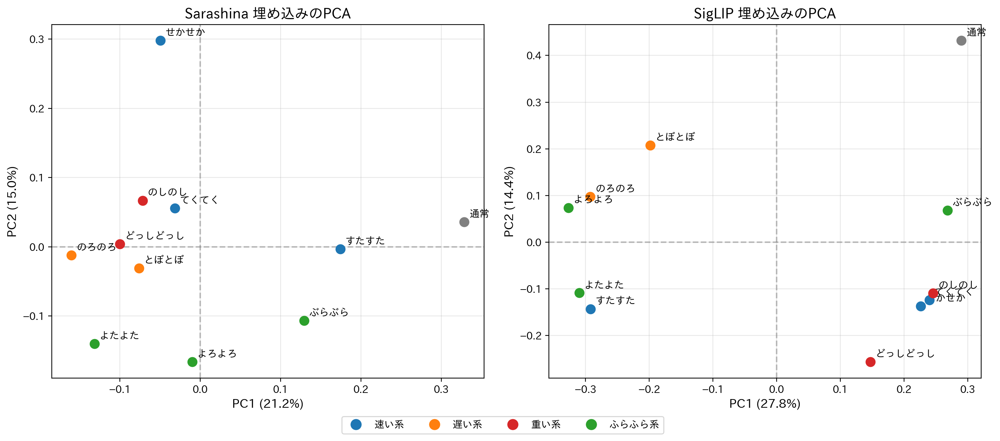

# オノマトペ埋め込みのPCA軸解析レポート

> **作成日**: 2025-12-03  
> **目的**: 学習前のテキストエンコーダ（Sarashina / SigLIP）がオノマトペの意味をどう理解しているかを解析する

---

## 1. 概要

歩行系オノマトペ11語に対して、2つの日本語対応テキストエンコーダで埋め込みを取得し、PCA（主成分分析）を行った。

### 対象オノマトペ

| カテゴリ | オノマトペ |
|---------|-----------|
| **速い系** | すたすた、せかせか、てくてく |
| **遅い系** | とぼとぼ、のろのろ |
| **重い系** | どっしどっし、のしのし |
| **ふらふら系** | ぶらぶら、よたよた、よろよろ |
| その他 | 通常 |

### テキストテンプレート

```
「〇〇と歩いている。」（通常の場合は「普通に歩いている。」）
```

---

## 2. 比較プロット



**図の見方**:
- 小さな丸（●）: 各オノマトペの位置
- 大きな×（✕）: カテゴリの重心
- 色分け: 速い系（青）、遅い系（橙）、重い系（赤）、ふらふら系（緑）

---

## 3. 寄与率（Explained Variance Ratio）

各主成分が元データの分散をどれだけ説明しているか。

### Sarashina

| 主成分 | 寄与率 | 累積寄与率 |
|--------|--------|-----------|
| PC1 | **21.16%** | 21.16% |
| PC2 | **14.96%** | 36.12% |
| PC3 | 13.07% | 49.19% |
| PC4 | 11.87% | 61.05% |
| PC5 | 10.23% | 71.28% |

### SigLIP

| 主成分 | 寄与率 | 累積寄与率 |
|--------|--------|-----------|
| PC1 | **27.81%** | 27.81% |
| PC2 | **14.41%** | 42.22% |
| PC3 | 11.64% | 53.87% |
| PC4 | 11.01% | 64.88% |
| PC5 | 7.92% | 72.80% |

**考察**: SigLIPの方がPC1の寄与率が高い（27.8% vs 21.2%）。これはSigLIPが1つの主要な軸に情報を集約していることを示す。

---

## 4. PC軸の解釈

各カテゴリの重心位置から、PC軸が何の質感を捉えているかを推測する。

### Sarashina

#### PC1軸（21.2%）: **速度軸？**

```
低 ←――――――――――――――――――――――――→ 高

遅い系     重い系      ふらふら系    速い系
(-0.12)   (-0.09)     (-0.00)     (+0.03)
```

→ **遅い ↔ 速い** の対比が見える！PC1は**速度を捉える軸**と解釈できる。

#### PC2軸（15.0%）: **安定性軸？**

```
低 ←――――――――――――――――――――――――→ 高

ふらふら系   遅い系      重い系      速い系
(-0.14)    (-0.02)    (+0.04)    (+0.12)
```

→ **ふらふら系が最も低い**位置にある。PC2は**安定性を捉える軸**と解釈できる。

---

### SigLIP

#### PC1軸（27.8%）

```
低 ←――――――――――――――――――――――――→ 高

遅い系    ふらふら系    速い系      重い系
(-0.25)   (-0.12)    (+0.06)    (+0.20)
```

→ Sarashinaほど「速度」に特化していない。**重い系が最も高い**位置にあり、混在気味。

#### PC2軸（14.4%）

```
低 ←――――――――――――――――――――――――→ 高

重い系      速い系     ふらふら系    遅い系
(-0.18)    (-0.13)   (+0.01)    (+0.15)
```

→ 解釈が難しい。重い系と速い系が一緒に低い位置にある。

---

## 5. カテゴリ重心の数値データ

### Sarashina

| カテゴリ | PC1 | PC2 |
|---------|-----|-----|
| 速い系 | +0.0308 | +0.1168 |
| 遅い系 | -0.1184 | -0.0217 |
| 重い系 | -0.0860 | +0.0353 |
| ふらふら系 | -0.0041 | -0.1377 |

### SigLIP

| カテゴリ | PC1 | PC2 |
|---------|-----|-----|
| 速い系 | +0.0581 | -0.1347 |
| 遅い系 | -0.2452 | +0.1524 |
| 重い系 | +0.1966 | -0.1830 |
| ふらふら系 | -0.1225 | +0.0111 |

---

## 6. 各オノマトペのPC座標

### Sarashina

| オノマトペ | PC1 | PC2 | カテゴリ |
|-----------|-----|-----|---------|
| 通常 | +0.3285 | +0.0357 | その他 |
| すたすた | +0.1740 | -0.0033 | 速い系 |
| せかせか | -0.0498 | +0.2980 | 速い系 |
| てくてく | -0.0317 | +0.0558 | 速い系 |
| どっしどっし | -0.1000 | +0.0038 | 重い系 |
| とぼとぼ | -0.0763 | -0.0311 | 遅い系 |
| のしのし | -0.0719 | +0.0667 | 重い系 |
| のろのろ | -0.1605 | -0.0124 | 遅い系 |
| ぶらぶら | +0.1293 | -0.1069 | ふらふら系 |
| よたよた | -0.1318 | -0.1399 | ふらふら系 |
| よろよろ | -0.0100 | -0.1664 | ふらふら系 |

### SigLIP

| オノマトペ | PC1 | PC2 | カテゴリ |
|-----------|-----|-----|---------|
| 通常 | +0.2902 | +0.4321 | その他 |
| すたすた | -0.2919 | -0.1430 | 速い系 |
| せかせか | +0.2263 | -0.1372 | 速い系 |
| てくてく | +0.2400 | -0.1238 | 速い系 |
| どっしどっし | +0.1475 | -0.2567 | 重い系 |
| とぼとぼ | -0.1980 | +0.2072 | 遅い系 |
| のしのし | +0.2458 | -0.1093 | 重い系 |
| のろのろ | -0.2923 | +0.0976 | 遅い系 |
| ぶらぶら | +0.2686 | +0.0682 | ふらふら系 |
| よたよた | -0.3095 | -0.1088 | ふらふら系 |
| よろよろ | -0.3265 | +0.0738 | ふらふら系 |

---

## 7. 結論

### Sarashina の特徴
- **PC1**: 速度軸として機能（遅い↔速い）
- **PC2**: 安定性軸として機能（ふらふら↔安定）
- カテゴリの分離が**比較的クリア**

### SigLIP の特徴
- PC1の寄与率は高いが、カテゴリの分離は**Sarashinaほどクリアではない**
- 「重い系」が速い系より高い位置にあるなど、解釈が難しい

### 推奨
オノマトペの質感学習には **Sarashina** の方が適している可能性がある。

---

## 8. 次のステップ

1. **学習後の潜在空間を可視化** → モーション埋め込みとテキスト埋め込みがどう整列するか確認
2. **異なるテンプレートで実験** → 「〜と歩いている」以外のテンプレートでの結果比較
3. **上位PC以外の分析** → PC3以降が何を捉えているかの調査

---

## 付録: 実行方法

```bash
# PCA解析を実行
/home/jouta/venvs/motionclip/bin/python hoyo_v1_1/viz/analyze_embedding_pca.py

# SigLIPで学習
/home/jouta/venvs/motionclip/bin/python hoyo_v1_1/models/train_motionclip_joint.py \
  --sem-encoder siglip --stage freeze --steps 3000
```

