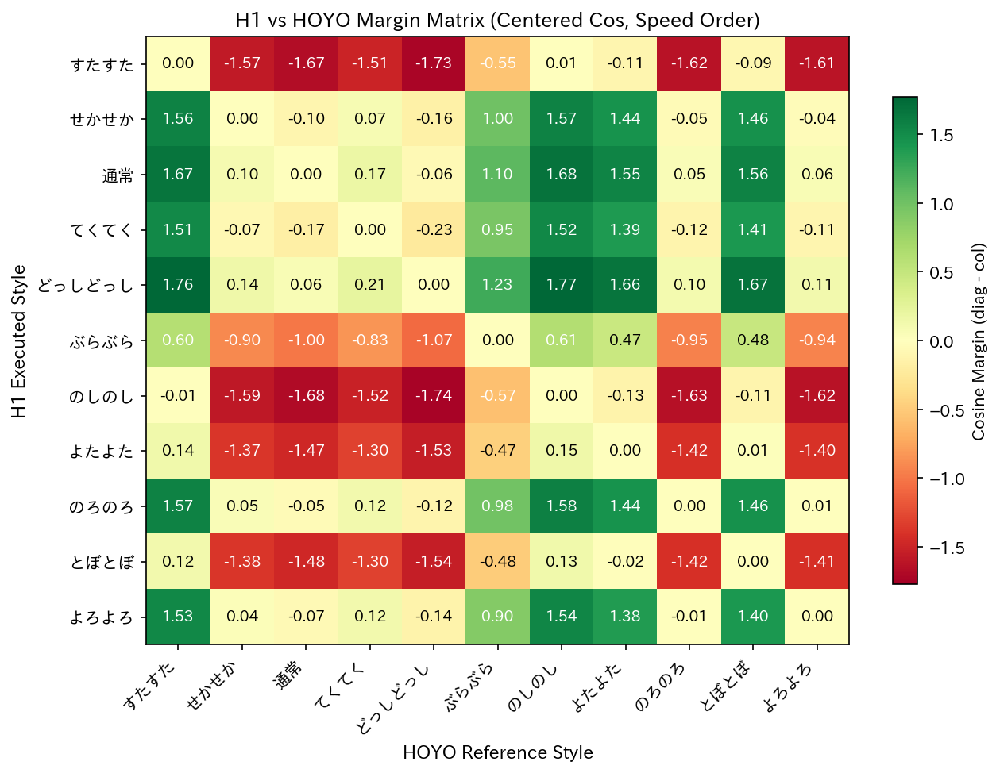
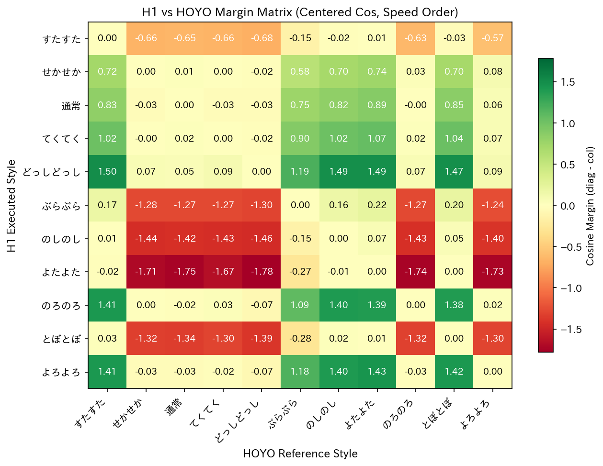
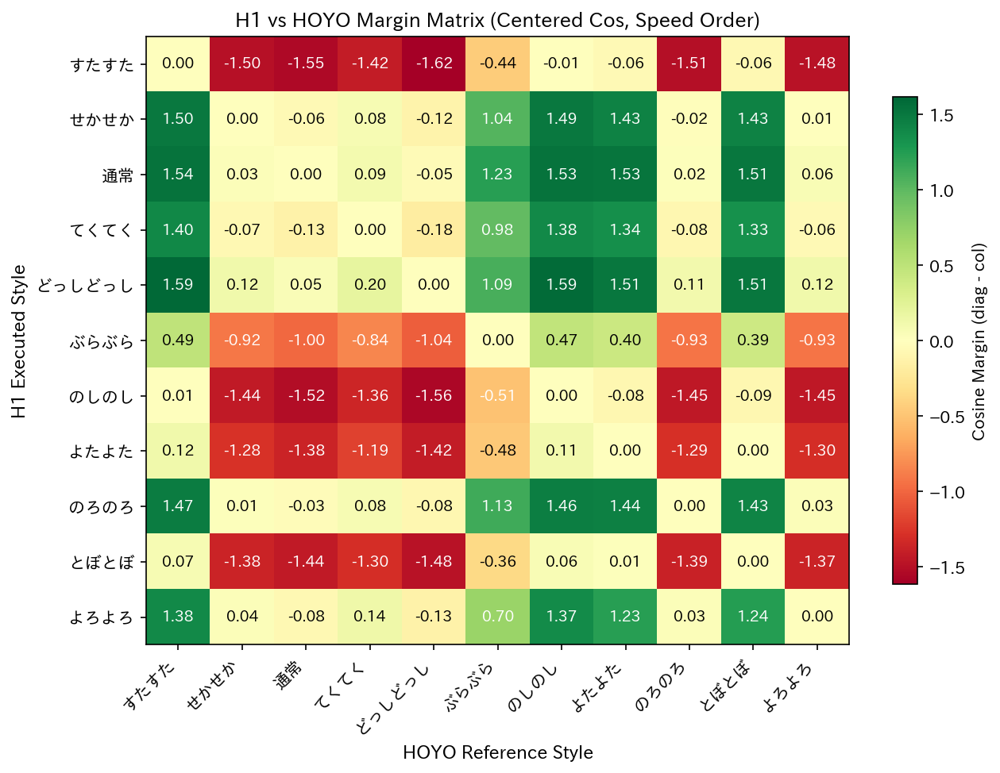

# H1 Vision Style Reward Comparison (2026-02-01)

## 目的
- 旧 run と 新 run（style weight 4.0）を `eval_motion.py` で同条件評価し、寄与率・混同行列・性能指標を比較する
- 11スタイル平均は使わず、**model_2000 の各スタイルログ**を整理して記録する

---
## 寄与率の意味（指標の解釈）

### rate^mag（報酬の“鳴り”の寄与）
- 1ステップの報酬項 $r_{t,k}$ を使った **絶対値寄与**
- 解釈: **音量が大きい報酬はどれか**（鳴っている項目）

定義（概念）:
$$\mathrm{rate}^{\mathrm{mag}}_k = \frac{\mathbb{E}[|r_{t,k}|]}{\sum_j \mathbb{E}[|r_{t,j}|]}$$

---

### rate^adv（学習に効いている寄与）
- 1-step TD残差を Advantage 近似として使用
- 解釈: **どの報酬が方策更新に効いているか**

TD残差:
$$\delta_t = r_t + \gamma V(s_{t+1}) - V(s_t)$$

共分散ベースの寄与（絶対値正規化）:
$$\mathrm{rate}^{\mathrm{adv}}_k = \frac{|\mathrm{Cov}(r_{t,k}, \delta_t)|}{\sum_j |\mathrm{Cov}(r_{t,j}, \delta_t)|}$$

> ※終端では $V(s_{t+1})$ を 0 にし、time_out は非終端扱いにする

---

### share^E（関節エネルギーの配分）
- 行動 $a$ の2乗をエネルギー指標とする
- 解釈: **どの関節が“努力”しているか**

$$\mathrm{share}^E_i = \frac{\mathbb{E}[a_i^2]}{\sum_j \mathbb{E}[a_j^2]}$$

**mean_action_sq**
- $\mathbb{E}[\|a\|^2]$ に相当
- share^E の偏りが「全体の暴れ」か「局所的な暴れ」かを見る補助指標

---
## 比較対象

### 旧 run（baseline）
- `2026-01-28_h1_vision_without_speedinput_exp_c_fixed03_exp_c_cmd03_seed42_dup1`

### 新 run（stylew4）
- `2026-01-31_h1_vision_without_speedinput_exp_c_fixed03_exp_c_cmd03_stylew4_seed42_dup1`

### Checkpoint
- `model_2000.pt` のみ

---

## 評価条件（共通）
- task: `h1_vision_without_speedinput_exp_c_fixed03`
- eval_steps: `500`
- num_envs: `16`（デフォルト）
- terrain: `flat`
- `--log_reward_terms` 有効
- docker: `navila_eval_20260201` + `/isaac-sim/python.sh`

---

## 出力ファイル

### 旧 run
- `eval_results/motion/20260201_compare/old_dup1_m2000/eval_motion_20260201_091804.json`
- `eval_results/motion/20260201_compare/old_dup1_m2000/confusion_heatmap_centered_20260201_091804.png`
- `docs/experiments/assets/20260201_h1_vision_style_reward_comparison/old_dup1_m2000_confusion_heatmap_centered_jp.png`（日本語フォント再生成）
- `docs/experiments/assets/20260201_h1_vision_style_reward_comparison/old_dup1_m2000_confusion_heatmap_centered_speed_order_20260207.png`（速度順で再生成）
- `docs/experiments/assets/20260201_h1_vision_style_reward_comparison/old_dup1_m2000_margin_heatmap_centered_speed_order_20260207.png`（速度順で再生成）

### 新 run（stylew4, 再評価 2026-02-03）
- `eval_results/motion/eval_motion_20260203_000603.json`
- `eval_results/motion/confusion_heatmap_centered_20260203_000603.png`
- `eval_results/motion/confusion_heatmap_raw_20260203_000603.png`
- `eval_results/motion/hoyo_pairwise_heatmap_20260203_000603.png`
- `docs/experiments/assets/20260201_h1_vision_style_reward_comparison/new_stylew4_dup1_m2000_confusion_heatmap_centered_20260203_000603.png`
- `docs/experiments/assets/20260201_h1_vision_style_reward_comparison/new_stylew4_dup1_m2000_confusion_heatmap_centered_speed_order_20260207.png`（速度順で再生成）
- `docs/experiments/assets/20260201_h1_vision_style_reward_comparison/new_stylew4_dup1_m2000_margin_heatmap_centered_speed_order_20260207.png`（速度順で再生成）

※ raw/centered heatmap と HOYO pairwise heatmap は各ディレクトリ内に保存済み。

---

## スタイル別主要指標（model_2000）

### 旧 run
| style | mean_velocity_x | mean_cos_centroid | mean_style_score | mean_joint_error | mean_action_sq | fall_rate | hoyo_diag_centered |
| --- | ---: | ---: | ---: | ---: | ---: | ---: | ---: |
| 通常 | 0.476662 | 0.500701 | 0 | 2.845608 | 6.137023 | 0 | 0.799995 |
| すたすた | 0.476509 | 0.532666 | 0.032107 | 3.727902 | 5.831093 | 0 | -0.864421 |
| せかせか | 0.474856 | 0.507478 | 0.006632 | 3.024729 | 6.008858 | 0 | 0.69863 |
| てくてく | 0.468489 | 0.48238 | -0.018169 | 3.272083 | 5.968622 | 0 | 0.638792 |
| どっしどっし | 0.468489 | 0.532982 | 0.033338 | 3.050531 | 6.529142 | 0 | 0.879839 |
| とぼとぼ | 0.469796 | 0.478921 | -0.022119 | 4.080446 | 7.367883 | 0 | -0.720332 |
| のしのし | 0.470836 | 0.433293 | -0.067032 | 4.214029 | 6.27933 | 0 | -0.878133 |
| のろのろ | 0.47437 | 0.476525 | -0.024469 | 2.775906 | 6.829737 | 0 | 0.721 |
| ぶらぶら | 0.470122 | 0.582759 | 0.081867 | 4.42361 | 7.435906 | 0 | -0.242052 |
| よたよた | 0.474921 | 0.453763 | -0.046819 | 4.3726 | 7.345674 | 0 | -0.709693 |
| よろよろ | 0.471984 | 0.67559 | 0.173706 | 3.01296 | 6.958871 | 0 | 0.68356 |

### 新 run（stylew4）
| style | mean_velocity_x | mean_cos_centroid | mean_style_score | mean_joint_error | mean_action_sq | fall_rate | hoyo_diag_centered |
| --- | ---: | ---: | ---: | ---: | ---: | ---: | ---: |
| 通常 | 0.221804 | 0.163761 | 0 | 3.552001 | 49.390207 | 0 | 0.425557 |
| すたすた | 0.087613 | 0.307778 | 0.020424 | 4.427398 | 58.241031 | 0 | -0.331539 |
| せかせか | 0.131488 | 0.251276 | 0.008928 | 3.610992 | 56.230168 | 0 | 0.361643 |
| てくてく | 0.31121 | 0.249397 | -0.003643 | 3.614573 | 42.803375 | 0 | 0.528 |
| どっしどっし | 0.216389 | 0.167236 | 0.102773 | 3.341593 | 29.105785 | 0 | 0.763283 |
| とぼとぼ | 0.188187 | 0.084825 | 0.015449 | 4.290895 | 34.867937 | 0 | -0.668007 |
| のしのし | 0.225699 | 0.162862 | 0.060377 | 4.815422 | 31.71875 | 0 | -0.692112 |
| のろのろ | 0.209207 | 0.159854 | 0.155403 | 3.742891 | 31.330889 | 0 | 0.681528 |
| ぶらぶら | 0.24358 | 0.148131 | 0.100713 | 4.523319 | 31.09027 | 0 | -0.537436 |
| よたよた | 0.388169 | -0.000107 | -0.069738 | 3.724056 | 5.791071 | 0 | -0.86512 |
| よろよろ | 0.216969 | 0.146175 | 0.053706 | 3.976109 | 32.35901 | 0 | 0.691393 |

---

## スタイル別寄与率（model_2000, --log_reward_terms）

### 旧 run
| style | mean_action_sq | rate^mag 上位 | rate^adv 上位 | rate^adv style_tracking | share^E 上位 |
| --- | ---: | --- | --- | ---: | --- |
| 通常 | 6.137 | track_lin_vel_xy_exp 69.1% / flat_orientation_l2 7.8% / style_tracking 6.9% | heading_tracking 26.9% / style_tracking 23.1% / feet_air_time 13.7% | 23.09% | joint_11 22.2% / joint_16 18.0% / joint_7 16.4% |
| すたすた | 5.831 | track_lin_vel_xy_exp 61.6% / style_tracking 17.5% / flat_orientation_l2 7.0% | style_tracking 57.4% / heading_tracking 11.5% / dof_acc_l2 11.4% | 57.43% | joint_11 21.3% / joint_16 18.9% / joint_7 16.9% |
| せかせか | 6.009 | track_lin_vel_xy_exp 56.1% / style_tracking 24.9% / flat_orientation_l2 5.8% | style_tracking 73.0% / track_lin_vel_xy_exp 5.5% / dof_acc_l2 4.5% | 72.98% | joint_11 21.9% / joint_16 18.5% / joint_7 16.2% |
| てくてく | 5.969 | track_lin_vel_xy_exp 51.9% / style_tracking 30.3% / flat_orientation_l2 6.3% | style_tracking 73.7% / track_lin_vel_xy_exp 8.0% / heading_tracking 5.3% | 73.67% | joint_11 20.4% / joint_16 18.8% / joint_7 17.6% |
| どっしどっし | 6.529 | track_lin_vel_xy_exp 44.9% / style_tracking 37.0% / flat_orientation_l2 7.1% | style_tracking 76.7% / track_lin_vel_xy_exp 8.6% / heading_tracking 6.6% | 76.70% | joint_16 21.1% / joint_11 18.5% / joint_7 17.3% |
| とぼとぼ | 7.368 | track_lin_vel_xy_exp 45.7% / style_tracking 41.1% / feet_air_time 3.7% | style_tracking 77.8% / track_lin_vel_xy_exp 7.7% / heading_tracking 6.2% | 77.80% | joint_11 25.3% / joint_16 17.8% / joint_7 11.9% |
| のしのし | 6.279 | track_lin_vel_xy_exp 43.5% / style_tracking 41.8% / flat_orientation_l2 4.5% | style_tracking 84.2% / track_lin_vel_xy_exp 5.5% / heading_tracking 4.8% | 84.19% | joint_11 22.0% / joint_16 17.5% / joint_7 17.0% |
| のろのろ | 6.83 | style_tracking 48.7% / track_lin_vel_xy_exp 40.2% / feet_air_time 3.3% | style_tracking 90.8% / track_lin_vel_xy_exp 4.4% / heading_tracking 1.2% | 90.83% | joint_11 24.6% / joint_16 17.3% / joint_7 14.4% |
| ぶらぶら | 7.436 | style_tracking 57.4% / track_lin_vel_xy_exp 34.2% / feet_air_time 2.7% | style_tracking 93.9% / track_lin_vel_xy_exp 3.3% / heading_tracking 0.8% | 93.93% | joint_11 25.3% / joint_16 18.4% / joint_7 11.8% |
| よたよた | 7.346 | style_tracking 53.3% / track_lin_vel_xy_exp 36.6% / feet_air_time 2.7% | style_tracking 90.8% / track_lin_vel_xy_exp 5.3% / heading_tracking 1.6% | 90.80% | joint_11 24.7% / joint_16 14.1% / joint_8 13.6% |
| よろよろ | 6.959 | style_tracking 64.1% / track_lin_vel_xy_exp 28.3% / feet_air_time 2.4% | style_tracking 95.8% / track_lin_vel_xy_exp 2.3% / heading_tracking 0.8% | 95.82% | joint_11 24.7% / joint_16 17.9% / joint_7 13.3% |

### 新 run（stylew4）
| style | mean_action_sq | rate^mag 上位 | rate^adv 上位 | rate^adv style_tracking | share^E 上位 |
| --- | ---: | --- | --- | ---: | --- |
| 通常 | 49.39 | track_lin_vel_xy_exp 43.4% / joint_deviation_arms 22.7% / joint_deviation_hip 10.5% | track_lin_vel_xy_exp 40.9% / heading_tracking 11.3% / feet_slide 10.4% | 2.65% | joint_5 31.1% / joint_2 12.4% / joint_11 7.9% |
| すたすた | 58.241 | track_lin_vel_xy_exp 31.9% / joint_deviation_arms 29.2% / joint_deviation_hip 11.0% | joint_deviation_arms 31.0% / track_lin_vel_xy_exp 20.8% / dof_pos_limits 9.0% | 7.97% | joint_5 40.0% / joint_2 10.4% / joint_9 7.1% |
| せかせか | 56.23 | track_lin_vel_xy_exp 34.9% / joint_deviation_arms 26.9% / joint_deviation_hip 10.4% | track_lin_vel_xy_exp 35.1% / joint_deviation_arms 22.3% / style_tracking 12.3% | 12.28% | joint_5 38.4% / joint_2 10.8% / joint_9 6.4% |
| てくてく | 42.803 | track_lin_vel_xy_exp 48.1% / joint_deviation_arms 17.2% / joint_deviation_hip 9.9% | track_lin_vel_xy_exp 25.4% / feet_slide 16.6% / heading_tracking 13.9% | 13.30% | joint_5 23.4% / joint_2 11.9% / joint_11 9.5% |
| どっしどっし | 29.106 | track_lin_vel_xy_exp 40.8% / style_tracking 16.9% / dof_pos_limits 11.5% | track_lin_vel_xy_exp 25.6% / dof_pos_limits 17.7% / style_tracking 17.7% | 17.66% | joint_15 16.8% / joint_7 9.9% / joint_11 9.2% |
| とぼとぼ | 34.868 | track_lin_vel_xy_exp 40.0% / dof_pos_limits 13.1% / style_tracking 11.5% | track_lin_vel_xy_exp 40.8% / dof_acc_l2 10.2% / feet_slide 9.5% | 7.69% | joint_15 13.3% / joint_2 12.5% / joint_11 9.2% |
| のしのし | 31.719 | track_lin_vel_xy_exp 40.8% / style_tracking 18.7% / dof_pos_limits 9.8% | style_tracking 26.0% / dof_pos_limits 15.3% / track_lin_vel_xy_exp 11.2% | 25.99% | joint_15 14.4% / joint_2 11.2% / joint_11 10.8% |
| のろのろ | 31.331 | track_lin_vel_xy_exp 33.6% / style_tracking 29.7% / dof_pos_limits 9.8% | style_tracking 18.6% / dof_pos_limits 17.1% / feet_slide 16.0% | 18.56% | joint_15 16.7% / joint_2 10.2% / joint_11 9.4% |
| ぶらぶら | 31.09 | track_lin_vel_xy_exp 36.5% / style_tracking 26.6% / joint_deviation_hip 8.3% | style_tracking 18.5% / track_lin_vel_xy_exp 15.0% / heading_tracking 14.5% | 18.49% | joint_15 15.7% / joint_2 10.6% / joint_11 10.5% |
| よたよた | 5.791 | track_lin_vel_xy_exp 69.8% / joint_deviation_arms 6.9% / style_tracking 5.1% | track_lin_vel_xy_exp 43.0% / heading_tracking 10.0% / joint_deviation_arms 7.8% | 6.99% | joint_11 25.8% / joint_12 15.8% / joint_9 11.8% |
| よろよろ | 32.359 | track_lin_vel_xy_exp 36.7% / style_tracking 26.3% / dof_pos_limits 9.9% | style_tracking 23.7% / track_lin_vel_xy_exp 20.1% / feet_slide 15.0% | 23.73% | joint_15 17.3% / joint_2 10.4% / joint_11 9.9% |

### 追加評価（stylew6 / model_2999）
| style | mean_action_sq | rate^mag 上位 | rate^adv 上位 | rate^adv style_tracking | share^E 上位 |
| --- | ---: | --- | --- | ---: | --- |
| 通常 | 20.575 | track_lin_vel_xy_exp 44.5% / flat_orientation_l2 27.8% / joint_deviation_arms 9.5% | flat_orientation_l2 25.8% / track_lin_vel_xy_exp 18.1% / ang_vel_xy_l2 14.5% | 5.42% | joint_8 21.4% / joint_7 16.3% / joint_6 11.8% |
| すたすた | 20.056 | track_lin_vel_xy_exp 45.1% / flat_orientation_l2 25.9% / joint_deviation_arms 9.4% | track_lin_vel_xy_exp 35.9% / flat_orientation_l2 23.8% / joint_deviation_arms 9.5% | 5.22% | joint_8 20.6% / joint_7 15.4% / joint_16 13.9% |
| せかせか | 19.980 | track_lin_vel_xy_exp 40.2% / flat_orientation_l2 24.0% / style_tracking 17.0% | track_lin_vel_xy_exp 30.8% / flat_orientation_l2 18.9% / style_tracking 15.0% | 14.96% | joint_8 21.2% / joint_7 16.2% / joint_6 12.2% |
| てくてく | 20.494 | track_lin_vel_xy_exp 35.1% / style_tracking 24.0% / flat_orientation_l2 22.4% | flat_orientation_l2 22.6% / track_lin_vel_xy_exp 22.1% / style_tracking 21.3% | 21.33% | joint_8 21.6% / joint_7 16.0% / joint_6 11.4% |
| どっしどっし | 23.634 | track_lin_vel_xy_exp 33.7% / style_tracking 25.1% / flat_orientation_l2 20.6% | style_tracking 23.5% / track_lin_vel_xy_exp 22.1% / flat_orientation_l2 20.8% | 23.54% | joint_8 18.9% / joint_7 13.5% / joint_16 13.0% |
| とぼとぼ | 22.987 | style_tracking 37.1% / track_lin_vel_xy_exp 27.7% / flat_orientation_l2 18.1% | track_lin_vel_xy_exp 19.9% / flat_orientation_l2 19.7% / style_tracking 18.1% | 18.10% | joint_8 19.9% / joint_7 14.0% / joint_16 13.0% |
| のしのし | 23.486 | style_tracking 41.4% / track_lin_vel_xy_exp 26.6% / flat_orientation_l2 16.8% | track_lin_vel_xy_exp 22.3% / style_tracking 21.0% / flat_orientation_l2 20.4% | 21.02% | joint_8 19.4% / joint_7 13.7% / joint_16 13.2% |
| のろのろ | 21.680 | style_tracking 39.5% / track_lin_vel_xy_exp 27.6% / flat_orientation_l2 17.9% | track_lin_vel_xy_exp 25.0% / flat_orientation_l2 22.6% / ang_vel_xy_l2 17.7% | 10.80% | joint_8 20.7% / joint_7 15.4% / joint_16 11.2% |
| ぶらぶら | 22.772 | style_tracking 39.9% / track_lin_vel_xy_exp 27.0% / flat_orientation_l2 17.6% | track_lin_vel_xy_exp 22.9% / flat_orientation_l2 21.6% / style_tracking 13.3% | 13.35% | joint_8 19.7% / joint_7 14.3% / joint_16 13.3% |
| よたよた | 24.538 | style_tracking 47.1% / track_lin_vel_xy_exp 23.2% / flat_orientation_l2 14.9% | style_tracking 52.3% / track_lin_vel_xy_exp 11.0% / flat_orientation_l2 9.8% | 52.31% | joint_8 18.8% / joint_16 14.3% / joint_7 13.1% |
| よろよろ | 23.867 | style_tracking 47.8% / track_lin_vel_xy_exp 23.2% / flat_orientation_l2 14.5% | track_lin_vel_xy_exp 22.9% / flat_orientation_l2 22.5% / ang_vel_xy_l2 12.2% | 11.22% | joint_8 19.0% / joint_7 13.2% / joint_16 13.1% |

### 観察メモ（寄与率）
- mean_action_sq の平均: 旧 6.608 / 新 36.630
- rate^mag のトップ1（スタイル数）: 旧は track_lin_vel_xy_exp が 7/11、新は track_lin_vel_xy_exp が 11/11
- rate^adv のトップ1（スタイル数）: 旧は style_tracking が 10/11、新は track_lin_vel_xy_exp 6/11・style_tracking 4/11・joint_deviation_arms 1/11
- share^E のトップ1（スタイル数）: 旧は joint_11 が 10/11、新は joint_15 6/11・joint_5 4/11・joint_11 1/11

---

## 追加評価（stylew6 相当 / 2026-02-02）

### 評価条件
- run: `2026-02-01_h1_vision_without_speedinput_exp_c_fixed03_exp_c_cmd03_stylew4_seed42`
- checkpoint: `model_2999.pt`
- task: `h1_vision_without_speedinput_exp_c_fixed03`
- eval_steps: `500`
- num_envs: `16`
- terrain: `flat`
- lin_vel_x: `0.5`
- video: 有効

### 注意点
- `env.yaml` の読み込みに失敗（`python/object/apply:builtins.slice`）のため、**run 固有の env 設定が反映されていない可能性**あり。
- 評価ログ上の `style_tracking` 重みは `2.0`（デフォルト）になっていたため、style_weight=6.0 の効果比較には注意。

### 出力ファイル
- `eval_results/motion/eval_motion_20260202_082729.json`
- `eval_results/motion/confusion_heatmap_centered_20260202_082729.png`
- `docs/experiments/assets/20260201_h1_vision_style_reward_comparison/stylew6_m2999_confusion_heatmap_centered_20260202_082729.png`
- `docs/experiments/assets/20260201_h1_vision_style_reward_comparison/stylew6_m2999_confusion_heatmap_centered_speed_order_20260207.png`（速度順で再生成）
- `docs/experiments/assets/20260201_h1_vision_style_reward_comparison/stylew6_m2999_margin_heatmap_centered_speed_order_20260207.png`（速度順で再生成）
- `eval_results/motion/eval_motion_20260202_131929.json`
- `eval_results/motion/confusion_heatmap_centered_20260202_131929.png`
- `eval_results/motion/confusion_heatmap_raw_20260202_131929.png`
- `eval_results/motion/hoyo_pairwise_heatmap_20260202_131929.png`

### 評価サマリ（eval_motion.py）
| onomatopoeia | Cmd X | Vel X | Style | Cos(C) | Cos(R) | L2 Err | Fall% |
| --- | ---: | ---: | ---: | ---: | ---: | ---: | ---: |
| 通常 | 0.50 | 0.489 | 0.000 | 0.566 | 0.537 | 3.1722 | 0.0% |
| すたすた | 0.50 | 0.457 | -0.237 | 0.322 | 0.347 | 4.2735 | 0.0% |
| せかせか | 0.50 | 0.461 | -0.023 | 0.383 | 0.189 | 3.5578 | 0.0% |
| てくてく | 0.50 | 0.483 | 0.051 | 0.655 | 0.620 | 3.5772 | 0.0% |
| どっしどっし | 0.50 | 0.521 | -0.044 | 0.753 | 0.624 | 3.1085 | 0.0% |
| とぼとぼ | 0.50 | 0.518 | 0.182 | 0.649 | 0.506 | 4.0397 | 0.0% |
| のしのし | 0.50 | 0.519 | 0.173 | 0.734 | 0.535 | 3.9400 | 0.0% |
| のろのろ | 0.50 | 0.504 | 0.041 | 0.605 | 0.483 | 3.2781 | 0.0% |
| ぶらぶら | 0.50 | 0.517 | -0.011 | 0.665 | 0.651 | 3.9832 | 0.0% |
| よたよた | 0.50 | 0.523 | 0.099 | 0.618 | 0.608 | 4.1045 | 0.0% |
| よろよろ | 0.50 | 0.531 | 0.086 | 0.683 | 0.675 | 3.0858 | 0.0% |

### ログ補足
- HOYO centered cos の off-diag mean が 0.995 と警告（20260202_082729 ログ）。

---

## マージン行列（主指標）
- 指標は `M[i,j] = S[i,i] - S[i,j]`（`S` は centered cosine）
- 行ごとの「正解スタイル優位性」を直接評価できるため、本比較では主指標として扱う
- 以下は **速度順（すたすた→…→よろよろ）** で再生成した画像（2026-02-07）

### 旧 run（model_2000）

`docs/experiments/assets/20260201_h1_vision_style_reward_comparison/old_dup1_m2000_margin_heatmap_centered_speed_order_20260207.png`

### 新 run（stylew4 / model_2000）

`docs/experiments/assets/20260201_h1_vision_style_reward_comparison/new_stylew4_dup1_m2000_margin_heatmap_centered_speed_order_20260207.png`

### 追加評価（2026-02-02 / stylew6 相当 / model_2999）

`docs/experiments/assets/20260201_h1_vision_style_reward_comparison/stylew6_m2999_margin_heatmap_centered_speed_order_20260207.png`

### 補助指標（従来の centered confusion）
- 絶対方向の確認用として `confusion_heatmap_centered_*` も併用する
- ただし主判断は上記 margin 行列に置く

---

## マージン行列の考察（centered margin）

- **定義**: `M[i,j] = S[i,i] - S[i,j]`（`S` は centered cosine）。  
  `M[i,j] > 0` なら「行 i は列 j より自己ラベルを優先」。

### 集約統計（off-diagonal margin 分布）

| run | mean | median | std | q10 | q90 | P(M>0) | row_all_positive |
| --- | ---: | ---: | ---: | ---: | ---: | ---: | ---: |
| 旧 run (dup1 m2000) | +0.0104 | +0.0018 | 1.0790 | -1.5352 | +1.5498 | 0.5000 | 1/11 |
| 新 run (stylew4 m2000) | -0.0438 | +0.0074 | 0.9180 | -1.4018 | +1.3794 | 0.5273 | 1/11 |
| 追加評価 (stylew6 m2999) | +0.0113 | +0.0105 | 1.0113 | -1.4376 | +1.4636 | 0.5273 | 1/11 |

- **新 run は平均が負**（`-0.0438`）で、分布全体として自己ラベル優位が崩れやすい。
- 一方で `P(M>0)` は新 run/stylew6 がやや高い。  
  これは「小さな正マージンは増えたが、大きな負マージンが残る」分布を示す。
- `row_all_positive` が全runで `1/11` のため、ほとんどのスタイルは少なくとも1つ以上の他ラベルに負ける。

### スタイル別（row mean margin）の傾向

- **上位（安定して分離できる）**:
  - 共通で `どっしどっし` が最上位（旧 `+0.8703` / 新 `+0.7499` / stylew6 `+0.7890`）
  - `通常` と `のろのろ` も3runで正マージンが安定
- **下位（分離失敗しやすい）**:
  - `のしのし` / `すたすた` / `とぼとぼ` / `よたよた` は負マージンが大きく、特に新 run の `よたよた` は `-1.0669`
  - 新 run では `ぶらぶら` / `のしのし` / `とぼとぼ` の負側が深く、stylew4で改善が見えない

### Hard Negative（最も取り違えやすい相手）

- 各行で `argmax_j S[i,j] (j≠i)` を取ると、hard negative はほぼ `どっしどっし` に集中:
  - 旧 run: `10/11` が `どっしどっし`
  - 新 run: `9/11` が `どっしどっし`
  - stylew6: `10/11` が `どっしどっし`
- つまり現在の埋め込み空間では、`どっしどっし` 方向が「吸引先」になっており、行列の崩れ方に強い偏りがある。

### 含意（margin主指標としての解釈）

- stylew4 は「速度レンジ拡大」は見えるが、margin の観点では識別性改善につながっていない。
- stylew6 は平均マージンを旧run水準へ戻すが、hard negative 偏りは残る。  
  → 課題は「全体強化」よりも「どっしどっし方向への集中抑制」と「下位スタイル（のしのし/とぼとぼ/よたよた）の分離強化」。

### 補助: centered confusion を使った追加考察（2026-02-07）

- **速度順との整合（Spearman）**:
  - 旧 run: `+0.3000`（弱い正相関）
  - 新 run: `-0.2273`（弱い逆相関）
  - 新 run は「速いはずのラベル（すたすた/せかせか）」が実測で遅く、「遅いはずのラベル（よたよた）」が最速になる逆転が強い。

- **速度レンジ**:
  - 旧 run: `0.468489` 〜 `0.476662`（レンジ `0.008173`）
  - 新 run: `0.087613` 〜 `0.388169`（レンジ `0.300556`）
  - 新 run は速度の分散は大きいが、dataset想定順には並ばない。

- **混同行列の識別性（centered cos）**:
  - 旧 run: `diag-off = +0.0104`
  - 新 run: `diag-off = -0.0438`
  - 旧 run でも対角優位は弱く、新 run で明確に崩れる。

- **top1 一致率（rowごとの最大列が同名ラベル）**:
  - 旧 run: `1/11 = 0.0909`
  - 新 run: `1/11 = 0.0909`
  - どちらも実質的に `どっしどっし` 列へ集中し、スタイル分離に失敗している。

- **まとめ**:
  - 新 run は「速度がバラける」一方で「ラベル整合とスタイル分離が悪い」。
  - 旧 run は「速度がほぼ一定」で「分離も弱い」ため、両者ともスタイル条件付けの識別性は十分ではない。

---

## ログ（旧 run / model_2000）

### 通常
```yaml
metrics:
  mean_velocity_x: 0.476662
  std_velocity_x: 0.078022
  mean_com_x: -0.114395
  std_com_x: 0.06243
  mean_cos_centroid: 0.500701
  std_cos_centroid: 0.002107
  mean_cos_random_sample: 0.515248
  std_cos_random_sample: 0.002498
  mean_style_score: 0
  std_style_score: 0
  mean_joint_error: 2.845608
  std_joint_error: 5.303215
  mean_joint_error_dtw: None
  std_joint_error_dtw: None
  mean_episode_length: 500
  fall_rate: 0
  episode_count: 0
  cos_centroid_count: 640
  cos_random_sample_count: 640
  style_score_count: 640
  mean_reward_total: 0.009581
  std_reward_total: 0.002222
  reward_step_dt: 0.02
  mean_action_sq: 6.137023
hoyo_similarity_mean:
  すたすた: 0.990366
  せかせか: 0.998555
  てくてく: 0.998064
  とぼとぼ: 0.990504
  どっしどっし: 0.999357
  のしのし: 0.989236
  のろのろ: 0.998893
  ぶらぶら: 0.989764
  よたよた: 0.989994
  よろよろ: 0.998848
  通常: 0.999105
hoyo_similarity_std:
  すたすた: 0.00026
  せかせか: 0.000391
  てくてく: 0.000479
  とぼとぼ: 0.00006
  どっしどっし: 0.000199
  のしのし: 0.000281
  のろのろ: 0.000329
  ぶらぶら: 0.000563
  よたよた: 0.00006
  よろよろ: 0.000299
  通常: 0.000243
hoyo_similarity_centered_mean:
  すたすた: -0.865853
  せかせか: 0.703441
  てくてく: 0.631828
  とぼとぼ: -0.764829
  どっしどっし: 0.859805
  のしのし: -0.877457
  のろのろ: 0.751506
  ぶらぶら: -0.303158
  よたよた: -0.74842
  よろよろ: 0.741044
  通常: 0.799995
hoyo_similarity_centered_std:
  すたすた: 0.017245
  せかせか: 0.071218
  てくてく: 0.082775
  とぼとぼ: 0.056335
  どっしどっし: 0.037117
  のしのし: 0.014943
  のろのろ: 0.064316
  ぶらぶら: 0.111992
  よたよた: 0.061304
  よろよろ: 0.05664
  通常: 0.045527
reward_terms_mean:
  action_rate_l2: -0.000084
  ang_vel_xy_l2: -0.000165
  dof_acc_l2: -0.000153
  dof_pos_limits: -0.000012
  dof_torques_l2: 0
  feet_air_time: 0.000871
  feet_slide: -0.000125
  feet_stumble: 0
  flat_orientation_l2: -0.001089
  heading_tracking: 0.000306
  joint_deviation_arms: -0.000268
  joint_deviation_hip: -0.00021
  joint_deviation_torso: -0.000039
  style_tracking: 0.000964
  termination_penalty: 0
  track_lin_vel_xy_exp: 0.009585
reward_terms_std:
  action_rate_l2: 0.000144
  ang_vel_xy_l2: 0.000184
  dof_acc_l2: 0.000715
  dof_pos_limits: 0.000106
  dof_torques_l2: 0
  feet_air_time: 0.00064
  feet_slide: 0.000597
  feet_stumble: 0
  flat_orientation_l2: 0.000245
  heading_tracking: 0.00087
  joint_deviation_arms: 0.000135
  joint_deviation_hip: 0.000089
  joint_deviation_torso: 0.00002
  style_tracking: 0.000634
  termination_penalty: 0
  track_lin_vel_xy_exp: 0.000904
rate_mag:
  action_rate_l2: 0.606492
  ang_vel_xy_l2: 1.188323
  dof_acc_l2: 1.103956
  dof_pos_limits: 0.086186
  dof_torques_l2: 0
  feet_air_time: 6.279133
  feet_slide: 0.901815
  feet_stumble: 0
  flat_orientation_l2: 7.847992
  heading_tracking: 2.208786
  joint_deviation_arms: 1.934432
  joint_deviation_hip: 1.514256
  joint_deviation_torso: 0.27937
  style_tracking: 6.94784
  termination_penalty: 0
  track_lin_vel_xy_exp: 69.10142
rate_adv:
  action_rate_l2: 3.234541
  ang_vel_xy_l2: 4.846499
  dof_acc_l2: 7.517311
  dof_pos_limits: 0.790934
  dof_torques_l2: 0
  feet_air_time: 13.717265
  feet_slide: 9.080625
  feet_stumble: 0
  flat_orientation_l2: 1.79942
  heading_tracking: 26.889492
  joint_deviation_arms: 3.489013
  joint_deviation_hip: 0.314698
  joint_deviation_torso: 0.684508
  style_tracking: 23.08868
  termination_penalty: 0
  track_lin_vel_xy_exp: 4.54701
share_e:
  joint_0: 0.70214
  joint_1: 0.365039
  joint_10: 3.820739
  joint_11: 22.195345
  joint_12: 7.487949
  joint_13: 0.470481
  joint_14: 0.551545
  joint_15: 2.795344
  joint_16: 17.970397
  joint_17: 0.425452
  joint_18: 1.111759
  joint_2: 0.759275
  joint_3: 0.553985
  joint_4: 0.560246
  joint_5: 1.428169
  joint_6: 1.613893
  joint_7: 16.42058
  joint_8: 15.319724
  joint_9: 5.447939
```

### すたすた
```yaml
metrics:
  mean_velocity_x: 0.476509
  std_velocity_x: 0.07789
  mean_com_x: 0.326088
  std_com_x: 0.200065
  mean_cos_centroid: 0.532666
  std_cos_centroid: 0.002397
  mean_cos_random_sample: 0.540618
  std_cos_random_sample: 0.002503
  mean_style_score: 0.032107
  std_style_score: 0.000222
  mean_joint_error: 3.727902
  std_joint_error: 4.59095
  mean_joint_error_dtw: None
  std_joint_error_dtw: None
  mean_episode_length: 500
  fall_rate: 0
  episode_count: 0
  cos_centroid_count: 640
  cos_random_sample_count: 640
  style_score_count: 640
  mean_reward_total: 0.011236
  std_reward_total: 0.002763
  reward_step_dt: 0.02
  mean_action_sq: 5.831093
hoyo_similarity_mean:
  すたすた: 0.990354
  せかせか: 0.998586
  てくてく: 0.998108
  とぼとぼ: 0.990455
  どっしどっし: 0.999369
  のしのし: 0.98922
  のろのろ: 0.998922
  ぶらぶら: 0.98963
  よたよた: 0.989941
  よろよろ: 0.998872
  通常: 0.999118
hoyo_similarity_std:
  すたすた: 0.000266
  せかせか: 0.000398
  てくてく: 0.000491
  とぼとぼ: 0.000059
  どっしどっし: 0.000196
  のしのし: 0.000291
  のろのろ: 0.000334
  ぶらぶら: 0.000603
  よたよた: 0.000065
  よろよろ: 0.0003
  通常: 0.000241
hoyo_similarity_centered_mean:
  すたすた: -0.864421
  せかせか: 0.710446
  てくてく: 0.640824
  とぼとぼ: -0.770276
  どっしどっし: 0.86295
  のしのし: -0.876611
  のろのろ: 0.759039
  ぶらぶら: -0.319196
  よたよた: -0.754291
  よろよろ: 0.747447
  通常: 0.803703
hoyo_similarity_centered_std:
  すたすた: 0.015514
  せかせか: 0.072856
  てくてく: 0.085238
  とぼとぼ: 0.05701
  どっしどっし: 0.036462
  のしのし: 0.012887
  のろのろ: 0.065567
  ぶらぶら: 0.117276
  よたよた: 0.062228
  よろよろ: 0.057072
  通常: 0.045186
reward_terms_mean:
  action_rate_l2: -0.000078
  ang_vel_xy_l2: -0.000167
  dof_acc_l2: -0.000172
  dof_pos_limits: -0.000004
  dof_torques_l2: 0
  feet_air_time: 0.000881
  feet_slide: -0.000139
  feet_stumble: 0
  flat_orientation_l2: -0.001091
  heading_tracking: 0.000197
  joint_deviation_arms: -0.000273
  joint_deviation_hip: -0.000213
  joint_deviation_torso: -0.00004
  style_tracking: 0.002734
  termination_penalty: 0
  track_lin_vel_xy_exp: 0.009598
reward_terms_std:
  action_rate_l2: 0.000133
  ang_vel_xy_l2: 0.000182
  dof_acc_l2: 0.000895
  dof_pos_limits: 0.000048
  dof_torques_l2: 0
  feet_air_time: 0.000653
  feet_slide: 0.00068
  feet_stumble: 0
  flat_orientation_l2: 0.000241
  heading_tracking: 0.000746
  joint_deviation_arms: 0.000125
  joint_deviation_hip: 0.000091
  joint_deviation_torso: 0.00002
  style_tracking: 0.001429
  termination_penalty: 0
  track_lin_vel_xy_exp: 0.000873
rate_mag:
  action_rate_l2: 0.498873
  ang_vel_xy_l2: 1.068257
  dof_acc_l2: 1.10496
  dof_pos_limits: 0.026599
  dof_torques_l2: 0
  feet_air_time: 5.655275
  feet_slide: 0.894274
  feet_stumble: 0
  flat_orientation_l2: 6.998505
  heading_tracking: 1.265258
  joint_deviation_arms: 1.748345
  joint_deviation_hip: 1.363587
  joint_deviation_torso: 0.255118
  style_tracking: 17.541702
  termination_penalty: 0
  track_lin_vel_xy_exp: 61.579255
rate_adv:
  action_rate_l2: 2.578904
  ang_vel_xy_l2: 1.441988
  dof_acc_l2: 11.427878
  dof_pos_limits: 0.60506
  dof_torques_l2: 0
  feet_air_time: 5.882069
  feet_slide: 0.924715
  feet_stumble: 0
  flat_orientation_l2: 5.434971
  heading_tracking: 11.472679
  joint_deviation_arms: 0.431648
  joint_deviation_hip: 0.428817
  joint_deviation_torso: 0.094013
  style_tracking: 57.430326
  termination_penalty: 0
  track_lin_vel_xy_exp: 1.846931
share_e:
  joint_0: 0.761353
  joint_1: 0.382885
  joint_10: 3.511154
  joint_11: 21.280581
  joint_12: 8.116581
  joint_13: 0.415287
  joint_14: 0.5747
  joint_15: 2.830361
  joint_16: 18.946268
  joint_17: 0.44903
  joint_18: 1.079481
  joint_2: 0.827467
  joint_3: 0.573158
  joint_4: 0.616119
  joint_5: 1.456577
  joint_6: 1.739705
  joint_7: 16.858286
  joint_8: 14.135725
  joint_9: 5.445279
```

### せかせか
```yaml
metrics:
  mean_velocity_x: 0.474856
  std_velocity_x: 0.076731
  mean_com_x: 0.598164
  std_com_x: 0.350016
  mean_cos_centroid: 0.507478
  std_cos_centroid: 0.002423
  mean_cos_random_sample: 0.442246
  std_cos_random_sample: 0.002398
  mean_style_score: 0.006632
  std_style_score: 0.000281
  mean_joint_error: 3.024729
  std_joint_error: 5.460564
  mean_joint_error_dtw: None
  std_joint_error_dtw: None
  mean_episode_length: 500
  fall_rate: 0
  episode_count: 0
  cos_centroid_count: 640
  cos_random_sample_count: 640
  style_score_count: 640
  mean_reward_total: 0.012859
  std_reward_total: 0.003217
  reward_step_dt: 0.02
  mean_action_sq: 6.008858
hoyo_similarity_mean:
  すたすた: 0.990313
  せかせか: 0.99852
  てくてく: 0.998025
  とぼとぼ: 0.990463
  どっしどっし: 0.999333
  のしのし: 0.98918
  のろのろ: 0.998859
  ぶらぶら: 0.989758
  よたよた: 0.989954
  よろよろ: 0.998814
  通常: 0.999075
hoyo_similarity_std:
  すたすた: 0.000269
  せかせか: 0.000399
  てくてく: 0.000488
  とぼとぼ: 0.000063
  どっしどっし: 0.000205
  のしのし: 0.00029
  のろのろ: 0.000337
  ぶらぶら: 0.000562
  よたよた: 0.000059
  よろよろ: 0.000306
  通常: 0.000249
hoyo_similarity_centered_mean:
  すたすた: -0.863138
  せかせか: 0.69863
  てくてく: 0.62674
  とぼとぼ: -0.760329
  どっしどっし: 0.856289
  のしのし: -0.874687
  のろのろ: 0.746747
  ぶらぶら: -0.297129
  よたよた: -0.743927
  よろよろ: 0.73613
  通常: 0.79567
hoyo_similarity_centered_std:
  すたすた: 0.017426
  せかせか: 0.071614
  てくてく: 0.08321
  とぼとぼ: 0.056695
  どっしどっし: 0.037495
  のしのし: 0.015246
  のろのろ: 0.064743
  ぶらぶら: 0.112239
  よたよた: 0.061689
  よろよろ: 0.057011
  通常: 0.045824
reward_terms_mean:
  action_rate_l2: -0.000086
  ang_vel_xy_l2: -0.000162
  dof_acc_l2: -0.00017
  dof_pos_limits: -0.000007
  dof_torques_l2: 0
  feet_air_time: 0.00089
  feet_slide: -0.000145
  feet_stumble: 0
  flat_orientation_l2: -0.000996
  heading_tracking: 0.00027
  joint_deviation_arms: -0.000276
  joint_deviation_hip: -0.000202
  joint_deviation_torso: -0.000041
  style_tracking: 0.004233
  termination_penalty: 0
  track_lin_vel_xy_exp: 0.009551
reward_terms_std:
  action_rate_l2: 0.000137
  ang_vel_xy_l2: 0.000184
  dof_acc_l2: 0.000822
  dof_pos_limits: 0.000075
  dof_torques_l2: 0
  feet_air_time: 0.000644
  feet_slide: 0.000756
  feet_stumble: 0
  flat_orientation_l2: 0.000218
  heading_tracking: 0.000745
  joint_deviation_arms: 0.000135
  joint_deviation_hip: 0.000084
  joint_deviation_torso: 0.000018
  style_tracking: 0.002145
  termination_penalty: 0
  track_lin_vel_xy_exp: 0.0009
rate_mag:
  action_rate_l2: 0.504775
  ang_vel_xy_l2: 0.948485
  dof_acc_l2: 0.997273
  dof_pos_limits: 0.04228
  dof_torques_l2: 0
  feet_air_time: 5.228147
  feet_slide: 0.853447
  feet_stumble: 0
  flat_orientation_l2: 5.846528
  heading_tracking: 1.585372
  joint_deviation_arms: 1.623275
  joint_deviation_hip: 1.183645
  joint_deviation_torso: 0.242466
  style_tracking: 24.855945
  termination_penalty: 0
  track_lin_vel_xy_exp: 56.088359
rate_adv:
  action_rate_l2: 0.618459
  ang_vel_xy_l2: 0.718965
  dof_acc_l2: 4.492648
  dof_pos_limits: 0.450555
  dof_torques_l2: 0
  feet_air_time: 1.664169
  feet_slide: 4.06747
  feet_stumble: 0
  flat_orientation_l2: 4.444345
  heading_tracking: 3.607472
  joint_deviation_arms: 1.115793
  joint_deviation_hip: 0.178189
  joint_deviation_torso: 0.134304
  style_tracking: 72.980869
  termination_penalty: 0
  track_lin_vel_xy_exp: 5.52676
share_e:
  joint_0: 0.735845
  joint_1: 0.389628
  joint_10: 3.896064
  joint_11: 21.86432
  joint_12: 7.843078
  joint_13: 0.489293
  joint_14: 0.546892
  joint_15: 2.557479
  joint_16: 18.475644
  joint_17: 0.412353
  joint_18: 1.132236
  joint_2: 0.855986
  joint_3: 0.599905
  joint_4: 0.597626
  joint_5: 1.574315
  joint_6: 1.742707
  joint_7: 16.152673
  joint_8: 14.274471
  joint_9: 5.85949
```

### てくてく
```yaml
metrics:
  mean_velocity_x: 0.468489
  std_velocity_x: 0.078566
  mean_com_x: -0.995214
  std_com_x: 0.614153
  mean_cos_centroid: 0.48238
  std_cos_centroid: 0.002285
  mean_cos_random_sample: 0.423841
  std_cos_random_sample: 0.002203
  mean_style_score: -0.018169
  std_style_score: 0.00018
  mean_joint_error: 3.272083
  std_joint_error: 5.754653
  mean_joint_error_dtw: None
  std_joint_error_dtw: None
  mean_episode_length: 500
  fall_rate: 0
  episode_count: 0
  cos_centroid_count: 640
  cos_random_sample_count: 640
  style_score_count: 640
  mean_reward_total: 0.013998
  std_reward_total: 0.003704
  reward_step_dt: 0.02
  mean_action_sq: 5.968622
hoyo_similarity_mean:
  すたすた: 0.990494
  せかせか: 0.99861
  てくてく: 0.998125
  とぼとぼ: 0.990621
  どっしどっし: 0.999396
  のしのし: 0.989369
  のろのろ: 0.998941
  ぶらぶら: 0.989837
  よたよた: 0.990105
  よろよろ: 0.998897
  通常: 0.999152
hoyo_similarity_std:
  すたすた: 0.000259
  せかせか: 0.000385
  てくてく: 0.000473
  とぼとぼ: 0.000059
  どっしどっし: 0.000194
  のしのし: 0.000279
  のろのろ: 0.000323
  ぶらぶら: 0.000556
  よたよた: 0.000057
  よろよろ: 0.000294
  通常: 0.000238
hoyo_similarity_centered_mean:
  すたすた: -0.87046
  せかせか: 0.710073
  てくてく: 0.638792
  とぼとぼ: -0.770089
  どっしどっし: 0.864583
  のしのし: -0.882244
  のろのろ: 0.756766
  ぶらぶら: -0.308828
  よたよた: -0.754837
  よろよろ: 0.746332
  通常: 0.805747
hoyo_similarity_centered_std:
  すたすた: 0.017478
  せかせか: 0.071932
  てくてく: 0.083723
  とぼとぼ: 0.056861
  どっしどっし: 0.037245
  のしのし: 0.015468
  のろのろ: 0.06476
  ぶらぶら: 0.112693
  よたよた: 0.0619
  よろよろ: 0.057216
  通常: 0.045849
reward_terms_mean:
  action_rate_l2: -0.000082
  ang_vel_xy_l2: -0.000164
  dof_acc_l2: -0.000114
  dof_pos_limits: -0.000007
  dof_torques_l2: 0
  feet_air_time: 0.000872
  feet_slide: -0.000148
  feet_stumble: 0
  flat_orientation_l2: -0.001161
  heading_tracking: 0.000206
  joint_deviation_arms: -0.000272
  joint_deviation_hip: -0.000211
  joint_deviation_torso: -0.00004
  style_tracking: 0.00557
  termination_penalty: 0
  track_lin_vel_xy_exp: 0.009549
reward_terms_std:
  action_rate_l2: 0.000136
  ang_vel_xy_l2: 0.000183
  dof_acc_l2: 0.000635
  dof_pos_limits: 0.000068
  dof_torques_l2: 0
  feet_air_time: 0.000628
  feet_slide: 0.000762
  feet_stumble: 0
  flat_orientation_l2: 0.000259
  heading_tracking: 0.000805
  joint_deviation_arms: 0.00014
  joint_deviation_hip: 0.000085
  joint_deviation_torso: 0.00002
  style_tracking: 0.002796
  termination_penalty: 0
  track_lin_vel_xy_exp: 0.000903
rate_mag:
  action_rate_l2: 0.44764
  ang_vel_xy_l2: 0.892117
  dof_acc_l2: 0.620682
  dof_pos_limits: 0.037617
  dof_torques_l2: 0
  feet_air_time: 4.738418
  feet_slide: 0.80222
  feet_stumble: 0
  flat_orientation_l2: 6.308866
  heading_tracking: 1.117379
  joint_deviation_arms: 1.47836
  joint_deviation_hip: 1.147157
  joint_deviation_torso: 0.216142
  style_tracking: 30.282449
  termination_penalty: 0
  track_lin_vel_xy_exp: 51.910952
rate_adv:
  action_rate_l2: 0.247277
  ang_vel_xy_l2: 1.446618
  dof_acc_l2: 2.001702
  dof_pos_limits: 0.253664
  dof_torques_l2: 0
  feet_air_time: 1.550337
  feet_slide: 2.417481
  feet_stumble: 0
  flat_orientation_l2: 4.702534
  heading_tracking: 5.277954
  joint_deviation_arms: 0.077086
  joint_deviation_hip: 0.329826
  joint_deviation_torso: 0.024487
  style_tracking: 73.673767
  termination_penalty: 0
  track_lin_vel_xy_exp: 7.99727
share_e:
  joint_0: 0.696401
  joint_1: 0.438498
  joint_10: 3.282217
  joint_11: 20.362202
  joint_12: 8.075025
  joint_13: 0.475592
  joint_14: 0.586646
  joint_15: 2.39179
  joint_16: 18.774153
  joint_17: 0.482909
  joint_18: 1.129989
  joint_2: 0.818145
  joint_3: 0.556314
  joint_4: 0.607063
  joint_5: 1.487216
  joint_6: 1.707457
  joint_7: 17.563643
  joint_8: 14.621987
  joint_9: 5.942754
```

### どっしどっし
```yaml
metrics:
  mean_velocity_x: 0.468489
  std_velocity_x: 0.078993
  mean_com_x: 0.055736
  std_com_x: 0.053448
  mean_cos_centroid: 0.532982
  std_cos_centroid: 0.001792
  mean_cos_random_sample: 0.527954
  std_cos_random_sample: 0.00114
  mean_style_score: 0.033338
  std_style_score: 0.0004
  mean_joint_error: 3.050531
  std_joint_error: 5.928615
  mean_joint_error_dtw: None
  std_joint_error_dtw: None
  mean_episode_length: 500
  fall_rate: 0
  episode_count: 0
  cos_centroid_count: 640
  cos_random_sample_count: 640
  style_score_count: 640
  mean_reward_total: 0.016062
  std_reward_total: 0.004769
  reward_step_dt: 0.02
  mean_action_sq: 6.529142
hoyo_similarity_mean:
  すたすた: 0.990625
  せかせか: 0.99877
  てくてく: 0.998322
  とぼとぼ: 0.990659
  どっしどっし: 0.999479
  のしのし: 0.989501
  のろのろ: 0.999078
  ぶらぶら: 0.989635
  よたよた: 0.990123
  よろよろ: 0.99902
  通常: 0.999252
hoyo_similarity_std:
  すたすた: 0.000234
  せかせか: 0.000348
  てくてく: 0.000434
  とぼとぼ: 0.000056
  どっしどっし: 0.000161
  のしのし: 0.000251
  のろのろ: 0.000288
  ぶらぶら: 0.000562
  よたよた: 0.000067
  よろよろ: 0.00026
  通常: 0.000203
hoyo_similarity_centered_mean:
  すたすた: -0.876344
  せかせか: 0.738866
  てくてく: 0.672497
  とぼとぼ: -0.792328
  どっしどっし: 0.879839
  のしのし: -0.889054
  のろのろ: 0.782882
  ぶらぶら: -0.353704
  よたよた: -0.779932
  よろよろ: 0.768781
  通常: 0.824038
hoyo_similarity_centered_std:
  すたすた: 0.013317
  せかせか: 0.067684
  てくてく: 0.080054
  とぼとぼ: 0.052278
  どっしどっし: 0.032099
  のしのし: 0.011663
  のろのろ: 0.060177
  ぶらぶら: 0.110423
  よたよた: 0.057426
  よろよろ: 0.052798
  通常: 0.04093
reward_terms_mean:
  action_rate_l2: -0.000091
  ang_vel_xy_l2: -0.000158
  dof_acc_l2: -0.000137
  dof_pos_limits: -0.000007
  dof_torques_l2: 0
  feet_air_time: 0.000859
  feet_slide: -0.000156
  feet_stumble: 0
  flat_orientation_l2: -0.001505
  heading_tracking: 0.000381
  joint_deviation_arms: -0.000281
  joint_deviation_hip: -0.000214
  joint_deviation_torso: -0.000037
  style_tracking: 0.007865
  termination_penalty: 0
  track_lin_vel_xy_exp: 0.009542
reward_terms_std:
  action_rate_l2: 0.000143
  ang_vel_xy_l2: 0.000176
  dof_acc_l2: 0.000765
  dof_pos_limits: 0.000074
  dof_torques_l2: 0
  feet_air_time: 0.000613
  feet_slide: 0.000757
  feet_stumble: 0
  flat_orientation_l2: 0.000332
  heading_tracking: 0.000953
  joint_deviation_arms: 0.00014
  joint_deviation_hip: 0.000078
  joint_deviation_torso: 0.00002
  style_tracking: 0.003933
  termination_penalty: 0
  track_lin_vel_xy_exp: 0.000916
rate_mag:
  action_rate_l2: 0.426974
  ang_vel_xy_l2: 0.745699
  dof_acc_l2: 0.646747
  dof_pos_limits: 0.031151
  dof_torques_l2: 0
  feet_air_time: 4.047098
  feet_slide: 0.734485
  feet_stumble: 0
  flat_orientation_l2: 7.089373
  heading_tracking: 1.793892
  joint_deviation_arms: 1.322292
  joint_deviation_hip: 1.006462
  joint_deviation_torso: 0.174073
  style_tracking: 37.04268
  termination_penalty: 0
  track_lin_vel_xy_exp: 44.939079
rate_adv:
  action_rate_l2: 0.062359
  ang_vel_xy_l2: 0.091247
  dof_acc_l2: 1.936926
  dof_pos_limits: 0.244293
  dof_torques_l2: 0
  feet_air_time: 0.426636
  feet_slide: 1.300308
  feet_stumble: 0
  flat_orientation_l2: 3.694283
  heading_tracking: 6.64523
  joint_deviation_arms: 0.017808
  joint_deviation_hip: 0.26489
  joint_deviation_torso: 0.034366
  style_tracking: 76.697031
  termination_penalty: 0
  track_lin_vel_xy_exp: 8.584624
share_e:
  joint_0: 0.559599
  joint_1: 0.511223
  joint_10: 3.175405
  joint_11: 18.49717
  joint_12: 7.007071
  joint_13: 0.461616
  joint_14: 0.590392
  joint_15: 3.569487
  joint_16: 21.108696
  joint_17: 0.493278
  joint_18: 1.183297
  joint_2: 0.678329
  joint_3: 0.521843
  joint_4: 0.55982
  joint_5: 1.71229
  joint_6: 1.59015
  joint_7: 17.26472
  joint_8: 14.769981
  joint_9: 5.745632
```

### とぼとぼ
```yaml
metrics:
  mean_velocity_x: 0.469796
  std_velocity_x: 0.070443
  mean_com_x: 0.19942
  std_com_x: 0.121126
  mean_cos_centroid: 0.478921
  std_cos_centroid: 0.002024
  mean_cos_random_sample: 0.3977
  std_cos_random_sample: 0.001681
  mean_style_score: -0.022119
  std_style_score: 0.000099
  mean_joint_error: 4.080446
  std_joint_error: 5.206245
  mean_joint_error_dtw: None
  std_joint_error_dtw: None
  mean_episode_length: 500
  fall_rate: 0
  episode_count: 0
  cos_centroid_count: 640
  cos_random_sample_count: 640
  style_score_count: 640
  mean_reward_total: 0.018323
  std_reward_total: 0.00515
  reward_step_dt: 0.02
  mean_action_sq: 7.367883
hoyo_similarity_mean:
  すたすた: 0.990179
  せかせか: 0.998268
  てくてく: 0.997737
  とぼとぼ: 0.990454
  どっしどっし: 0.999143
  のしのし: 0.989056
  のろのろ: 0.998612
  ぶらぶら: 0.990046
  よたよた: 0.989956
  よろよろ: 0.998561
  通常: 0.998861
hoyo_similarity_std:
  すたすた: 0.000316
  せかせか: 0.000464
  てくてく: 0.000561
  とぼとぼ: 0.000076
  どっしどっし: 0.000254
  のしのし: 0.000336
  のろのろ: 0.000398
  ぶらぶら: 0.000596
  よたよた: 0.000055
  よろよろ: 0.000368
  通常: 0.000304
hoyo_similarity_centered_mean:
  すたすた: -0.842788
  せかせか: 0.65731
  てくてく: 0.582239
  とぼとぼ: -0.720332
  どっしどっし: 0.821633
  のしのし: -0.852295
  のろのろ: 0.70187
  ぶらぶら: -0.235953
  よたよた: -0.703682
  よろよろ: 0.69028
  通常: 0.756899
hoyo_similarity_centered_std:
  すたすた: 0.022565
  せかせか: 0.079536
  てくてく: 0.091404
  とぼとぼ: 0.063951
  どっしどっし: 0.04436
  のしのし: 0.019885
  のろのろ: 0.072702
  ぶらぶら: 0.121322
  よたよた: 0.06911
  よろよろ: 0.064912
  通常: 0.053215
reward_terms_mean:
  action_rate_l2: -0.000103
  ang_vel_xy_l2: -0.000168
  dof_acc_l2: -0.000159
  dof_pos_limits: -0.000016
  dof_torques_l2: 0
  feet_air_time: 0.000779
  feet_slide: -0.000122
  feet_stumble: 0
  flat_orientation_l2: -0.000183
  heading_tracking: 0.000674
  joint_deviation_arms: -0.000284
  joint_deviation_hip: -0.000228
  joint_deviation_torso: -0.000052
  style_tracking: 0.008604
  termination_penalty: 0
  track_lin_vel_xy_exp: 0.009579
reward_terms_std:
  action_rate_l2: 0.000173
  ang_vel_xy_l2: 0.00019
  dof_acc_l2: 0.000733
  dof_pos_limits: 0.000133
  dof_torques_l2: 0
  feet_air_time: 0.000586
  feet_slide: 0.00048
  feet_stumble: 0
  flat_orientation_l2: 0.000075
  heading_tracking: 0.001296
  joint_deviation_arms: 0.000131
  joint_deviation_hip: 0.000077
  joint_deviation_torso: 0.000018
  style_tracking: 0.004294
  termination_penalty: 0
  track_lin_vel_xy_exp: 0.000894
rate_mag:
  action_rate_l2: 0.489708
  ang_vel_xy_l2: 0.79969
  dof_acc_l2: 0.757858
  dof_pos_limits: 0.077769
  dof_torques_l2: 0
  feet_air_time: 3.719354
  feet_slide: 0.580786
  feet_stumble: 0
  flat_orientation_l2: 0.87148
  heading_tracking: 3.217082
  joint_deviation_arms: 1.354773
  joint_deviation_hip: 1.089878
  joint_deviation_torso: 0.247266
  style_tracking: 41.070199
  termination_penalty: 0
  track_lin_vel_xy_exp: 45.724156
rate_adv:
  action_rate_l2: 0.479506
  ang_vel_xy_l2: 0.445818
  dof_acc_l2: 0.771707
  dof_pos_limits: 1.211407
  dof_torques_l2: 0
  feet_air_time: 2.272045
  feet_slide: 1.623833
  feet_stumble: 0
  flat_orientation_l2: 0.50277
  heading_tracking: 6.175203
  joint_deviation_arms: 0.997621
  joint_deviation_hip: 0.016824
  joint_deviation_torso: 0.03042
  style_tracking: 77.79998
  termination_penalty: 0
  track_lin_vel_xy_exp: 7.672867
share_e:
  joint_0: 1.053223
  joint_1: 0.368535
  joint_10: 3.358269
  joint_11: 25.300399
  joint_12: 7.711912
  joint_13: 0.718652
  joint_14: 0.538507
  joint_15: 8.91621
  joint_16: 17.838806
  joint_17: 0.366567
  joint_18: 0.766055
  joint_2: 1.035619
  joint_3: 0.596975
  joint_4: 0.503367
  joint_5: 1.115822
  joint_6: 1.115875
  joint_7: 11.861851
  joint_8: 11.339767
  joint_9: 5.493594
```

### のしのし
```yaml
metrics:
  mean_velocity_x: 0.470836
  std_velocity_x: 0.077375
  mean_com_x: -0.040966
  std_com_x: 0.053549
  mean_cos_centroid: 0.433293
  std_cos_centroid: 0.001965
  mean_cos_random_sample: 0.468613
  std_cos_random_sample: 0.002228
  mean_style_score: -0.067032
  std_style_score: 0.000226
  mean_joint_error: 4.214029
  std_joint_error: 5.421117
  mean_joint_error_dtw: None
  std_joint_error_dtw: None
  mean_episode_length: 500
  fall_rate: 0
  episode_count: 0
  cos_centroid_count: 640
  cos_random_sample_count: 640
  style_score_count: 640
  mean_reward_total: 0.017925
  std_reward_total: 0.005331
  reward_step_dt: 0.02
  mean_action_sq: 6.27933
hoyo_similarity_mean:
  すたすた: 0.990471
  せかせか: 0.998601
  てくてく: 0.99812
  とぼとぼ: 0.990595
  どっしどっし: 0.999377
  のしのし: 0.989347
  のろのろ: 0.998926
  ぶらぶら: 0.989796
  よたよた: 0.990073
  よろよろ: 0.998871
  通常: 0.999129
hoyo_similarity_std:
  すたすた: 0.000255
  せかせか: 0.000376
  てくてく: 0.000462
  とぼとぼ: 0.000058
  どっしどっし: 0.000189
  のしのし: 0.000273
  のろのろ: 0.000316
  ぶらぶら: 0.000545
  よたよた: 0.000055
  よろよろ: 0.000288
  通常: 0.000232
hoyo_similarity_centered_mean:
  すたすた: -0.866659
  せかせか: 0.709477
  てくてく: 0.63905
  とぼとぼ: -0.767285
  どっしどっし: 0.861228
  のしのし: -0.878133
  のろのろ: 0.754694
  ぶらぶら: -0.309782
  よたよた: -0.753053
  よろよろ: 0.741771
  通常: 0.801706
hoyo_similarity_centered_std:
  すたすた: 0.016784
  せかせか: 0.069672
  てくてく: 0.08126
  とぼとぼ: 0.054926
  どっしどっし: 0.035819
  のしのし: 0.01476
  のろのろ: 0.062696
  ぶらぶら: 0.109815
  よたよた: 0.059824
  よろよろ: 0.055509
  通常: 0.044295
reward_terms_mean:
  action_rate_l2: -0.000093
  ang_vel_xy_l2: -0.000161
  dof_acc_l2: -0.000128
  dof_pos_limits: -0.00001
  dof_torques_l2: 0
  feet_air_time: 0.000851
  feet_slide: -0.000121
  feet_stumble: 0
  flat_orientation_l2: -0.000994
  heading_tracking: 0.000364
  joint_deviation_arms: -0.000267
  joint_deviation_hip: -0.000195
  joint_deviation_torso: -0.000041
  style_tracking: 0.009175
  termination_penalty: 0
  track_lin_vel_xy_exp: 0.009544
reward_terms_std:
  action_rate_l2: 0.00015
  ang_vel_xy_l2: 0.000181
  dof_acc_l2: 0.000665
  dof_pos_limits: 0.000097
  dof_torques_l2: 0
  feet_air_time: 0.000605
  feet_slide: 0.000432
  feet_stumble: 0
  flat_orientation_l2: 0.000213
  heading_tracking: 0.000987
  joint_deviation_arms: 0.000144
  joint_deviation_hip: 0.000083
  joint_deviation_torso: 0.000019
  style_tracking: 0.004573
  termination_penalty: 0
  track_lin_vel_xy_exp: 0.000914
rate_mag:
  action_rate_l2: 0.423753
  ang_vel_xy_l2: 0.733782
  dof_acc_l2: 0.583693
  dof_pos_limits: 0.04707
  dof_torques_l2: 0
  feet_air_time: 3.877733
  feet_slide: 0.551479
  feet_stumble: 0
  flat_orientation_l2: 4.530271
  heading_tracking: 1.660714
  joint_deviation_arms: 1.215117
  joint_deviation_hip: 0.886916
  joint_deviation_torso: 0.185834
  style_tracking: 41.811017
  termination_penalty: 0
  track_lin_vel_xy_exp: 43.492622
rate_adv:
  action_rate_l2: 0.059762
  ang_vel_xy_l2: 0.225461
  dof_acc_l2: 0.541037
  dof_pos_limits: 0.368134
  dof_torques_l2: 0
  feet_air_time: 0.917094
  feet_slide: 1.155678
  feet_stumble: 0
  flat_orientation_l2: 1.869237
  heading_tracking: 4.806499
  joint_deviation_arms: 0.237909
  joint_deviation_hip: 0.107491
  joint_deviation_torso: 0.015135
  style_tracking: 84.190839
  termination_penalty: 0
  track_lin_vel_xy_exp: 5.505724
share_e:
  joint_0: 0.690369
  joint_1: 0.400099
  joint_10: 3.607377
  joint_11: 21.986802
  joint_12: 7.630746
  joint_13: 0.597459
  joint_14: 0.563729
  joint_15: 2.328593
  joint_16: 17.475557
  joint_17: 0.437938
  joint_18: 1.152384
  joint_2: 0.823514
  joint_3: 0.575495
  joint_4: 0.568968
  joint_5: 1.600445
  joint_6: 1.515708
  joint_7: 17.024739
  joint_8: 14.990578
  joint_9: 6.029505
```

### のろのろ
```yaml
metrics:
  mean_velocity_x: 0.47437
  std_velocity_x: 0.073522
  mean_com_x: -0.297081
  std_com_x: 0.182216
  mean_cos_centroid: 0.476525
  std_cos_centroid: 0.001673
  mean_cos_random_sample: 0.425093
  std_cos_random_sample: 0.001561
  mean_style_score: -0.024469
  std_style_score: 0.000069
  mean_joint_error: 2.775906
  std_joint_error: 4.934646
  mean_joint_error_dtw: None
  std_joint_error_dtw: None
  mean_episode_length: 500
  fall_rate: 0
  episode_count: 0
  cos_centroid_count: 640
  cos_random_sample_count: 640
  style_score_count: 640
  mean_reward_total: 0.020746
  std_reward_total: 0.006396
  reward_step_dt: 0.02
  mean_action_sq: 6.829737
hoyo_similarity_mean:
  すたすた: 0.990261
  せかせか: 0.998389
  てくてく: 0.997873
  とぼとぼ: 0.990487
  どっしどっし: 0.999237
  のしのし: 0.989139
  のろのろ: 0.998729
  ぶらぶら: 0.989948
  よたよた: 0.989981
  よろよろ: 0.998676
  通常: 0.998964
hoyo_similarity_std:
  すたすた: 0.000256
  せかせか: 0.000381
  てくてく: 0.000458
  とぼとぼ: 0.000065
  どっしどっし: 0.000214
  のしのし: 0.000275
  のろのろ: 0.000327
  ぶらぶら: 0.000471
  よたよた: 0.000046
  よろよろ: 0.000303
  通常: 0.000255
hoyo_similarity_centered_mean:
  すたすた: -0.852923
  せかせか: 0.675258
  てくてく: 0.601048
  とぼとぼ: -0.737269
  どっしどっし: 0.83749
  のしのし: -0.862759
  のろのろ: 0.721
  ぶらぶら: -0.260476
  よたよた: -0.721205
  よろよろ: 0.708741
  通常: 0.7739
hoyo_similarity_centered_std:
  すたすた: 0.021323
  せかせか: 0.065361
  てくてく: 0.074608
  とぼとぼ: 0.053064
  どっしどっし: 0.03769
  のしのし: 0.018321
  のろのろ: 0.059698
  ぶらぶら: 0.097908
  よたよた: 0.057169
  よろよろ: 0.053666
  通常: 0.044922
reward_terms_mean:
  action_rate_l2: -0.000094
  ang_vel_xy_l2: -0.000167
  dof_acc_l2: -0.000173
  dof_pos_limits: -0.000015
  dof_torques_l2: 0
  feet_air_time: 0.000795
  feet_slide: -0.000137
  feet_stumble: 0
  flat_orientation_l2: -0.000452
  heading_tracking: 0.000305
  joint_deviation_arms: -0.000266
  joint_deviation_hip: -0.000199
  joint_deviation_torso: -0.000047
  style_tracking: 0.011614
  termination_penalty: 0
  track_lin_vel_xy_exp: 0.009581
reward_terms_std:
  action_rate_l2: 0.000159
  ang_vel_xy_l2: 0.000187
  dof_acc_l2: 0.000734
  dof_pos_limits: 0.000125
  dof_torques_l2: 0
  feet_air_time: 0.000593
  feet_slide: 0.000467
  feet_stumble: 0
  flat_orientation_l2: 0.000108
  heading_tracking: 0.000835
  joint_deviation_arms: 0.000136
  joint_deviation_hip: 0.000081
  joint_deviation_torso: 0.000019
  style_tracking: 0.005785
  termination_penalty: 0
  track_lin_vel_xy_exp: 0.000901
rate_mag:
  action_rate_l2: 0.395676
  ang_vel_xy_l2: 0.701783
  dof_acc_l2: 0.724521
  dof_pos_limits: 0.062871
  dof_torques_l2: 0
  feet_air_time: 3.335014
  feet_slide: 0.573117
  feet_stumble: 0
  flat_orientation_l2: 1.894034
  heading_tracking: 1.280785
  joint_deviation_arms: 1.1142
  joint_deviation_hip: 0.835728
  joint_deviation_torso: 0.197432
  style_tracking: 48.70611
  termination_penalty: 0
  track_lin_vel_xy_exp: 40.178721
rate_adv:
  action_rate_l2: 0.235918
  ang_vel_xy_l2: 0.144883
  dof_acc_l2: 0.944472
  dof_pos_limits: 0.51754
  dof_torques_l2: 0
  feet_air_time: 0.563778
  feet_slide: 0.835047
  feet_stumble: 0
  flat_orientation_l2: 0.00422
  heading_tracking: 1.174716
  joint_deviation_arms: 0.282002
  joint_deviation_hip: 0.053673
  joint_deviation_torso: 0.005559
  style_tracking: 90.826206
  termination_penalty: 0
  track_lin_vel_xy_exp: 4.411994
share_e:
  joint_0: 0.9302
  joint_1: 0.343531
  joint_10: 3.63423
  joint_11: 24.561047
  joint_12: 7.687826
  joint_13: 0.67705
  joint_14: 0.528737
  joint_15: 4.529804
  joint_16: 17.310159
  joint_17: 0.341539
  joint_18: 0.954353
  joint_2: 0.948569
  joint_3: 0.580524
  joint_4: 0.506583
  joint_5: 1.274499
  joint_6: 1.192309
  joint_7: 14.384344
  joint_8: 13.915836
  joint_9: 5.698868
```

### ぶらぶら
```yaml
metrics:
  mean_velocity_x: 0.470122
  std_velocity_x: 0.070875
  mean_com_x: 0.016225
  std_com_x: 0.011275
  mean_cos_centroid: 0.582759
  std_cos_centroid: 0.001414
  mean_cos_random_sample: 0.548142
  std_cos_random_sample: 0.001249
  mean_style_score: 0.081867
  std_style_score: 0.000656
  mean_joint_error: 4.42361
  std_joint_error: 5.645547
  mean_joint_error_dtw: None
  std_joint_error_dtw: None
  mean_episode_length: 500
  fall_rate: 0
  episode_count: 0
  cos_centroid_count: 640
  cos_random_sample_count: 640
  style_score_count: 640
  mean_reward_total: 0.025372
  std_reward_total: 0.008557
  reward_step_dt: 0.02
  mean_action_sq: 7.435906
hoyo_similarity_mean:
  すたすた: 0.990173
  せかせか: 0.998291
  てくてく: 0.997767
  とぼとぼ: 0.990435
  どっしどっし: 0.999152
  のしのし: 0.989047
  のろのろ: 0.998628
  ぶらぶら: 0.989999
  よたよた: 0.989933
  よろよろ: 0.998576
  通常: 0.998873
hoyo_similarity_std:
  すたすた: 0.000314
  せかせか: 0.000463
  てくてく: 0.00056
  とぼとぼ: 0.000076
  どっしどっし: 0.000253
  のしのし: 0.000335
  のろのろ: 0.000398
  ぶらぶら: 0.000603
  よたよた: 0.000058
  よろよろ: 0.000367
  通常: 0.000303
hoyo_similarity_centered_mean:
  すたすた: -0.843787
  せかせか: 0.661748
  てくてく: 0.587739
  とぼとぼ: -0.7237
  どっしどっし: 0.823685
  のしのし: -0.853817
  のろのろ: 0.7054
  ぶらぶら: -0.242052
  よたよた: -0.707522
  よろよろ: 0.693602
  通常: 0.759492
hoyo_similarity_centered_std:
  すたすた: 0.022154
  せかせか: 0.079487
  てくてく: 0.09139
  とぼとぼ: 0.063794
  どっしどっし: 0.044092
  のしのし: 0.019414
  のろのろ: 0.072647
  ぶらぶら: 0.121866
  よたよた: 0.069001
  よろよろ: 0.064805
  通常: 0.053037
reward_terms_mean:
  action_rate_l2: -0.000101
  ang_vel_xy_l2: -0.000168
  dof_acc_l2: -0.000149
  dof_pos_limits: -0.000015
  dof_torques_l2: 0
  feet_air_time: 0.000766
  feet_slide: -0.00013
  feet_stumble: 0
  flat_orientation_l2: -0.000194
  heading_tracking: 0.000276
  joint_deviation_arms: -0.000289
  joint_deviation_hip: -0.000228
  joint_deviation_torso: -0.000051
  style_tracking: 0.016079
  termination_penalty: 0
  track_lin_vel_xy_exp: 0.009576
reward_terms_std:
  action_rate_l2: 0.00017
  ang_vel_xy_l2: 0.00019
  dof_acc_l2: 0.000663
  dof_pos_limits: 0.000126
  dof_torques_l2: 0
  feet_air_time: 0.000577
  feet_slide: 0.000493
  feet_stumble: 0
  flat_orientation_l2: 0.000072
  heading_tracking: 0.00074
  joint_deviation_arms: 0.000136
  joint_deviation_hip: 0.000078
  joint_deviation_torso: 0.000018
  style_tracking: 0.008004
  termination_penalty: 0
  track_lin_vel_xy_exp: 0.000896
rate_mag:
  action_rate_l2: 0.360787
  ang_vel_xy_l2: 0.600262
  dof_acc_l2: 0.531535
  dof_pos_limits: 0.054284
  dof_torques_l2: 0
  feet_air_time: 2.733781
  feet_slide: 0.465655
  feet_stumble: 0
  flat_orientation_l2: 0.69268
  heading_tracking: 0.983896
  joint_deviation_arms: 1.03011
  joint_deviation_hip: 0.811981
  joint_deviation_torso: 0.181026
  style_tracking: 57.37985
  termination_penalty: 0
  track_lin_vel_xy_exp: 34.174157
rate_adv:
  action_rate_l2: 0.200955
  ang_vel_xy_l2: 0.081112
  dof_acc_l2: 0.197421
  dof_pos_limits: 0.396926
  dof_torques_l2: 0
  feet_air_time: 0.329732
  feet_slide: 0.160215
  feet_stumble: 0
  flat_orientation_l2: 0.400023
  heading_tracking: 0.780254
  joint_deviation_arms: 0.144088
  joint_deviation_hip: 0.111445
  joint_deviation_torso: 0.012269
  style_tracking: 93.930251
  termination_penalty: 0
  track_lin_vel_xy_exp: 3.255313
share_e:
  joint_0: 1.054658
  joint_1: 0.400283
  joint_10: 3.487502
  joint_11: 25.348563
  joint_12: 7.59548
  joint_13: 0.706338
  joint_14: 0.505495
  joint_15: 7.854275
  joint_16: 18.439703
  joint_17: 0.363733
  joint_18: 0.810185
  joint_2: 0.990566
  joint_3: 0.569193
  joint_4: 0.493609
  joint_5: 1.138859
  joint_6: 1.173943
  joint_7: 11.827121
  joint_8: 11.772971
  joint_9: 5.46752
```

### よたよた
```yaml
metrics:
  mean_velocity_x: 0.474921
  std_velocity_x: 0.071598
  mean_com_x: 0.02623
  std_com_x: 0.021547
  mean_cos_centroid: 0.453763
  std_cos_centroid: 0.001319
  mean_cos_random_sample: 0.394701
  std_cos_random_sample: 0.001385
  mean_style_score: -0.046819
  std_style_score: 0.000496
  mean_joint_error: 4.3726
  std_joint_error: 5.702815
  mean_joint_error_dtw: None
  std_joint_error_dtw: None
  mean_episode_length: 500
  fall_rate: 0
  episode_count: 0
  cos_centroid_count: 640
  cos_random_sample_count: 640
  style_score_count: 640
  mean_reward_total: 0.023055
  std_reward_total: 0.007648
  reward_step_dt: 0.02
  mean_action_sq: 7.345674
hoyo_similarity_mean:
  すたすた: 0.99025
  せかせか: 0.998324
  てくてく: 0.9978
  とぼとぼ: 0.990514
  どっしどっし: 0.999172
  のしのし: 0.989134
  のろのろ: 0.998652
  ぶらぶら: 0.990059
  よたよた: 0.990005
  よろよろ: 0.998597
  通常: 0.998897
hoyo_similarity_std:
  すたすた: 0.000279
  せかせか: 0.000427
  てくてく: 0.000512
  とぼとぼ: 0.000062
  どっしどっし: 0.000241
  のしのし: 0.000302
  のろのろ: 0.000371
  ぶらぶら: 0.000565
  よたよた: 0.000048
  よろよろ: 0.00034
  通常: 0.000284
hoyo_similarity_centered_mean:
  すたすた: -0.846198
  せかせか: 0.664515
  てくてく: 0.589914
  とぼとぼ: -0.72456
  どっしどっし: 0.824768
  のしのし: -0.855048
  のろのろ: 0.706139
  ぶらぶら: -0.242157
  よたよた: -0.709693
  よろよろ: 0.693459
  通常: 0.760783
hoyo_similarity_centered_std:
  すたすた: 0.021978
  せかせか: 0.073338
  てくてく: 0.083575
  とぼとぼ: 0.059225
  どっしどっし: 0.042554
  のしのし: 0.018487
  のろのろ: 0.068163
  ぶらぶら: 0.113159
  よたよた: 0.063964
  よろよろ: 0.060307
  通常: 0.050131
reward_terms_mean:
  action_rate_l2: -0.000127
  ang_vel_xy_l2: -0.000188
  dof_acc_l2: -0.000193
  dof_pos_limits: -0.000014
  dof_torques_l2: 0
  feet_air_time: 0.000706
  feet_slide: -0.000165
  feet_stumble: 0
  flat_orientation_l2: -0.000348
  heading_tracking: 0.000359
  joint_deviation_arms: -0.000292
  joint_deviation_hip: -0.000202
  joint_deviation_torso: -0.000047
  style_tracking: 0.013975
  termination_penalty: 0
  track_lin_vel_xy_exp: 0.00959
reward_terms_std:
  action_rate_l2: 0.000186
  ang_vel_xy_l2: 0.000207
  dof_acc_l2: 0.000862
  dof_pos_limits: 0.000117
  dof_torques_l2: 0
  feet_air_time: 0.000516
  feet_slide: 0.000715
  feet_stumble: 0
  flat_orientation_l2: 0.00012
  heading_tracking: 0.00097
  joint_deviation_arms: 0.000136
  joint_deviation_hip: 0.000076
  joint_deviation_torso: 0.000017
  style_tracking: 0.006954
  termination_penalty: 0
  track_lin_vel_xy_exp: 0.000904
rate_mag:
  action_rate_l2: 0.484476
  ang_vel_xy_l2: 0.715941
  dof_acc_l2: 0.735889
  dof_pos_limits: 0.053019
  dof_torques_l2: 0
  feet_air_time: 2.692323
  feet_slide: 0.631108
  feet_stumble: 0
  flat_orientation_l2: 1.327247
  heading_tracking: 1.370679
  joint_deviation_arms: 1.112586
  joint_deviation_hip: 0.77011
  joint_deviation_torso: 0.178962
  style_tracking: 53.331239
  termination_penalty: 0
  track_lin_vel_xy_exp: 36.59642
rate_adv:
  action_rate_l2: 0.071965
  ang_vel_xy_l2: 0.109742
  dof_acc_l2: 0.107542
  dof_pos_limits: 0.415946
  dof_torques_l2: 0
  feet_air_time: 0.540316
  feet_slide: 0.211814
  feet_stumble: 0
  flat_orientation_l2: 0.547968
  heading_tracking: 1.559527
  joint_deviation_arms: 0.210432
  joint_deviation_hip: 0.101268
  joint_deviation_torso: 0.022857
  style_tracking: 90.799248
  termination_penalty: 0
  track_lin_vel_xy_exp: 5.301373
share_e:
  joint_0: 0.961329
  joint_1: 0.43748
  joint_10: 3.761459
  joint_11: 24.732924
  joint_12: 7.931133
  joint_13: 0.912117
  joint_14: 0.57524
  joint_15: 6.876715
  joint_16: 14.130936
  joint_17: 0.484475
  joint_18: 1.195374
  joint_2: 0.902397
  joint_3: 0.645436
  joint_4: 0.571266
  joint_5: 1.572567
  joint_6: 1.112264
  joint_7: 13.101531
  joint_8: 13.64129
  joint_9: 6.454063
```

### よろよろ
```yaml
metrics:
  mean_velocity_x: 0.471984
  std_velocity_x: 0.072
  mean_com_x: 0.461361
  std_com_x: 0.274416
  mean_cos_centroid: 0.67559
  std_cos_centroid: 0.000123
  mean_cos_random_sample: 0.517981
  std_cos_random_sample: 0.000667
  mean_style_score: 0.173706
  std_style_score: 0.00147
  mean_joint_error: 3.01296
  std_joint_error: 5.394707
  mean_joint_error_dtw: None
  std_joint_error_dtw: None
  mean_episode_length: 500
  fall_rate: 0
  episode_count: 0
  cos_centroid_count: 640
  cos_random_sample_count: 640
  style_score_count: 640
  mean_reward_total: 0.030971
  std_reward_total: 0.011283
  reward_step_dt: 0.02
  mean_action_sq: 6.958871
hoyo_similarity_mean:
  すたすた: 0.990078
  せかせか: 0.99819
  てくてく: 0.997637
  とぼとぼ: 0.990401
  どっしどっし: 0.999119
  のしのし: 0.988949
  のろのろ: 0.998553
  ぶらぶら: 0.99013
  よたよた: 0.989916
  よろよろ: 0.998514
  通常: 0.998826
hoyo_similarity_std:
  すたすた: 0.000268
  せかせか: 0.000389
  てくてく: 0.000458
  とぼとぼ: 0.00009
  どっしどっし: 0.000236
  のしのし: 0.000286
  のろのろ: 0.000339
  ぶらぶら: 0.000406
  よたよた: 0.000066
  よろよろ: 0.000318
  通常: 0.000274
hoyo_similarity_centered_mean:
  すたすた: -0.843766
  せかせか: 0.644506
  てくてく: 0.566242
  とぼとぼ: -0.712904
  どっしどっし: 0.819106
  のしのし: -0.853257
  のろのろ: 0.692193
  ぶらぶら: -0.2144
  よたよた: -0.694008
  よろよろ: 0.68356
  通常: 0.752566
hoyo_similarity_centered_std:
  すたすた: 0.02377
  せかせか: 0.061426
  てくてく: 0.068924
  とぼとぼ: 0.051041
  どっしどっし: 0.038233
  のしのし: 0.021079
  のろのろ: 0.056789
  ぶらぶら: 0.087903
  よたよた: 0.054541
  よろよろ: 0.051539
  通常: 0.044398
reward_terms_mean:
  action_rate_l2: -0.000094
  ang_vel_xy_l2: -0.000168
  dof_acc_l2: -0.000146
  dof_pos_limits: -0.000014
  dof_torques_l2: 0
  feet_air_time: 0.000804
  feet_slide: -0.000133
  feet_stumble: 0
  flat_orientation_l2: -0.000322
  heading_tracking: 0.00034
  joint_deviation_arms: -0.000272
  joint_deviation_hip: -0.000211
  joint_deviation_torso: -0.00005
  style_tracking: 0.021673
  termination_penalty: 0
  track_lin_vel_xy_exp: 0.009563
reward_terms_std:
  action_rate_l2: 0.00016
  ang_vel_xy_l2: 0.000189
  dof_acc_l2: 0.000699
  dof_pos_limits: 0.000116
  dof_torques_l2: 0
  feet_air_time: 0.000596
  feet_slide: 0.00045
  feet_stumble: 0
  flat_orientation_l2: 0.000086
  heading_tracking: 0.000956
  joint_deviation_arms: 0.000139
  joint_deviation_hip: 0.000075
  joint_deviation_torso: 0.000019
  style_tracking: 0.010769
  termination_penalty: 0
  track_lin_vel_xy_exp: 0.0009
rate_mag:
  action_rate_l2: 0.2773
  ang_vel_xy_l2: 0.496233
  dof_acc_l2: 0.433064
  dof_pos_limits: 0.04087
  dof_torques_l2: 0
  feet_air_time: 2.378508
  feet_slide: 0.392309
  feet_stumble: 0
  flat_orientation_l2: 0.954075
  heading_tracking: 1.00651
  joint_deviation_arms: 0.804237
  joint_deviation_hip: 0.624994
  joint_deviation_torso: 0.14809
  style_tracking: 64.141604
  termination_penalty: 0
  track_lin_vel_xy_exp: 28.302201
rate_adv:
  action_rate_l2: 0.030799
  ang_vel_xy_l2: 0.002796
  dof_acc_l2: 0.175465
  dof_pos_limits: 0.245031
  dof_torques_l2: 0
  feet_air_time: 0.304734
  feet_slide: 0.013317
  feet_stumble: 0
  flat_orientation_l2: 0.209035
  heading_tracking: 0.750366
  joint_deviation_arms: 0.054878
  joint_deviation_hip: 0.058122
  joint_deviation_torso: 0.019877
  style_tracking: 95.816655
  termination_penalty: 0
  track_lin_vel_xy_exp: 2.318928
share_e:
  joint_0: 1.03275
  joint_1: 0.375299
  joint_10: 3.532246
  joint_11: 24.67075
  joint_12: 7.786007
  joint_13: 0.668229
  joint_14: 0.476549
  joint_15: 6.067621
  joint_16: 17.88591
  joint_17: 0.350275
  joint_18: 0.882247
  joint_2: 1.034519
  joint_3: 0.601231
  joint_4: 0.504802
  joint_5: 1.243345
  joint_6: 1.229097
  joint_7: 13.255391
  joint_8: 12.853417
  joint_9: 5.550317
```

---

## ログ（新 run / stylew4 / model_2000）

### 通常
```yaml
metrics:
  mean_velocity_x: 0.221804
  std_velocity_x: 0.088454
  mean_com_x: -0.014308
  std_com_x: 0.107067
  mean_cos_centroid: 0.163761
  std_cos_centroid: 0.002677
  mean_cos_random_sample: 0.152741
  std_cos_random_sample: 0.002587
  mean_style_score: 0
  std_style_score: 0
  mean_joint_error: 3.552001
  std_joint_error: 4.719601
  mean_joint_error_dtw: None
  std_joint_error_dtw: None
  mean_episode_length: 500
  fall_rate: 0
  episode_count: 0
  cos_centroid_count: 640
  cos_random_sample_count: 640
  style_score_count: 640
  mean_reward_total: -0.000571
  std_reward_total: 0.002347
  reward_step_dt: 0.02
  mean_action_sq: 49.390207
hoyo_similarity_mean:
  通常: 0.993116
  すたすた: 0.985067
  せかせか: 0.99321
  てくてく: 0.993107
  どっしどっし: 0.993371
  とぼとぼ: 0.983991
  のしのし: 0.984032
  のろのろ: 0.993117
  ぶらぶら: 0.977624
  よたよた: 0.982532
  よろよろ: 0.992641
hoyo_similarity_std:
  通常: 0.000187
  すたすた: 0.000253
  せかせか: 0.000187
  てくてく: 0.000274
  どっしどっし: 0.000227
  とぼとぼ: 0.000494
  のしのし: 0.000178
  のろのろ: 0.000194
  ぶらぶら: 0.001295
  よたよた: 0.000565
  よろよろ: 0.000216
hoyo_similarity_centered_mean:
  通常: 0.425557
  すたすた: -0.406497
  せかせか: 0.454756
  てくてく: 0.459473
  どっしどっし: 0.457113
  とぼとぼ: -0.423482
  のしのし: -0.395264
  のろのろ: 0.428018
  ぶらぶら: -0.327962
  よたよた: -0.462245
  よろよろ: 0.369399
hoyo_similarity_centered_std:
  通常: 0.015336
  すたすた: 0.011598
  せかせか: 0.029345
  てくてく: 0.037347
  どっしどっし: 0.011958
  とぼとぼ: 0.020129
  のしのし: 0.019135
  のろのろ: 0.026825
  ぶらぶら: 0.058247
  よたよた: 0.022574
  よろよろ: 0.022674
reward_terms_mean:
  track_lin_vel_xy_exp: 0.006872
  ang_vel_xy_l2: -0.000188
  dof_torques_l2: 0
  dof_acc_l2: -0.000169
  action_rate_l2: -0.000258
  feet_air_time: 0.000164
  flat_orientation_l2: -0.000234
  dof_pos_limits: -0.000972
  termination_penalty: 0
  feet_slide: -0.000637
  joint_deviation_hip: -0.001657
  joint_deviation_arms: -0.003593
  joint_deviation_torso: -0.000488
  feet_stumble: 0
  heading_tracking: 0.000443
  style_tracking: 0.000146
reward_terms_std:
  track_lin_vel_xy_exp: 0.001481
  ang_vel_xy_l2: 0.00018
  dof_torques_l2: 0
  dof_acc_l2: 0.000554
  action_rate_l2: 0.000199
  feet_air_time: 0.000183
  flat_orientation_l2: 0.000076
  dof_pos_limits: 0.000472
  termination_penalty: 0
  feet_slide: 0.000906
  joint_deviation_hip: 0.000225
  joint_deviation_arms: 0.000669
  joint_deviation_torso: 0.000084
  feet_stumble: 0
  heading_tracking: 0.001039
  style_tracking: 0.000095
rate_mag:
  track_lin_vel_xy_exp: 43.435277
  ang_vel_xy_l2: 1.188378
  dof_torques_l2: 0
  dof_acc_l2: 1.066295
  action_rate_l2: 1.63014
  feet_air_time: 1.038989
  flat_orientation_l2: 1.480121
  dof_pos_limits: 6.146329
  termination_penalty: 0
  feet_slide: 4.025371
  joint_deviation_hip: 10.471544
  joint_deviation_arms: 22.711802
  joint_deviation_torso: 3.084849
  feet_stumble: 0
  heading_tracking: 2.797892
  style_tracking: 0.923008
rate_adv:
  track_lin_vel_xy_exp: 40.921798
  ang_vel_xy_l2: 3.925966
  dof_torques_l2: 0
  dof_acc_l2: 1.249932
  action_rate_l2: 9.597602
  feet_air_time: 5.015584
  flat_orientation_l2: 0.450558
  dof_pos_limits: 3.020046
  termination_penalty: 0
  feet_slide: 10.406205
  joint_deviation_hip: 6.60101
  joint_deviation_arms: 3.654943
  joint_deviation_torso: 1.156413
  feet_stumble: 0
  heading_tracking: 11.349294
  style_tracking: 2.650649
share_e:
  joint_0: 2.242011
  joint_1: 2.821459
  joint_2: 12.394619
  joint_3: 1.325805
  joint_4: 3.191006
  joint_5: 31.091496
  joint_6: 5.92294
  joint_7: 6.802257
  joint_8: 5.057888
  joint_9: 3.290307
  joint_10: 1.540438
  joint_11: 7.851061
  joint_12: 4.652507
  joint_13: 0.846136
  joint_14: 1.04276
  joint_15: 6.494248
  joint_16: 2.4005
  joint_17: 0.66743
  joint_18: 0.365132
```

### すたすた
```yaml
metrics:
  mean_velocity_x: 0.087613
  std_velocity_x: 0.09177
  mean_com_x: -0.065271
  std_com_x: 0.020053
  mean_cos_centroid: 0.307778
  std_cos_centroid: 0.001658
  mean_cos_random_sample: 0.36705
  std_cos_random_sample: 0.001036
  mean_style_score: 0.020424
  std_style_score: 0.000787
  mean_joint_error: 4.427398
  std_joint_error: 5.35688
  mean_joint_error_dtw: None
  std_joint_error_dtw: None
  mean_episode_length: 500
  fall_rate: 0
  episode_count: 0
  cos_centroid_count: 640
  cos_random_sample_count: 640
  style_score_count: 640
  mean_reward_total: -0.003499
  std_reward_total: 0.002421
  reward_step_dt: 0.02
  mean_action_sq: 58.241031
hoyo_similarity_mean:
  通常: 0.991449
  すたすた: 0.984688
  せかせか: 0.991206
  てくてく: 0.990898
  どっしどっし: 0.991741
  とぼとぼ: 0.984153
  のしのし: 0.983805
  のろのろ: 0.991232
  ぶらぶら: 0.978975
  よたよた: 0.982749
  よろよろ: 0.990782
hoyo_similarity_std:
  通常: 0.000315
  すたすた: 0.000246
  せかせか: 0.000469
  てくてく: 0.000594
  どっしどっし: 0.000298
  とぼとぼ: 0.000322
  のしのし: 0.000151
  のろのろ: 0.000452
  ぶらぶら: 0.00112
  よたよた: 0.00037
  よろよろ: 0.000422
hoyo_similarity_centered_mean:
  通常: 0.316609
  すたすた: -0.331539
  せかせか: 0.327976
  てくてく: 0.323777
  どっしどっし: 0.350695
  とぼとぼ: -0.30338
  のしのし: -0.313174
  のろのろ: 0.297669
  ぶらぶら: -0.184232
  よたよた: -0.343937
  よろよろ: 0.243286
hoyo_similarity_centered_std:
  通常: 0.022917
  すたすた: 0.004317
  せかせか: 0.037212
  てくてく: 0.045896
  どっしどっし: 0.019535
  とぼとぼ: 0.030169
  のしのし: 0.011362
  のろのろ: 0.039502
  ぶらぶら: 0.065985
  よたよた: 0.031216
  よろよろ: 0.035062
reward_terms_mean:
  track_lin_vel_xy_exp: 0.004814
  ang_vel_xy_l2: -0.000119
  dof_torques_l2: 0
  dof_acc_l2: -0.000128
  action_rate_l2: -0.000176
  feet_air_time: 0.000152
  flat_orientation_l2: -0.000574
  dof_pos_limits: -0.001254
  termination_penalty: 0
  feet_slide: -0.000496
  joint_deviation_hip: -0.001659
  joint_deviation_arms: -0.004408
  joint_deviation_torso: -0.000487
  feet_stumble: 0
  heading_tracking: 0.000358
  style_tracking: 0.000479
reward_terms_std:
  track_lin_vel_xy_exp: 0.001394
  ang_vel_xy_l2: 0.00015
  dof_torques_l2: 0
  dof_acc_l2: 0.000502
  action_rate_l2: 0.000139
  feet_air_time: 0.000198
  flat_orientation_l2: 0.000169
  dof_pos_limits: 0.000301
  termination_penalty: 0
  feet_slide: 0.000728
  joint_deviation_hip: 0.000224
  joint_deviation_arms: 0.000855
  joint_deviation_torso: 0.000084
  feet_stumble: 0
  heading_tracking: 0.000929
  style_tracking: 0.000249
rate_mag:
  track_lin_vel_xy_exp: 31.870891
  ang_vel_xy_l2: 0.786377
  dof_torques_l2: 0
  dof_acc_l2: 0.847343
  action_rate_l2: 1.164235
  feet_air_time: 1.006319
  flat_orientation_l2: 3.799077
  dof_pos_limits: 8.305763
  termination_penalty: 0
  feet_slide: 3.286691
  joint_deviation_hip: 10.985089
  joint_deviation_arms: 29.185246
  joint_deviation_torso: 3.224434
  feet_stumble: 0
  heading_tracking: 2.368084
  style_tracking: 3.170447
rate_adv:
  track_lin_vel_xy_exp: 20.824216
  ang_vel_xy_l2: 1.850134
  dof_torques_l2: 0
  dof_acc_l2: 2.529006
  action_rate_l2: 3.957879
  feet_air_time: 0.826436
  flat_orientation_l2: 5.789797
  dof_pos_limits: 8.960509
  termination_penalty: 0
  feet_slide: 3.428708
  joint_deviation_hip: 6.955394
  joint_deviation_arms: 31.041488
  joint_deviation_torso: 2.838798
  feet_stumble: 0
  heading_tracking: 3.024126
  style_tracking: 7.973514
share_e:
  joint_0: 1.922368
  joint_1: 1.95508
  joint_2: 10.419697
  joint_3: 1.253908
  joint_4: 2.908103
  joint_5: 39.981676
  joint_6: 5.961581
  joint_7: 5.54341
  joint_8: 3.06183
  joint_9: 7.064112
  joint_10: 0.838783
  joint_11: 5.420081
  joint_12: 2.470246
  joint_13: 1.586805
  joint_14: 2.169366
  joint_15: 5.398867
  joint_16: 1.667122
  joint_17: 0.124572
  joint_18: 0.252388
```

### せかせか
```yaml
metrics:
  mean_velocity_x: 0.131488
  std_velocity_x: 0.093149
  mean_com_x: -0.062302
  std_com_x: 0.040923
  mean_cos_centroid: 0.251276
  std_cos_centroid: 0.001059
  mean_cos_random_sample: 0.083078
  std_cos_random_sample: 0.000903
  mean_style_score: 0.008928
  std_style_score: 0.002989
  mean_joint_error: 3.610992
  std_joint_error: 4.796193
  mean_joint_error_dtw: None
  std_joint_error_dtw: None
  mean_episode_length: 500
  fall_rate: 0
  episode_count: 0
  cos_centroid_count: 640
  cos_random_sample_count: 640
  style_score_count: 640
  mean_reward_total: -0.002545
  std_reward_total: 0.002453
  reward_step_dt: 0.02
  mean_action_sq: 56.230168
hoyo_similarity_mean:
  通常: 0.991895
  すたすた: 0.984693
  せかせか: 0.991729
  てくてく: 0.991462
  どっしどっし: 0.992179
  とぼとぼ: 0.984053
  のしのし: 0.983766
  のろのろ: 0.991714
  ぶらぶら: 0.978676
  よたよた: 0.982627
  よろよろ: 0.991261
hoyo_similarity_std:
  通常: 0.000397
  すたすた: 0.000325
  せかせか: 0.000411
  てくてく: 0.000453
  どっしどっし: 0.000421
  とぼとぼ: 0.000419
  のしのし: 0.000207
  のろのろ: 0.000442
  ぶらぶら: 0.00101
  よたよた: 0.000482
  よろよろ: 0.000459
hoyo_similarity_centered_mean:
  通常: 0.347735
  すたすた: -0.357037
  せかせか: 0.361643
  てくてく: 0.358338
  どっしどっし: 0.381402
  とぼとぼ: -0.336292
  のしのし: -0.340301
  のろのろ: 0.331659
  ぶらぶら: -0.215402
  よたよた: -0.376611
  よろよろ: 0.276847
hoyo_similarity_centered_std:
  通常: 0.01901
  すたすた: 0.013321
  せかせか: 0.027268
  てくてく: 0.032859
  どっしどっし: 0.01921
  とぼとぼ: 0.023015
  のしのし: 0.023162
  のろのろ: 0.02832
  ぶらぶら: 0.047363
  よたよた: 0.023268
  よろよろ: 0.026326
reward_terms_mean:
  track_lin_vel_xy_exp: 0.005502
  ang_vel_xy_l2: -0.000127
  dof_torques_l2: 0
  dof_acc_l2: -0.000168
  action_rate_l2: -0.00021
  feet_air_time: 0.000159
  flat_orientation_l2: -0.000498
  dof_pos_limits: -0.001235
  termination_penalty: 0
  feet_slide: -0.000548
  joint_deviation_hip: -0.001646
  joint_deviation_arms: -0.004245
  joint_deviation_torso: -0.000487
  feet_stumble: 0
  heading_tracking: 0.000263
  style_tracking: 0.000693
reward_terms_std:
  track_lin_vel_xy_exp: 0.001506
  ang_vel_xy_l2: 0.000161
  dof_torques_l2: 0
  dof_acc_l2: 0.000551
  action_rate_l2: 0.000162
  feet_air_time: 0.000202
  flat_orientation_l2: 0.000165
  dof_pos_limits: 0.000306
  termination_penalty: 0
  feet_slide: 0.000778
  joint_deviation_hip: 0.000227
  joint_deviation_arms: 0.000859
  joint_deviation_torso: 0.000087
  feet_stumble: 0
  heading_tracking: 0.000806
  style_tracking: 0.000352
rate_mag:
  track_lin_vel_xy_exp: 34.866726
  ang_vel_xy_l2: 0.804961
  dof_torques_l2: 0
  dof_acc_l2: 1.066644
  action_rate_l2: 1.332069
  feet_air_time: 1.00942
  flat_orientation_l2: 3.154422
  dof_pos_limits: 7.825649
  termination_penalty: 0
  feet_slide: 3.470847
  joint_deviation_hip: 10.429607
  joint_deviation_arms: 26.896631
  joint_deviation_torso: 3.083418
  feet_stumble: 0
  heading_tracking: 1.665951
  style_tracking: 4.393657
rate_adv:
  track_lin_vel_xy_exp: 35.145336
  ang_vel_xy_l2: 1.900541
  dof_torques_l2: 0
  dof_acc_l2: 1.244196
  action_rate_l2: 2.732039
  feet_air_time: 0.807166
  flat_orientation_l2: 5.43666
  dof_pos_limits: 3.345011
  termination_penalty: 0
  feet_slide: 5.876746
  joint_deviation_hip: 1.907278
  joint_deviation_arms: 22.256652
  joint_deviation_torso: 1.47306
  feet_stumble: 0
  heading_tracking: 5.59888
  style_tracking: 12.276436
share_e:
  joint_0: 1.977287
  joint_1: 1.858976
  joint_2: 10.832821
  joint_3: 1.341615
  joint_4: 2.980463
  joint_5: 38.442425
  joint_6: 6.187129
  joint_7: 5.862325
  joint_8: 3.38006
  joint_9: 6.36113
  joint_10: 0.983673
  joint_11: 6.321898
  joint_12: 2.969542
  joint_13: 1.423184
  joint_14: 2.108202
  joint_15: 4.603257
  joint_16: 1.851957
  joint_17: 0.220392
  joint_18: 0.293664
```

### てくてく
```yaml
metrics:
  mean_velocity_x: 0.31121
  std_velocity_x: 0.075494
  mean_com_x: 0.091144
  std_com_x: 0.034143
  mean_cos_centroid: 0.249397
  std_cos_centroid: 0.002321
  mean_cos_random_sample: 0.218076
  std_cos_random_sample: 0.001106
  mean_style_score: -0.003643
  std_style_score: 0.001009
  mean_joint_error: 3.614573
  std_joint_error: 5.076164
  mean_joint_error_dtw: None
  std_joint_error_dtw: None
  mean_episode_length: 500
  fall_rate: 0
  episode_count: 0
  cos_centroid_count: 640
  cos_random_sample_count: 640
  style_score_count: 640
  mean_reward_total: 0.001975
  std_reward_total: 0.002314
  reward_step_dt: 0.02
  mean_action_sq: 42.803375
hoyo_similarity_mean:
  通常: 0.994296
  すたすた: 0.985079
  せかせか: 0.994401
  てくてく: 0.994285
  どっしどっし: 0.99459
  とぼとぼ: 0.983957
  のしのし: 0.983907
  のろのろ: 0.99432
  ぶらぶら: 0.977756
  よたよた: 0.982542
  よろよろ: 0.993909
hoyo_similarity_std:
  通常: 0.00018
  すたすた: 0.00028
  せかせか: 0.000207
  てくてく: 0.000338
  どっしどっし: 0.000218
  とぼとぼ: 0.000637
  のしのし: 0.000249
  のろのろ: 0.000122
  ぶらぶら: 0.001693
  よたよた: 0.000717
  よろよろ: 0.000113
hoyo_similarity_centered_mean:
  通常: 0.510469
  すたすた: -0.494636
  せかせか: 0.529547
  てくてく: 0.528
  どっしどっし: 0.548614
  とぼとぼ: -0.510077
  のしのし: -0.488595
  のろのろ: 0.512932
  ぶらぶら: -0.372915
  よたよた: -0.540671
  よろよろ: 0.461333
hoyo_similarity_centered_std:
  通常: 0.019041
  すたすた: 0.020484
  せかせか: 0.037795
  てくてく: 0.04865
  どっしどっし: 0.01251
  とぼとぼ: 0.024356
  のしのし: 0.016921
  のろのろ: 0.033472
  ぶらぶら: 0.077425
  よたよた: 0.028625
  よろよろ: 0.026118
reward_terms_mean:
  track_lin_vel_xy_exp: 0.008122
  ang_vel_xy_l2: -0.000231
  dof_torques_l2: 0
  dof_acc_l2: -0.000218
  action_rate_l2: -0.000297
  feet_air_time: 0.000168
  flat_orientation_l2: -0.000074
  dof_pos_limits: -0.000872
  termination_penalty: 0
  feet_slide: -0.000741
  joint_deviation_hip: -0.001662
  joint_deviation_arms: -0.002909
  joint_deviation_torso: -0.000444
  feet_stumble: 0
  heading_tracking: 0.000267
  style_tracking: 0.000867
reward_terms_std:
  track_lin_vel_xy_exp: 0.001267
  ang_vel_xy_l2: 0.000205
  dof_torques_l2: 0
  dof_acc_l2: 0.000629
  action_rate_l2: 0.000198
  feet_air_time: 0.000166
  flat_orientation_l2: 0.000041
  dof_pos_limits: 0.000482
  termination_penalty: 0
  feet_slide: 0.001098
  joint_deviation_hip: 0.000225
  joint_deviation_arms: 0.000505
  joint_deviation_torso: 0.000076
  feet_stumble: 0
  heading_tracking: 0.000832
  style_tracking: 0.000435
rate_mag:
  track_lin_vel_xy_exp: 48.138643
  ang_vel_xy_l2: 1.367981
  dof_torques_l2: 0
  dof_acc_l2: 1.289959
  action_rate_l2: 1.763005
  feet_air_time: 0.994812
  flat_orientation_l2: 0.439845
  dof_pos_limits: 5.16653
  termination_penalty: 0
  feet_slide: 4.394533
  joint_deviation_hip: 9.853441
  joint_deviation_arms: 17.242559
  joint_deviation_torso: 2.62906
  feet_stumble: 0
  heading_tracking: 1.579888
  style_tracking: 5.139742
rate_adv:
  track_lin_vel_xy_exp: 25.44055
  ang_vel_xy_l2: 6.577538
  dof_torques_l2: 0
  dof_acc_l2: 3.19631
  action_rate_l2: 5.688478
  feet_air_time: 3.047025
  flat_orientation_l2: 0.177691
  dof_pos_limits: 1.035243
  termination_penalty: 0
  feet_slide: 16.6384
  joint_deviation_hip: 2.350148
  joint_deviation_arms: 8.627404
  joint_deviation_torso: 0.062704
  feet_stumble: 0
  heading_tracking: 13.862185
  style_tracking: 13.296319
share_e:
  joint_0: 2.559509
  joint_1: 3.552367
  joint_2: 11.864915
  joint_3: 1.484462
  joint_4: 3.532414
  joint_5: 23.377925
  joint_6: 5.867068
  joint_7: 8.095791
  joint_8: 6.99254
  joint_9: 2.187561
  joint_10: 1.958318
  joint_11: 9.499416
  joint_12: 7.105689
  joint_13: 0.434726
  joint_14: 0.552808
  joint_15: 6.185376
  joint_16: 2.707398
  joint_17: 1.461499
  joint_18: 0.580219
```

### どっしどっし
```yaml
metrics:
  mean_velocity_x: 0.216389
  std_velocity_x: 0.056977
  mean_com_x: -0.012743
  std_com_x: 0.006009
  mean_cos_centroid: 0.167236
  std_cos_centroid: 0.0007
  mean_cos_random_sample: 0.109257
  std_cos_random_sample: 0.000675
  mean_style_score: 0.102773
  std_style_score: 0.003943
  mean_joint_error: 3.341593
  std_joint_error: 5.014839
  mean_joint_error_dtw: None
  std_joint_error_dtw: None
  mean_episode_length: 500
  fall_rate: 0
  episode_count: 0
  cos_centroid_count: 640
  cos_random_sample_count: 640
  style_score_count: 640
  mean_reward_total: 0.00358
  std_reward_total: 0.002313
  reward_step_dt: 0.02
  mean_action_sq: 29.105785
hoyo_similarity_mean:
  通常: 0.996004
  すたすた: 0.983153
  せかせか: 0.996064
  てくてく: 0.995845
  どっしどっし: 0.996363
  とぼとぼ: 0.982218
  のしのし: 0.981767
  のろのろ: 0.995917
  ぶらぶら: 0.97709
  よたよた: 0.980833
  よろよろ: 0.995739
hoyo_similarity_std:
  通常: 0.000247
  すたすた: 0.000372
  せかせか: 0.000257
  てくてく: 0.000326
  どっしどっし: 0.000264
  とぼとぼ: 0.000647
  のしのし: 0.000387
  のろのろ: 0.000193
  ぶらぶら: 0.001433
  よたよた: 0.000708
  よろよろ: 0.000182
hoyo_similarity_centered_mean:
  通常: 0.716044
  すたすた: -0.73356
  せかせか: 0.694761
  てくてく: 0.669308
  どっしどっし: 0.763283
  とぼとぼ: -0.710577
  のしのし: -0.723554
  のろのろ: 0.697468
  ぶらぶら: -0.430763
  よたよた: -0.722414
  よろよろ: 0.677575
hoyo_similarity_centered_std:
  通常: 0.021978
  すたすた: 0.024185
  せかせか: 0.033645
  てくてく: 0.041307
  どっしどっし: 0.018958
  とぼとぼ: 0.024166
  のしのし: 0.014657
  のろのろ: 0.029904
  ぶらぶら: 0.061424
  よたよた: 0.027304
  よろよろ: 0.024479
reward_terms_mean:
  track_lin_vel_xy_exp: 0.006816
  ang_vel_xy_l2: -0.000076
  dof_torques_l2: 0
  dof_acc_l2: -0.000221
  action_rate_l2: -0.000253
  feet_air_time: 0.000198
  flat_orientation_l2: -0.000021
  dof_pos_limits: -0.001915
  termination_penalty: 0
  feet_slide: -0.000598
  joint_deviation_hip: -0.001623
  joint_deviation_arms: -0.001526
  joint_deviation_torso: -0.000321
  feet_stumble: 0
  heading_tracking: 0.000293
  style_tracking: 0.002827
reward_terms_std:
  track_lin_vel_xy_exp: 0.001191
  ang_vel_xy_l2: 0.000117
  dof_torques_l2: 0
  dof_acc_l2: 0.000734
  action_rate_l2: 0.000183
  feet_air_time: 0.000179
  flat_orientation_l2: 0.000024
  dof_pos_limits: 0.000629
  termination_penalty: 0
  feet_slide: 0.000881
  joint_deviation_hip: 0.000238
  joint_deviation_arms: 0.000223
  joint_deviation_torso: 0.000062
  feet_stumble: 0
  heading_tracking: 0.000825
  style_tracking: 0.001415
rate_mag:
  track_lin_vel_xy_exp: 40.8467
  ang_vel_xy_l2: 0.452545
  dof_torques_l2: 0
  dof_acc_l2: 1.32616
  action_rate_l2: 1.514643
  feet_air_time: 1.185745
  flat_orientation_l2: 0.125949
  dof_pos_limits: 11.475682
  termination_penalty: 0
  feet_slide: 3.584526
  joint_deviation_hip: 9.725188
  joint_deviation_arms: 9.145411
  joint_deviation_torso: 1.921099
  feet_stumble: 0
  heading_tracking: 1.754567
  style_tracking: 16.941786
rate_adv:
  track_lin_vel_xy_exp: 25.582583
  ang_vel_xy_l2: 0.896282
  dof_torques_l2: 0
  dof_acc_l2: 6.157847
  action_rate_l2: 3.073656
  feet_air_time: 2.368169
  flat_orientation_l2: 0.315534
  dof_pos_limits: 17.688778
  termination_penalty: 0
  feet_slide: 12.576911
  joint_deviation_hip: 4.990084
  joint_deviation_arms: 2.115851
  joint_deviation_torso: 0.016581
  feet_stumble: 0
  heading_tracking: 6.559951
  style_tracking: 17.657767
share_e:
  joint_0: 3.251102
  joint_1: 4.744138
  joint_2: 9.155521
  joint_3: 1.429359
  joint_4: 4.622348
  joint_5: 5.489698
  joint_6: 3.526195
  joint_7: 9.899821
  joint_8: 7.36401
  joint_9: 1.48677
  joint_10: 3.614786
  joint_11: 9.249567
  joint_12: 7.928459
  joint_13: 0.459692
  joint_14: 0.878585
  joint_15: 16.753725
  joint_16: 3.716202
  joint_17: 4.203561
  joint_18: 2.226466
```

### とぼとぼ
```yaml
metrics:
  mean_velocity_x: 0.188187
  std_velocity_x: 0.057553
  mean_com_x: 0.18219
  std_com_x: 0.077489
  mean_cos_centroid: 0.084825
  std_cos_centroid: 0.001349
  mean_cos_random_sample: 0.0298
  std_cos_random_sample: 0.002567
  mean_style_score: 0.015449
  std_style_score: 0.002722
  mean_joint_error: 4.290895
  std_joint_error: 4.325794
  mean_joint_error_dtw: None
  std_joint_error_dtw: None
  mean_episode_length: 500
  fall_rate: 0
  episode_count: 0
  cos_centroid_count: 640
  cos_random_sample_count: 640
  style_score_count: 640
  mean_reward_total: 0.00177
  std_reward_total: 0.002385
  reward_step_dt: 0.02
  mean_action_sq: 34.867937
hoyo_similarity_mean:
  通常: 0.995401
  すたすた: 0.982954
  せかせか: 0.995438
  てくてく: 0.995217
  どっしどっし: 0.995769
  とぼとぼ: 0.982091
  のしのし: 0.981546
  のろのろ: 0.995284
  ぶらぶら: 0.977256
  よたよた: 0.980715
  よろよろ: 0.995097
hoyo_similarity_std:
  通常: 0.000571
  すたすた: 0.000281
  せかせか: 0.000903
  てくてく: 0.00111
  どっしどっし: 0.000503
  とぼとぼ: 0.000714
  のしのし: 0.000241
  のろのろ: 0.000713
  ぶらぶら: 0.002152
  よたよた: 0.000858
  よろよろ: 0.000608
hoyo_similarity_centered_mean:
  通常: 0.670965
  すたすた: -0.695489
  せかせか: 0.653076
  てくてく: 0.630414
  どっしどっし: 0.718018
  とぼとぼ: -0.668007
  のしのし: -0.690013
  のろのろ: 0.650346
  ぶらぶら: -0.387617
  よたよた: -0.681005
  よろよろ: 0.629231
hoyo_similarity_centered_std:
  通常: 0.062311
  すたすた: 0.031279
  せかせか: 0.087679
  てくてく: 0.099951
  どっしどっし: 0.052884
  とぼとぼ: 0.067576
  のしのし: 0.02191
  のろのろ: 0.079304
  ぶらぶら: 0.127108
  よたよた: 0.075385
  よろよろ: 0.066853
reward_terms_mean:
  track_lin_vel_xy_exp: 0.006333
  ang_vel_xy_l2: -0.000092
  dof_torques_l2: 0
  dof_acc_l2: -0.000229
  action_rate_l2: -0.000264
  feet_air_time: 0.000196
  flat_orientation_l2: -0.000035
  dof_pos_limits: -0.002071
  termination_penalty: 0
  feet_slide: -0.000588
  joint_deviation_hip: -0.001647
  joint_deviation_arms: -0.001692
  joint_deviation_torso: -0.00041
  feet_stumble: 0
  heading_tracking: 0.000453
  style_tracking: 0.001815
reward_terms_std:
  track_lin_vel_xy_exp: 0.001281
  ang_vel_xy_l2: 0.000102
  dof_torques_l2: 0
  dof_acc_l2: 0.000735
  action_rate_l2: 0.000176
  feet_air_time: 0.000175
  flat_orientation_l2: 0.000032
  dof_pos_limits: 0.00061
  termination_penalty: 0
  feet_slide: 0.000896
  joint_deviation_hip: 0.000229
  joint_deviation_arms: 0.00028
  joint_deviation_torso: 0.000072
  feet_stumble: 0
  heading_tracking: 0.000998
  style_tracking: 0.000906
rate_mag:
  track_lin_vel_xy_exp: 40.022183
  ang_vel_xy_l2: 0.579368
  dof_torques_l2: 0
  dof_acc_l2: 1.445123
  action_rate_l2: 1.666403
  feet_air_time: 1.235782
  flat_orientation_l2: 0.223813
  dof_pos_limits: 13.087847
  termination_penalty: 0
  feet_slide: 3.71514
  joint_deviation_hip: 10.409161
  joint_deviation_arms: 10.692447
  joint_deviation_torso: 2.589288
  feet_stumble: 0
  heading_tracking: 2.861354
  style_tracking: 11.472083
rate_adv:
  track_lin_vel_xy_exp: 40.800436
  ang_vel_xy_l2: 2.447951
  dof_torques_l2: 0
  dof_acc_l2: 10.206851
  action_rate_l2: 0.123554
  feet_air_time: 1.726566
  flat_orientation_l2: 0.107616
  dof_pos_limits: 7.244957
  termination_penalty: 0
  feet_slide: 9.515803
  joint_deviation_hip: 5.849322
  joint_deviation_arms: 4.028855
  joint_deviation_torso: 0.881485
  feet_stumble: 0
  heading_tracking: 9.377071
  style_tracking: 7.689531
share_e:
  joint_0: 2.934797
  joint_1: 7.093061
  joint_2: 12.45233
  joint_3: 1.428048
  joint_4: 4.021562
  joint_5: 7.890053
  joint_6: 2.227614
  joint_7: 8.806715
  joint_8: 8.6616
  joint_9: 1.110977
  joint_10: 2.939086
  joint_11: 9.162167
  joint_12: 7.957936
  joint_13: 0.181989
  joint_14: 0.563401
  joint_15: 13.349581
  joint_16: 3.335567
  joint_17: 4.771893
  joint_18: 1.111626
```

### のしのし
```yaml
metrics:
  mean_velocity_x: 0.225699
  std_velocity_x: 0.038866
  mean_com_x: -0.017587
  std_com_x: 0.012885
  mean_cos_centroid: 0.162862
  std_cos_centroid: 0.001528
  mean_cos_random_sample: 0.150936
  std_cos_random_sample: 0.001311
  mean_style_score: 0.060377
  std_style_score: 0.002953
  mean_joint_error: 4.815422
  std_joint_error: 5.313806
  mean_joint_error_dtw: None
  std_joint_error_dtw: None
  mean_episode_length: 500
  fall_rate: 0
  episode_count: 0
  cos_centroid_count: 640
  cos_random_sample_count: 640
  style_score_count: 640
  mean_reward_total: 0.004392
  std_reward_total: 0.002585
  reward_step_dt: 0.02
  mean_action_sq: 31.71875
hoyo_similarity_mean:
  通常: 0.995546
  すたすた: 0.982167
  せかせか: 0.996048
  てくてく: 0.996116
  どっしどっし: 0.995808
  とぼとぼ: 0.980643
  のしのし: 0.980793
  のろのろ: 0.995698
  ぶらぶら: 0.973888
  よたよた: 0.9791
  よろよろ: 0.995401
hoyo_similarity_std:
  通常: 0.000237
  すたすた: 0.000317
  せかせか: 0.00028
  てくてく: 0.00034
  どっしどっし: 0.000243
  とぼとぼ: 0.000555
  のしのし: 0.000275
  のろのろ: 0.000197
  ぶらぶら: 0.001272
  よたよた: 0.00062
  よろよろ: 0.000181
hoyo_similarity_centered_mean:
  通常: 0.730467
  すたすた: -0.703678
  せかせか: 0.745461
  てくてく: 0.740153
  どっしどっし: 0.763083
  とぼとぼ: -0.737796
  のしのし: -0.692112
  のろのろ: 0.739348
  ぶらぶら: -0.544757
  よたよた: -0.75738
  よろよろ: 0.707381
hoyo_similarity_centered_std:
  通常: 0.023611
  すたすた: 0.021735
  せかせか: 0.033088
  てくてく: 0.038133
  どっしどっし: 0.020098
  とぼとぼ: 0.024174
  のしのし: 0.01478
  のろのろ: 0.027422
  ぶらぶら: 0.053292
  よたよた: 0.027784
  よろよろ: 0.022097
reward_terms_mean:
  track_lin_vel_xy_exp: 0.006994
  ang_vel_xy_l2: -0.000084
  dof_torques_l2: 0
  dof_acc_l2: -0.000219
  action_rate_l2: -0.000271
  feet_air_time: 0.000198
  flat_orientation_l2: -0.000062
  dof_pos_limits: -0.001683
  termination_penalty: 0
  feet_slide: -0.000503
  joint_deviation_hip: -0.001649
  joint_deviation_arms: -0.001523
  joint_deviation_torso: -0.000371
  feet_stumble: 0
  heading_tracking: 0.000368
  style_tracking: 0.003197
reward_terms_std:
  track_lin_vel_xy_exp: 0.001089
  ang_vel_xy_l2: 0.000122
  dof_torques_l2: 0
  dof_acc_l2: 0.000681
  action_rate_l2: 0.000188
  feet_air_time: 0.000176
  flat_orientation_l2: 0.000021
  dof_pos_limits: 0.00043
  termination_penalty: 0
  feet_slide: 0.000836
  joint_deviation_hip: 0.000233
  joint_deviation_arms: 0.000216
  joint_deviation_torso: 0.000068
  feet_stumble: 0
  heading_tracking: 0.000888
  style_tracking: 0.001594
rate_mag:
  track_lin_vel_xy_exp: 40.848552
  ang_vel_xy_l2: 0.492731
  dof_torques_l2: 0
  dof_acc_l2: 1.276228
  action_rate_l2: 1.582854
  feet_air_time: 1.155329
  flat_orientation_l2: 0.3632
  dof_pos_limits: 9.83053
  termination_penalty: 0
  feet_slide: 2.93655
  joint_deviation_hip: 9.629006
  joint_deviation_arms: 8.895532
  joint_deviation_torso: 2.166935
  feet_stumble: 0
  heading_tracking: 2.152126
  style_tracking: 18.670433
rate_adv:
  track_lin_vel_xy_exp: 11.242785
  ang_vel_xy_l2: 1.539826
  dof_torques_l2: 0
  dof_acc_l2: 5.385877
  action_rate_l2: 2.06845
  feet_air_time: 1.668953
  flat_orientation_l2: 0.184535
  dof_pos_limits: 15.288035
  termination_penalty: 0
  feet_slide: 10.45502
  joint_deviation_hip: 10.303616
  joint_deviation_arms: 8.574156
  joint_deviation_torso: 2.365938
  feet_stumble: 0
  heading_tracking: 4.929222
  style_tracking: 25.99359
share_e:
  joint_0: 3.293427
  joint_1: 4.597199
  joint_2: 11.237839
  joint_3: 1.464159
  joint_4: 4.914717
  joint_5: 6.55689
  joint_6: 3.30006
  joint_7: 9.524454
  joint_8: 7.255356
  joint_9: 1.381007
  joint_10: 3.277068
  joint_11: 10.784812
  joint_12: 7.490182
  joint_13: 0.355326
  joint_14: 0.560553
  joint_15: 14.449153
  joint_16: 4.077127
  joint_17: 3.789298
  joint_18: 1.691367
```

### のろのろ
```yaml
metrics:
  mean_velocity_x: 0.209207
  std_velocity_x: 0.053724
  mean_com_x: 0.215252
  std_com_x: 0.093468
  mean_cos_centroid: 0.159854
  std_cos_centroid: 0.000253
  mean_cos_random_sample: 0.012862
  std_cos_random_sample: 0.000256
  mean_style_score: 0.155403
  std_style_score: 0.002396
  mean_joint_error: 3.742891
  std_joint_error: 5.760735
  mean_joint_error_dtw: None
  std_joint_error_dtw: None
  mean_episode_length: 500
  fall_rate: 0
  episode_count: 0
  cos_centroid_count: 640
  cos_random_sample_count: 640
  style_score_count: 640
  mean_reward_total: 0.006738
  std_reward_total: 0.003229
  reward_step_dt: 0.02
  mean_action_sq: 31.330889
hoyo_similarity_mean:
  通常: 0.995935
  すたすた: 0.983282
  せかせか: 0.995936
  てくてく: 0.995686
  どっしどっし: 0.996307
  とぼとぼ: 0.982423
  のしのし: 0.981895
  のろのろ: 0.99582
  ぶらぶら: 0.977511
  よたよた: 0.981064
  よろよろ: 0.995654
hoyo_similarity_std:
  通常: 0.000285
  すたすた: 0.000344
  せかせか: 0.000317
  てくてく: 0.000418
  どっしどっし: 0.000303
  とぼとぼ: 0.000713
  のしのし: 0.000365
  のろのろ: 0.000241
  ぶらぶら: 0.001748
  よたよた: 0.000785
  よろよろ: 0.000222
hoyo_similarity_centered_mean:
  通常: 0.7031
  すたすた: -0.72695
  せかせか: 0.678223
  てくてく: 0.651214
  どっしどっし: 0.752217
  とぼとぼ: -0.69679
  のしのし: -0.717892
  のろのろ: 0.681528
  ぶらぶら: -0.40854
  よたよた: -0.707606
  よろよろ: 0.662856
hoyo_similarity_centered_std:
  通常: 0.02499
  すたすた: 0.027617
  せかせか: 0.040757
  てくてく: 0.050983
  どっしどっし: 0.021032
  とぼとぼ: 0.028712
  のしのし: 0.01866
  のろのろ: 0.037211
  ぶらぶら: 0.078656
  よたよた: 0.032367
  よろよろ: 0.03014
reward_terms_mean:
  track_lin_vel_xy_exp: 0.006704
  ang_vel_xy_l2: -0.000074
  dof_torques_l2: 0
  dof_acc_l2: -0.000263
  action_rate_l2: -0.00027
  feet_air_time: 0.000202
  flat_orientation_l2: -0.00001
  dof_pos_limits: -0.001955
  termination_penalty: 0
  feet_slide: -0.000588
  joint_deviation_hip: -0.001625
  joint_deviation_arms: -0.001457
  joint_deviation_torso: -0.000352
  feet_stumble: 0
  heading_tracking: 0.000503
  style_tracking: 0.005922
reward_terms_std:
  track_lin_vel_xy_exp: 0.001067
  ang_vel_xy_l2: 0.000105
  dof_torques_l2: 0
  dof_acc_l2: 0.000839
  action_rate_l2: 0.000203
  feet_air_time: 0.000177
  flat_orientation_l2: 0.000021
  dof_pos_limits: 0.000577
  termination_penalty: 0
  feet_slide: 0.000958
  joint_deviation_hip: 0.000224
  joint_deviation_arms: 0.00021
  joint_deviation_torso: 0.000065
  feet_stumble: 0
  heading_tracking: 0.001126
  style_tracking: 0.002948
rate_mag:
  track_lin_vel_xy_exp: 33.64705
  ang_vel_xy_l2: 0.370978
  dof_torques_l2: 0
  dof_acc_l2: 1.321034
  action_rate_l2: 1.356252
  feet_air_time: 1.0128
  flat_orientation_l2: 0.051902
  dof_pos_limits: 9.81064
  termination_penalty: 0
  feet_slide: 2.948898
  joint_deviation_hip: 8.154734
  joint_deviation_arms: 7.312012
  joint_deviation_torso: 1.764553
  feet_stumble: 0
  heading_tracking: 2.527077
  style_tracking: 29.722068
rate_adv:
  track_lin_vel_xy_exp: 8.354397
  ang_vel_xy_l2: 1.406869
  dof_torques_l2: 0
  dof_acc_l2: 15.339172
  action_rate_l2: 1.343335
  feet_air_time: 1.224554
  flat_orientation_l2: 0.082045
  dof_pos_limits: 17.107021
  termination_penalty: 0
  feet_slide: 16.039112
  joint_deviation_hip: 6.448059
  joint_deviation_arms: 4.234948
  joint_deviation_torso: 1.370467
  feet_stumble: 0
  heading_tracking: 8.493775
  style_tracking: 18.556244
share_e:
  joint_0: 3.264154
  joint_1: 4.86412
  joint_2: 10.200594
  joint_3: 1.329729
  joint_4: 4.438041
  joint_5: 5.974982
  joint_6: 3.107766
  joint_7: 9.370928
  joint_8: 7.939599
  joint_9: 1.208483
  joint_10: 3.229057
  joint_11: 9.421657
  joint_12: 8.183485
  joint_13: 0.284578
  joint_14: 0.77603
  joint_15: 16.721622
  joint_16: 3.882599
  joint_17: 3.906492
  joint_18: 1.896086
```

### ぶらぶら
```yaml
metrics:
  mean_velocity_x: 0.24358
  std_velocity_x: 0.041564
  mean_com_x: 0.135335
  std_com_x: 0.077741
  mean_cos_centroid: 0.148131
  std_cos_centroid: 0.002072
  mean_cos_random_sample: 0.009295
  std_cos_random_sample: 0.001329
  mean_style_score: 0.100713
  std_style_score: 0.001589
  mean_joint_error: 4.523319
  std_joint_error: 4.239153
  mean_joint_error_dtw: None
  std_joint_error_dtw: None
  mean_episode_length: 500
  fall_rate: 0
  episode_count: 0
  cos_centroid_count: 640
  cos_random_sample_count: 640
  style_score_count: 640
  mean_reward_total: 0.007243
  std_reward_total: 0.003322
  reward_step_dt: 0.02
  mean_action_sq: 31.09027
hoyo_similarity_mean:
  通常: 0.995653
  すたすた: 0.982397
  せかせか: 0.996106
  てくてく: 0.996145
  どっしどっし: 0.995925
  とぼとぼ: 0.980922
  のしのし: 0.981022
  のろのろ: 0.995788
  ぶらぶら: 0.974282
  よたよた: 0.979398
  よろよろ: 0.995498
hoyo_similarity_std:
  通常: 0.000251
  すたすた: 0.00034
  せかせか: 0.000274
  てくてく: 0.000332
  どっしどっし: 0.000263
  とぼとぼ: 0.000595
  のしのし: 0.000307
  のろのろ: 0.000196
  ぶらぶら: 0.001351
  よたよた: 0.000662
  よろよろ: 0.000188
hoyo_similarity_centered_mean:
  通常: 0.729664
  すたすた: -0.705394
  せかせか: 0.741442
  てくてく: 0.734386
  どっしどっし: 0.763881
  とぼとぼ: -0.735576
  のしのし: -0.694283
  のろのろ: 0.736936
  ぶらぶら: -0.537436
  よたよた: -0.754575
  よろよろ: 0.705401
hoyo_similarity_centered_std:
  通常: 0.023417
  すたすた: 0.023391
  せかせか: 0.03318
  てくてく: 0.038815
  どっしどっし: 0.020183
  とぼとぼ: 0.024026
  のしのし: 0.016067
  のろのろ: 0.027609
  ぶらぶら: 0.055489
  よたよた: 0.027625
  よろよろ: 0.022189
reward_terms_mean:
  track_lin_vel_xy_exp: 0.007231
  ang_vel_xy_l2: -0.000082
  dof_torques_l2: 0
  dof_acc_l2: -0.000184
  action_rate_l2: -0.000262
  feet_air_time: 0.000206
  flat_orientation_l2: -0.000052
  dof_pos_limits: -0.001637
  termination_penalty: 0
  feet_slide: -0.000536
  joint_deviation_hip: -0.001637
  joint_deviation_arms: -0.001542
  joint_deviation_torso: -0.000357
  feet_stumble: 0
  heading_tracking: 0.000824
  style_tracking: 0.005271
reward_terms_std:
  track_lin_vel_xy_exp: 0.001087
  ang_vel_xy_l2: 0.00012
  dof_torques_l2: 0
  dof_acc_l2: 0.00051
  action_rate_l2: 0.000196
  feet_air_time: 0.00018
  flat_orientation_l2: 0.000019
  dof_pos_limits: 0.000439
  termination_penalty: 0
  feet_slide: 0.000815
  joint_deviation_hip: 0.000237
  joint_deviation_arms: 0.000221
  joint_deviation_torso: 0.000065
  feet_stumble: 0
  heading_tracking: 0.001309
  style_tracking: 0.002624
rate_mag:
  track_lin_vel_xy_exp: 36.481163
  ang_vel_xy_l2: 0.411705
  dof_torques_l2: 0
  dof_acc_l2: 0.927233
  action_rate_l2: 1.32345
  feet_air_time: 1.040187
  flat_orientation_l2: 0.263511
  dof_pos_limits: 8.257255
  termination_penalty: 0
  feet_slide: 2.703587
  joint_deviation_hip: 8.260989
  joint_deviation_arms: 7.778824
  joint_deviation_torso: 1.803284
  feet_stumble: 0
  heading_tracking: 4.157519
  style_tracking: 26.591292
rate_adv:
  track_lin_vel_xy_exp: 14.999621
  ang_vel_xy_l2: 1.373558
  dof_torques_l2: 0
  dof_acc_l2: 4.665356
  action_rate_l2: 0.548652
  feet_air_time: 2.847105
  flat_orientation_l2: 0.1437
  dof_pos_limits: 14.109303
  termination_penalty: 0
  feet_slide: 10.688269
  joint_deviation_hip: 8.78536
  joint_deviation_arms: 7.072053
  joint_deviation_torso: 1.81869
  feet_stumble: 0
  heading_tracking: 14.457204
  style_tracking: 18.491128
share_e:
  joint_0: 3.273847
  joint_1: 4.808335
  joint_2: 10.6405
  joint_3: 1.409853
  joint_4: 4.698221
  joint_5: 5.951765
  joint_6: 3.065839
  joint_7: 9.985288
  joint_8: 7.264138
  joint_9: 1.426134
  joint_10: 3.140261
  joint_11: 10.465345
  joint_12: 7.777795
  joint_13: 0.35817
  joint_14: 0.684833
  joint_15: 15.652682
  joint_16: 3.367269
  joint_17: 4.014566
  joint_18: 2.015164
```

### よたよた
```yaml
metrics:
  mean_velocity_x: 0.388169
  std_velocity_x: 0.046598
  mean_com_x: 0.572681
  std_com_x: 0.344234
  mean_cos_centroid: -0.000107
  std_cos_centroid: 0.000818
  mean_cos_random_sample: -0.047769
  std_cos_random_sample: 0.000475
  mean_style_score: -0.069738
  std_style_score: 0.000826
  mean_joint_error: 3.724056
  std_joint_error: 4.845501
  mean_joint_error_dtw: None
  std_joint_error_dtw: None
  mean_episode_length: 500
  fall_rate: 0
  episode_count: 0
  cos_centroid_count: 640
  cos_random_sample_count: 640
  style_score_count: 640
  mean_reward_total: 0.008613
  std_reward_total: 0.002003
  reward_step_dt: 0.02
  mean_action_sq: 5.791071
hoyo_similarity_mean:
  通常: 0.99957
  すたすた: 0.991978
  せかせか: 0.999149
  てくてく: 0.998719
  どっしどっし: 0.999678
  とぼとぼ: 0.990983
  のしのし: 0.990774
  のろのろ: 0.999499
  ぶらぶら: 0.985246
  よたよた: 0.989995
  よろよろ: 0.999466
hoyo_similarity_std:
  通常: 0.00005
  すたすた: 0.000063
  せかせか: 0.000187
  てくてく: 0.000281
  どっしどっし: 0.000025
  とぼとぼ: 0.000273
  のしのし: 0.000069
  のろのろ: 0.000141
  ぶらぶら: 0.000878
  よたよた: 0.000312
  よろよろ: 0.000102
hoyo_similarity_centered_mean:
  通常: 0.884779
  すたすた: -0.840233
  せかせか: 0.843947
  てくてく: 0.801635
  どっしどっし: 0.914226
  とぼとぼ: -0.865289
  のしのし: -0.856578
  のろのろ: 0.872948
  ぶらぶら: -0.598129
  よたよた: -0.86512
  よろよろ: 0.860721
hoyo_similarity_centered_std:
  通常: 0.014648
  すたすた: 0.023376
  せかせか: 0.040422
  てくてく: 0.055253
  どっしどっし: 0.007068
  とぼとぼ: 0.024318
  のしのし: 0.021396
  のろのろ: 0.037761
  ぶらぶら: 0.092505
  よたよた: 0.028246
  よろよろ: 0.028333
reward_terms_mean:
  track_lin_vel_xy_exp: 0.009358
  ang_vel_xy_l2: -0.000141
  dof_torques_l2: 0
  dof_acc_l2: -0.000165
  action_rate_l2: -0.000054
  feet_air_time: 0.000561
  flat_orientation_l2: -0.000547
  dof_pos_limits: 0
  termination_penalty: 0
  feet_slide: -0.000189
  joint_deviation_hip: -0.000363
  joint_deviation_arms: -0.000926
  joint_deviation_torso: -0.000016
  feet_stumble: 0
  heading_tracking: 0.00041
  style_tracking: 0.000684
reward_terms_std:
  track_lin_vel_xy_exp: 0.000593
  ang_vel_xy_l2: 0.000153
  dof_torques_l2: 0
  dof_acc_l2: 0.000708
  action_rate_l2: 0.000074
  feet_air_time: 0.000342
  flat_orientation_l2: 0.000107
  dof_pos_limits: 0
  termination_penalty: 0
  feet_slide: 0.000883
  joint_deviation_hip: 0.000045
  joint_deviation_arms: 0.000102
  joint_deviation_torso: 0.00001
  feet_stumble: 0
  heading_tracking: 0.000988
  style_tracking: 0.00034
rate_mag:
  track_lin_vel_xy_exp: 69.767469
  ang_vel_xy_l2: 1.048567
  dof_torques_l2: 0
  dof_acc_l2: 1.229806
  action_rate_l2: 0.40465
  feet_air_time: 4.185
  flat_orientation_l2: 4.075925
  dof_pos_limits: 0
  termination_penalty: 0
  feet_slide: 1.407563
  joint_deviation_hip: 2.704513
  joint_deviation_arms: 6.904774
  joint_deviation_torso: 0.118019
  feet_stumble: 0
  heading_tracking: 3.056981
  style_tracking: 5.096735
rate_adv:
  track_lin_vel_xy_exp: 42.981245
  ang_vel_xy_l2: 2.273466
  dof_torques_l2: 0
  dof_acc_l2: 5.459629
  action_rate_l2: 5.600785
  feet_air_time: 4.613089
  flat_orientation_l2: 5.099312
  dof_pos_limits: 0
  termination_penalty: 0
  feet_slide: 6.52858
  joint_deviation_hip: 2.581494
  joint_deviation_arms: 7.831152
  joint_deviation_torso: 0.016691
  feet_stumble: 0
  heading_tracking: 10.028923
  style_tracking: 6.985633
share_e:
  joint_0: 1.435635
  joint_1: 0.242037
  joint_2: 0.291713
  joint_3: 0.628983
  joint_4: 0.985774
  joint_5: 9.07232
  joint_6: 4.773523
  joint_7: 6.62297
  joint_8: 0.743593
  joint_9: 11.847945
  joint_10: 2.876864
  joint_11: 25.772573
  joint_12: 15.791153
  joint_13: 2.838931
  joint_14: 1.273544
  joint_15: 6.427521
  joint_16: 4.55641
  joint_17: 3.474659
  joint_18: 0.343857
```

### よろよろ
```yaml
metrics:
  mean_velocity_x: 0.216969
  std_velocity_x: 0.053236
  mean_com_x: -0.016329
  std_com_x: 0.007396
  mean_cos_centroid: 0.146175
  std_cos_centroid: 0.001589
  mean_cos_random_sample: 0.124375
  std_cos_random_sample: 0.000568
  mean_style_score: 0.053706
  std_style_score: 0.003608
  mean_joint_error: 3.976109
  std_joint_error: 6.114366
  mean_joint_error_dtw: None
  std_joint_error_dtw: None
  mean_episode_length: 500
  fall_rate: 0
  episode_count: 0
  cos_centroid_count: 640
  cos_random_sample_count: 640
  style_score_count: 640
  mean_reward_total: 0.005522
  std_reward_total: 0.002705
  reward_step_dt: 0.02
  mean_action_sq: 32.35901
hoyo_similarity_mean:
  通常: 0.995691
  すたすた: 0.982454
  せかせか: 0.995989
  てくてく: 0.995923
  どっしどっし: 0.995997
  とぼとぼ: 0.981234
  のしのし: 0.981068
  のろのろ: 0.995711
  ぶらぶら: 0.975341
  よたよた: 0.979754
  よろよろ: 0.995473
hoyo_similarity_std:
  通常: 0.00028
  すたすた: 0.000333
  せかせか: 0.000263
  てくてく: 0.000318
  どっしどっし: 0.000302
  とぼとぼ: 0.000628
  のしのし: 0.000315
  のろのろ: 0.000196
  ぶらぶら: 0.001495
  よたよた: 0.000692
  よろよろ: 0.0002
hoyo_similarity_centered_mean:
  通常: 0.723436
  すたすた: -0.719963
  せかせか: 0.721499
  てくてく: 0.706707
  どっしどっし: 0.762335
  とぼとぼ: -0.724511
  のしのし: -0.708904
  のろのろ: 0.717325
  ぶらぶら: -0.48594
  よたよた: -0.741196
  よろよろ: 0.691393
hoyo_similarity_centered_std:
  通常: 0.022719
  すたすた: 0.028993
  せかせか: 0.032314
  てくてく: 0.039212
  どっしどっし: 0.02054
  とぼとぼ: 0.023304
  のしのし: 0.020527
  のろのろ: 0.027756
  ぶらぶら: 0.060734
  よたよた: 0.026501
  よろよろ: 0.022337
reward_terms_mean:
  track_lin_vel_xy_exp: 0.006792
  ang_vel_xy_l2: -0.000086
  dof_torques_l2: 0
  dof_acc_l2: -0.000191
  action_rate_l2: -0.000276
  feet_air_time: 0.000205
  flat_orientation_l2: -0.000052
  dof_pos_limits: -0.001838
  termination_penalty: 0
  feet_slide: -0.000538
  joint_deviation_hip: -0.001646
  joint_deviation_arms: -0.001506
  joint_deviation_torso: -0.000361
  feet_stumble: 0
  heading_tracking: 0.000146
  style_tracking: 0.004873
reward_terms_std:
  track_lin_vel_xy_exp: 0.001153
  ang_vel_xy_l2: 0.000117
  dof_torques_l2: 0
  dof_acc_l2: 0.00064
  action_rate_l2: 0.000198
  feet_air_time: 0.000177
  flat_orientation_l2: 0.000027
  dof_pos_limits: 0.00052
  termination_penalty: 0
  feet_slide: 0.000808
  joint_deviation_hip: 0.000236
  joint_deviation_arms: 0.000229
  joint_deviation_torso: 0.000067
  feet_stumble: 0
  heading_tracking: 0.000589
  style_tracking: 0.002426
rate_mag:
  track_lin_vel_xy_exp: 36.697198
  ang_vel_xy_l2: 0.463128
  dof_torques_l2: 0
  dof_acc_l2: 1.034195
  action_rate_l2: 1.489287
  feet_air_time: 1.108168
  flat_orientation_l2: 0.278784
  dof_pos_limits: 9.930395
  termination_penalty: 0
  feet_slide: 2.906727
  joint_deviation_hip: 8.892416
  joint_deviation_arms: 8.138008
  joint_deviation_torso: 1.948759
  feet_stumble: 0
  heading_tracking: 0.786215
  style_tracking: 26.326721
rate_adv:
  track_lin_vel_xy_exp: 20.126118
  ang_vel_xy_l2: 0.938618
  dof_torques_l2: 0
  dof_acc_l2: 6.965871
  action_rate_l2: 0.80504
  feet_air_time: 1.518388
  flat_orientation_l2: 0.006099
  dof_pos_limits: 12.222929
  termination_penalty: 0
  feet_slide: 14.991878
  joint_deviation_hip: 8.153715
  joint_deviation_arms: 7.06462
  joint_deviation_torso: 1.971071
  feet_stumble: 0
  heading_tracking: 1.508718
  style_tracking: 23.726941
share_e:
  joint_0: 3.300853
  joint_1: 4.445968
  joint_2: 10.424952
  joint_3: 1.364231
  joint_4: 4.396194
  joint_5: 7.155831
  joint_6: 2.837713
  joint_7: 9.512253
  joint_8: 6.867371
  joint_9: 1.341001
  joint_10: 2.993985
  joint_11: 9.897651
  joint_12: 7.696334
  joint_13: 0.293925
  joint_14: 0.659945
  joint_15: 17.269256
  joint_16: 3.927289
  joint_17: 3.506565
  joint_18: 2.108685
```


## 重要な注意（env.yaml ロード失敗）

2026-02-01 の初回評価では **新 run の env.yaml を正しく適用できず**、以下の警告が出ていた:

```
Failed to load env config: [Config]: Incorrect type under namespace: /scene/terrain/env_spacing.
```

このため初回の stylew4 評価は **style_tracking weight=2.0（デフォルト）** で算出されていた。

**再評価（2026-02-03）では Reward Manager の `style_tracking` 重みが 4.0 と表示されており、env.yaml が反映されていることを確認済み。**
以降の比較・考察は 2026-02-03 の再評価結果を正とする。
