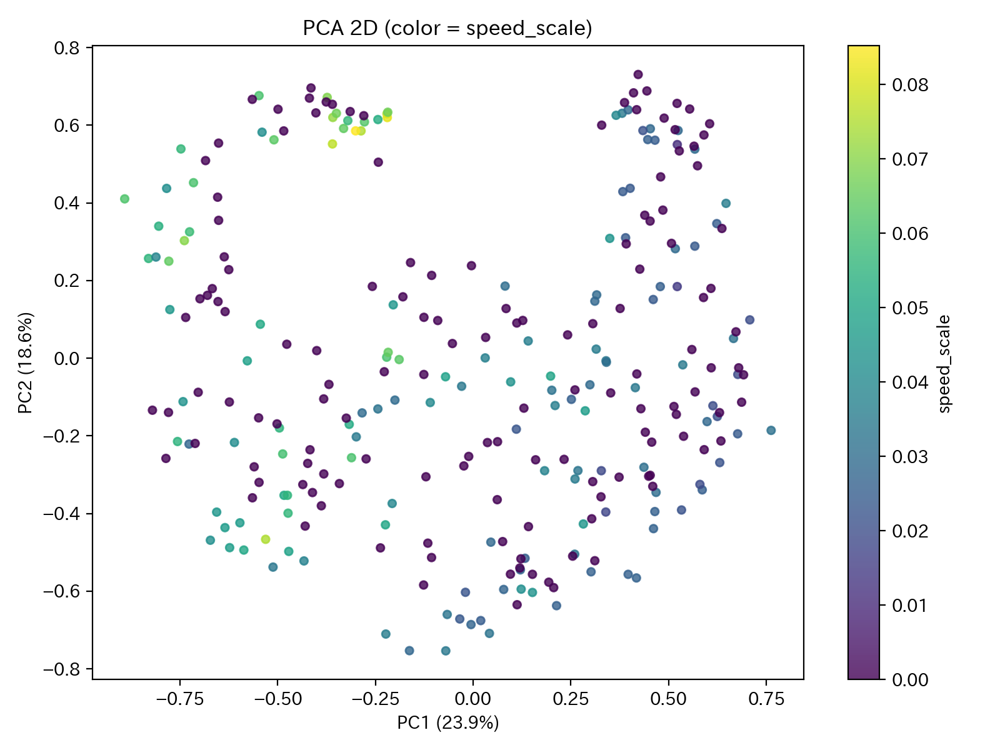
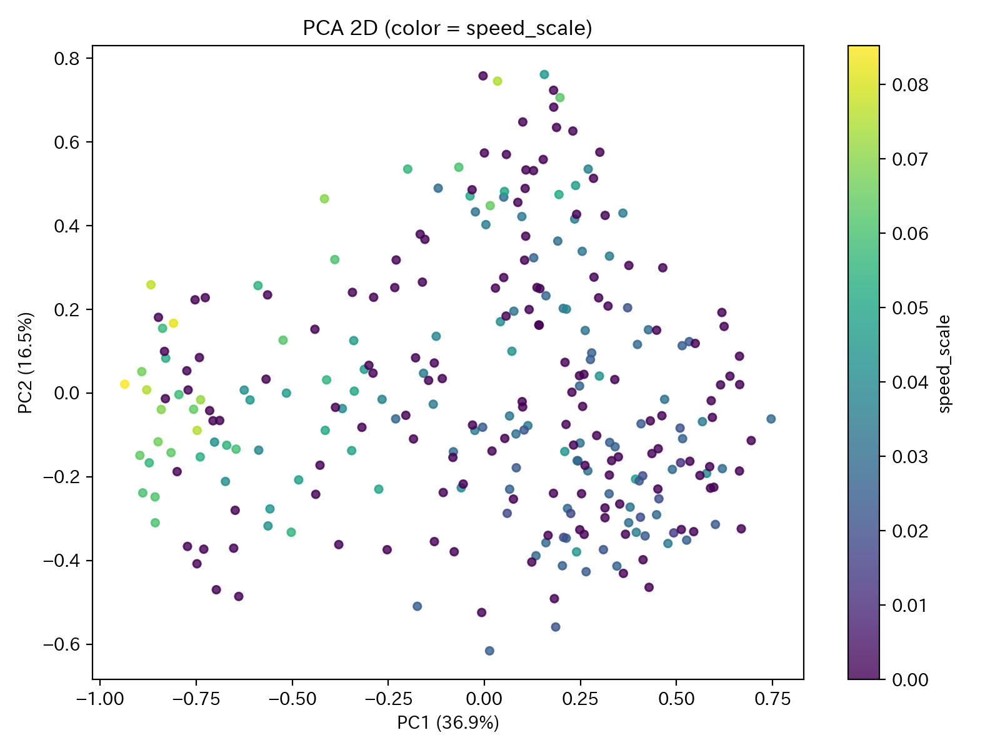
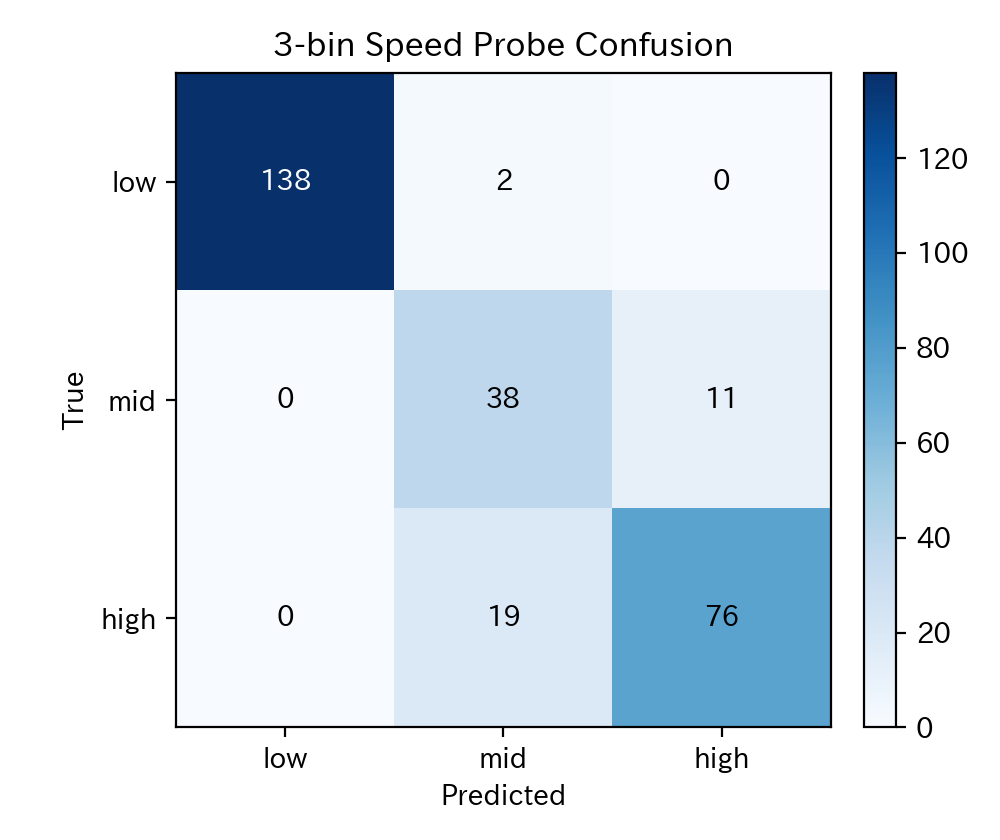
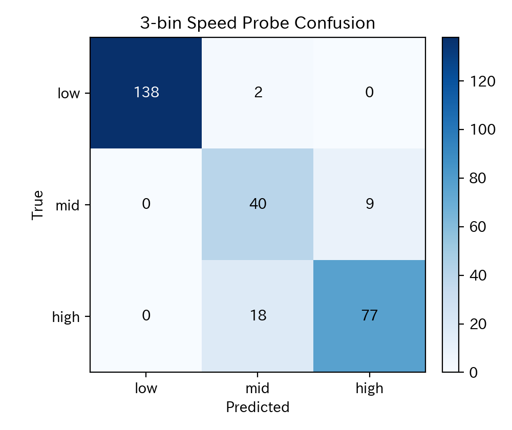

# MotionCLIP Latent Speed Separation Comparison (2026-02-07)

## 目的
この実験は、次を定量的に確認するために行った。
- HOYO の歩行モーションに対して、MotionCLIP latent から速度情報を復元できるか
- その傾向が新旧2runでどう違うか

本稿では、**回帰 + 分類 + permutation test** を主軸にする。

---

## 比較対象 run
- 新: `20260127_contrastive_vae_fine_lambda_vae_sarashina_fine_lv0.12_temp0.05_lc2.0_lv0.12_s43_f2000_full8000_full`
- 旧: `20260109_optuna_trial1_full`

---

## 評価フロー（主）

### 1. HOYO 284サンプルの latent を抽出
- 対象: オノマトペ付き歩行モーション 284サンプル
- 各runの `motionclip_full_joint_best.pth`（無ければ `final`）で同一サンプルをエンコード
- 出力: 各サンプルの L2正規化 latent ベクトル

### 2. 各サンプルの速度を2D関節から計算
`compute_scale_speed_per_s` を使用。
- head(0) と mid-feet(10,13) 距離の時間変化を利用
- `log(scale)` の時間傾きを速度代理指標とする
- 代理速度: `speed = max(0, slope)`

### 3. 回帰評価（連続速度）
- 入力: latent
- 目的変数: サンプル速度（連続値）
- モデル: `StandardScaler -> Ridge(alpha=1.0)`
- 評価: 5-fold OOF
- 指標: `Spearman rho`, `R2`, `MAE`

狙い:
- latent から連続速度を復元できるか（recoverability）

### 4. 分類評価（速度帯）
- 速度を3分位で `low / mid / high` に分割
- モデル: `StandardScaler -> LogisticRegression(class_weight='balanced')`
- 評価: 5-fold OOF
- 指標: `macro-F1`, `balanced accuracy`

狙い:
- latent 上で速度帯が分離しているか

### 5. permutation test（偶然性の排除）
- 回帰: `rho` の permutation p値（1000回）
- 分類: `macro-F1` の permutation p値（1000回）

狙い:
- 「たまたま当たった」可能性を下げる

### 6. 新旧run比較
- 同一サンプル集合・同一速度ベクトルで run A/B を比較
- 判定は主に `sample rho + probe macro-F1 + p値` の組で見る

---

## 実行条件
- スクリプト: `hoyo_v1_1/viz/analyze_latent_speed_separation.py`
- サンプル数: `N=284`
- CV: `5-fold`
- permutation: `1000`

実行コマンド:
```bash
/home/jouta/venvs/motionclip/bin/python hoyo_v1_1/viz/analyze_latent_speed_separation.py \
  --run-a 20260127_contrastive_vae_fine_lambda_vae_sarashina_fine_lv0.12_temp0.05_lc2.0_lv0.12_s43_f2000_full8000_full \
  --run-b 20260109_optuna_trial1_full
```

---

## 主結果（回帰+分類+permutation）
| Metric | 新run | 旧run | Delta (新-旧) |
|---|---:|---:|---:|
| Sample Spearman rho | 0.907222 | 0.913492 | -0.006269 |
| Regression R2 | 0.834894 | 0.879943 | -0.045049 |
| Regression MAE | 0.007198 | 0.006337 | +0.000860 |
| Probe macro-F1 (3bin) | 0.843891 | 0.859193 | -0.015302 |
| Probe balanced acc (3bin) | 0.853741 | 0.870856 | -0.017114 |
| Perm p (rho) | 0.000999 | 0.000999 | 0.000000 |
| Perm p (macro-F1) | 0.000999 | 0.000999 | 0.000000 |

補足:
- 3bin境界（両run共通）: `[0.0, 0.0292808]`
- 3binクラス件数（両run共通）: `low=140, mid=49, high=95`（全クラス非空）
- 両runとも `pass_speed_reflection=True`

---

## 解釈
- 言えること:
  - 両runとも、sample-level 回帰は高い復元性能を示す（rho: 新0.907 / 旧0.913, R2: 新0.835 / 旧0.880）。
  - 3bin は全クラス非空（low=140, mid=49, high=95）で、分類も有意に機能している（macro-F1: 新0.844 / 旧0.859, permutation p=0.000999）。
  - 本比較条件では、旧runが回帰・分類の両方で僅差優位。
- まだ言えないこと:
  - 「速度を意図的・因果的にエンコードしている」ことまではこの解析だけでは断定できない。
  - RLで必ず性能向上することは未検証（潜在の可読性と制御可能性は別）。
- RL観点での含意:
  - 少なくとも latent に速度情報が十分載っているため、速度系 reward をかける土台はある。
  - 一方で、新runが旧runより速度反映で優れる根拠は本結果からは得られていない。

---

## 補助解析（参考）
主評価ではないが、補助として次も保存している。
- label-order consistency（ラベル速度順位の Spearman）
- semantic固定境界分類（fast/mid/slow）

今回値（参考）:
- label-rank rho: 新旧とも `0.927273`
- semantic macro-F1: 新 `0.933845`, 旧 `0.880369`

---

## 生成物
- 比較サマリ: `docs/experiments/assets/20260207_motionclip_speed_latent/comparison_summary.md`
- 比較CSV: `docs/experiments/assets/20260207_motionclip_speed_latent/comparison_metrics.csv`
- 新run詳細: `docs/experiments/assets/20260207_motionclip_speed_latent/run_20260127_contrastive_vae_fine_lambda_vae_sarashina_fine_lv0.12_temp0.05_lc2.0_lv0.12_s43_f2000_full8000_full/`
- 旧run詳細: `docs/experiments/assets/20260207_motionclip_speed_latent/run_20260109_optuna_trial1_full/`

---

## 図
### 新run PCA（速度着色）


### 旧run PCA（速度着色）


### 新run 3bin混同行列


### 旧run 3bin混同行列

