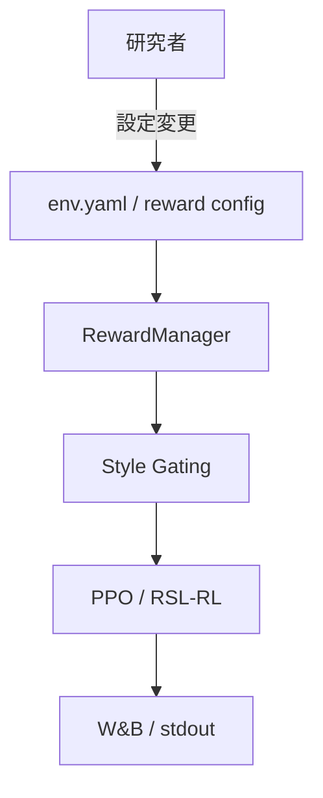
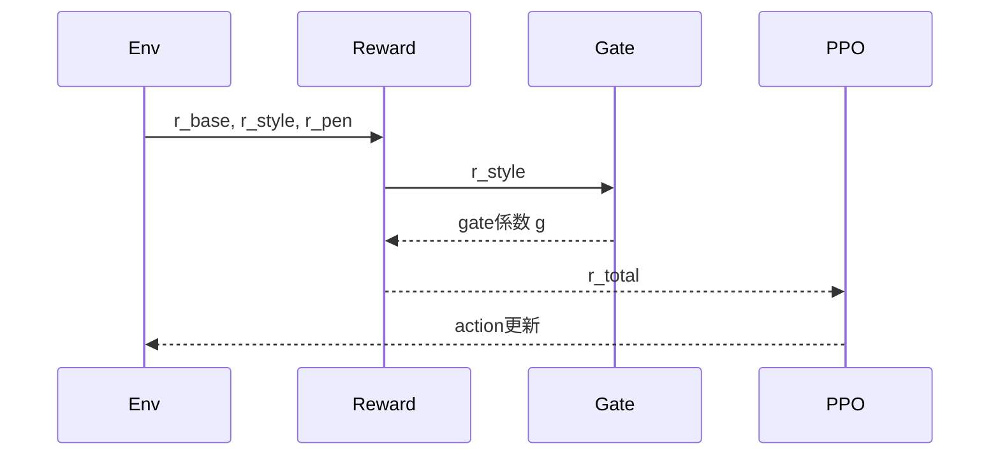

# 機能設計書 (Functional Design Document)

## タイトル
**Style Dominant Reward Gating 設計（方針B）**

## 背景 / 課題
- 現状は **velocity追従系の報酬（track_lin_vel_xy_exp）** が支配的で、style の存在感が弱い
- 旧モデルでは style 寄与が強いが、**暴れや関節偏り**が強い傾向がある
- 「**style を出さないと報酬が伸びない構造**」にして、支配性を構造的に確保したい

---

## システム構成図

---

## 技術スタック

| 分類 | 技術 | 選定理由 |
|------|------|----------|
| 言語 | Python | 既存RL基盤がPython | 
| シミュレータ | Isaac Sim / IsaacLab | H1環境が既に構築済み |
| RLフレームワーク | RSL-RL (PPO) | 既存実装との整合 |
| ロギング | W&B / JSON | 学習中・評価後の比較容易 |

---

## 設計方針（方針B）

### 目的
- **style報酬が“支配的”になる**ように設計
- 同時に **暴れ（mean_action_sq増大）**を抑える

### 基本方針
1. **style報酬を gating に利用**し、styleが低いと総報酬が伸びない構造にする
2. gating は **過剰な破綻を避けるために連続関数**で実装する
3. 行動暴れを抑えるために **action penalty を保持/強化**する

---

## アルゴリズム設計

### 記号定義
- $r_{\text{base}}$: 歩行の基礎報酬（速度追従、姿勢安定など）
- $r_{\text{style}}$: style報酬（例: cos(z_motion, z_text)）
- $r_{\text{pen}}$: ペナルティ（action, joint deviation 等）
- $g(\cdot)$: gating関数
- $\gamma$: 割引率

---

### 案B-1: 乗算ゲーティング（シンプル）

**総報酬**:
$$r_t = r_{\text{base}} \cdot (1 + \alpha \cdot g(r_{\text{style}})) + r_{\text{pen}}$$

- $g$ は **0〜1** の範囲に正規化されたstyle指標
- $\alpha$ を上げるほど style が報酬に効く

**候補関数**:
- 線形: $g(s)=\mathrm{clip}\left(\frac{s-s_0}{s_1-s_0}, 0, 1\right)$
- シグモイド: $g(s)=\sigma(k(s-\tau))$

---

### 案B-2: 閾値ゲーティング（スタイル最低保証）

**総報酬**:
$$r_t = r_{\text{base}} \cdot g(r_{\text{style}}) + r_{\text{pen}}$$

**gating**:
$$g(s)=\begin{cases}
0 & (s < \tau) \\
1 & (s \ge \tau)
\end{cases}$$

- style が閾値未満なら「基礎報酬を切る」
- 強いが壊れやすいので **学習中は非推奨**（段階導入向き）

---

### 案B-3: ペナルティ型（style不足を罰する）

$$r_t = r_{\text{base}} + r_{\text{style}} + r_{\text{pen}} - \lambda \cdot \max(0, \tau - r_{\text{style}})$$

- style が低いと追加ペナルティ
- 乗算ではなく **減点で制約**するタイプ

---

## パラメータ設計（初期案）

| パラメータ | 役割 | 初期値案 | 備考 |
|---|---|---|---|
| $\alpha$ | style影響度 | 0.5〜1.5 | 乗算ゲートの場合 |
| $\tau$ | style閾値 | 0.02〜0.05 | 過去の平均style参考 |
| $k$ | シグモイド勾配 | 10〜30 | 急峻すぎ注意 |
| $\lambda$ | style不足ペナルティ | 0.2〜0.5 | 罰則型の場合 |

---

## ログ設計（W&B / JSON）

### 追加で確認すべき指標
- `Train/Reward/style_score_mean`（style平均）
- `Train/Reward/gate_mean`（gating係数平均）
- `Train/Contrib/rate_mag/*`
- `Train/Contrib/rate_adv/*`
- `Train/Contrib/share_E/*`
- `Train/Reward/mean_action_sq`

---

## 期待される効果
- **style寄与が報酬の中心に移る**
- 速度追従が従属的な位置に落ち、styleが主役になる

---

## リスクと対策

| リスク | 内容 | 対策 |
|---|---|---|
| 学習崩壊 | styleが弱い初期に報酬が出ず崩れる | gateを緩めて段階導入（A→B） |
| 暴れ | style寄与が増えて行動が激化 | action penalty を強化 |
| 速度低下 | velocity報酬が下がり過ぎる | r_base最低保障 or clamp |

---

## ユースケース（学習ステップの流れ）

---

## 実験計画（最初に試す順）
1. **B-1（乗算ゲーティング）** を小さめの $\alpha$ で試す
2. 暴れが出る場合は **action penalty 増強**
3. 安定性が確保できたら **B-2/B-3 へ段階的に移行**

---

## 今後の拡張
- style だけでなく **style×速度一致** の複合指標を gating に利用
- share^E の偏りが大きい関節に追加ペナルティ

---

## 参考
- 既存指標: `rate^mag`, `rate^adv`, `share^E`, `mean_action_sq`
- 評価スクリプト: `legged-loco/scripts/eval_motion.py`

