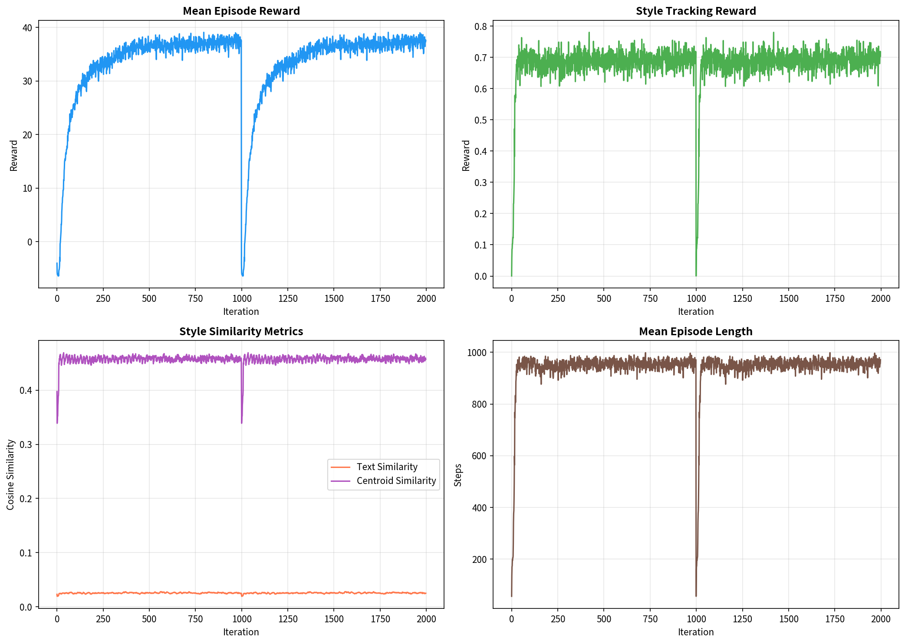
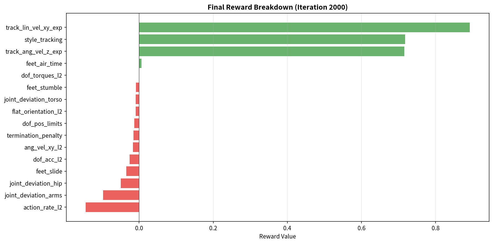
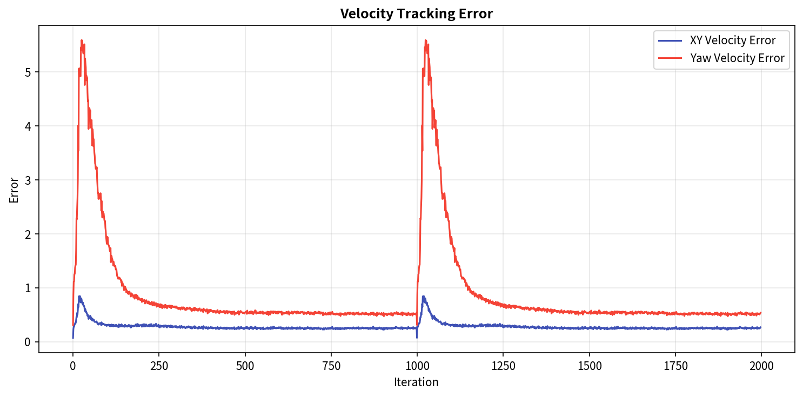

# 実験設定サマリ (Phase 1: NaVILA + H1 Vision)

現在の学習設定（`h1_low_vision_cfg.py`）の概要です。

## 1. アルゴリズム (Algorithm)
**Hybrid Residual Policy (部分ファインチューニング + 残差)** を採用します。
ベースモデルの能力を維持しつつ、スタイル適応のために一部の重みを再学習(Unfreeze)させます。

*   **ポリシー構造**:
    *   $a_{total} = \pi_{base}(o_{base}) + \lambda \cdot \pi_{residual}(o_{base}, z_{style})$
    *   **Base Policy**: 事前学習済みモデルを使用。**最終層近傍のみ学習許可 (Partial Fine-tuning)**、下層は固定。
    *   **Residual Policy**: 新規学習（スタイル条件付き）
    *   **Residual Scale ($\lambda$)**: `0.1` (初期設定)
*   **学習手法**: PPO (Proximal Policy Optimization)

## 2. ベースモデル (Base Model)
*   **Checkpoint**: `/home/jouta/NaVILA-Bench/logs/rsl_rl/h1_vision_rough/2024-11-03_15-08-09_height_scan_obst/model_4999.pt`
*   **入力**: 視覚情報（Height Scan）を含む歩行ポリシー

## 3. 観測空間 (Observation Space)
`policy` グループ（Actorへの入力）には、基本観測に加え **スタイル潜在変数** が追加されています。

| 観測項目 | 次元 | 説明 | 備考 |
| :--- | :--- | :--- | :--- |
| `base_lin_vel` | 3 | ベース並進速度 | |
| `base_ang_vel` | 3 | ベース角速度 | |
| `projected_gravity` | 3 | 重力ベクトル射影 | |
| `velocity_commands` | 3 | 指示速度 (x, y, yaw) | |
| `joint_pos` | 19 | 関節位置 (相対) | |
| `joint_vel` | 19 | 関節速度 | |
| `actions` | 19 | 前ステップの行動 | |
| `height_scan` | N | 地形ハイトスキャン | Vision対応 |
| **`style_latents`** | **512** | **オノマトペ/テキスト潜在変数** | **今回追加** |

## 4. 報酬関数 (Reward Function)
基本的な歩行報酬 (`H1Rewards`) に、スタイル追従報酬を追加しています。

### 追加・変更された報酬
| 報酬項 | 重み (Weight) | 説明 | パラメータ |
| :--- | :--- | :--- | :--- |
| **`style_tracking`** | **0.5** | スタイル追従報酬 | `beta_text=0.5`<br>`beta_centroid=0.5` |
| `feet_stumble` | -0.5 | 足のつまずきペナルティ | `CustomH1Rewards` で再定義 |

#### 報酬設計: 対照学習に基づくスタイル報酬 (Contrastive Style Reward)
本実装では、**MotionCLIP** の対照学習済み潜在空間（Latent Space）を利用して報酬を計算します。
MotionCLIPは、**「動作（Motion）」**と**「テキスト（Text/Onomatopoeia）」**を同じ512次元の空間に写像するように学習されています。この空間では、意味的に対応する動作とテキストのベクトルが近く（コサイン類似度が高く）なります。

#### 1. 報酬計算の仕組み
強化学習のエージェントが生成した動作 ($Motion_{agent}$) をリアルタイムにエンコードし、ターゲットとなるオノマトペ ($Text_{target}$) との距離を縮めるように報酬を与えます。

*   **動作エンコーダ**: $z_{agent} = \text{Encoder}_{motion}(Motion_{agent})$
    *   H1ロボットの動作をMotionCLIPの入力形式（14関節, X-Z平面投影）に変換してエンコードします。
*   **テキストエンコーダ**: $z_{text} = \text{Encoder}_{text}(Text_{target})$
    *   ターゲットとなるオノマトペ（例: "すたすた"）をエンコードします。
*   **スタイル重心 (Centroid)**: $z_{centroid}$
    *   そのオノマトペに対応する、学習データセット内の平均的な動きのベクトル。
    *   テキストだけでなく、実際のモーションデータの分布中心にも近づけることで、動作の自然さを担保します。

#### 2. 報酬式
最終的なスタイル報酬 ($R_{style}$) は、以下の2つのコサイン類似度の重み付け和で計算されます。

```math
R_{style} = \beta_{text} \cdot \underbrace{\cos(z_{agent}, z_{text})}_{\text{テキスト指示への追従}} + \beta_{centroid} \cdot \underbrace{\cos(z_{agent}, z_{centroid})}_{\text{自然な動作の正則化}}
```

*   **$\beta_{text}=0.5$**: テキスト（オノマトペ）の意味内容にどれだけ合っているか。
*   **$\beta_{centroid}=0.5$**: そのスタイルの典型的な動き（重心）から外れすぎていないか（Out-of-Distributionの防止）。

これにより、エージェントは**「物理シミュレーション上で転倒せずに歩く」**という基本タスクを満たしつつ、**「潜在空間上でオノマトペの意味に近い動きをする」**ように誘導されます。

#### 補足: 入力データの前処理（幾何学的修正）
ロボットの進行方向（Heading）に依存せず正しくスタイルを評価するため、以下の座標変換を行ってから $z_{agent}$ を計算しています。
1.  **3Dバッファリング**: ワールド座標 (3D) とHeadingをバッファに保存。
2.  **Canonical Frameへの回転**: 動作ウィンドウの基準（フレーム0）のHeadingをキャンセルするように、入力軌跡全体をZ軸周りで逆回転させます（Heading 0 = +X 方向への相対運動に正規化）。
2.  **2D投影**: 正規化後に、矢状面（Sagittal Plane: X-Z）へ投影して MotionCLIP に入力します。

### 基本報酬 (Base Rewards, from `H1Rewards`)
`h1_low_vision_cfg.py` および `H1Rewards` で設定されている、基本歩行のための報酬です。これらは物理的な安定性と指示速度への追従を保証します。

| 報酬項 | 重み | 数式 / 説明 |
| :--- | :--- | :--- |
| **Linear Velocity Tracking** | 1.0 | $\exp(-\|v_{xy}^{cmd} - v_{xy}\|^2 / \sigma^2)$ <br> 平面速度 ($v_x, v_y$) が指示値に近いほど報酬 (RBFカーネル)。 |
| **Angular Velocity Tracking** | 1.0 | $\exp(-(\omega_z^{cmd} - \omega_z)^2 / \sigma^2)$ <br> 旋回速度 ($\omega_z$) が指示値に近いほど報酬。 |
| **Feet Air Time** | 0.25 | $\sum_{feet} t_{air} \cdot \mathbb{I}[t_{air} > 0.4]$ <br> 足が長時間(0.4s以上)浮いている＝大きく歩いていると報酬。 |
| **Flat Orientation** | -1.0 | $-\|g_{xy}\|^2$ <br> 重力ベクトルのXY成分（傾き）に対するペナルティ。直立維持。 |
| **Action Rate** | -0.005 | $-\|a_t - a_{t-1}\|^2$ <br> 行動(PDターゲット)の急激な変化を抑制。滑らかさ。 |
| **Joint Acceleration** | -1.25e-7 | $-\|\ddot{q}\|^2$ <br> 関節加速度の抑制（振動防止、省エネ）。 |
| **Feet Stumble** | -0.5 | $-\mathbb{I}[\text{hit\_obs}]$ <br> 足がつまずいた（障害物に接触した）場合のペナルティ。 |

※ `Linear Velocity Penalty (z)` (上下動ペナルティ) や `Undesired Contacts` は、本設定では **無効化 (None)** されています。これは視覚を使って障害物を乗り越える際に、上下動や一時的な接触が必要になるためです。

### W&B ログの報酬キー対応表（どれがどの報酬か）
W&B に出るキー名が「どの報酬に対応するか」を、**実装コード起点**で整理しました。

#### 1) RSL-RL が必ず出す全体指標（合計報酬）
| W&B Key | 内容 | 補足 |
| :--- | :--- | :--- |
| `Train/mean_reward` | **総報酬の平均**（直近100エピソードの合計報酬） | 重み付き報酬の合計（全 RewTerm の和） |
| `Train/mean_reward_time` | 上記の time 軸版 | W&B 側で名前が置換される |
| `Train/mean_episode_length` | エピソード長の平均 | |
| `Train/mean_episode_length_time` | 上記の time 軸版 | W&B 側で名前が置換される |

#### 2) style_reward が追加で出すメトリクス（env.extras 経由）
※ これらは `legged-loco/.../mdp/rewards/style_rewards.py` で **明示的に env.extras に追加**している指標。

| W&B Key | 中身 | 意味 |
| :--- | :--- | :--- |
| `metrics/style_text_sim` | $\cos(z_{agent}, z_{text})$ | **テキスト指示への一致度** |
| `metrics/style_teacher_motion_sim` | $\cos(z_{agent}, z_{teacher})$ | **教師モーションへの一致度** |
| `metrics/style_reward_raw` | $\beta_{text} \cdot \text{TextSim} + \beta_{teacher} \cdot \text{TeacherSim}$ | **style_tracking の素点（重み未適用）** |
| `metrics/style_warmup_ratio` | バッファ充足率 | ウォームアップ完了率（0〜1） |

> **style_tracking の実寄与**は  
> `style_tracking.weight * metrics/style_reward_raw`  
> （現在の weight は `h1_low_vision_cfg.py` で **3.0**）

#### 3) style_reward のデバッグログ（直接 wandb.log）
※ `style_rewards.py` が **10ステップごと**に直接ログ。

| W&B Key | 中身 | 意味 |
| :--- | :--- | :--- |
| `debug/style_text_sim` | TextSim | デバッグ用（平均） |
| `debug/style_teacher_motion_sim` | TeacherSim | デバッグ用（平均） |
| `debug/style_reward_raw` | RawReward | デバッグ用（平均） |
| `debug/style_reward_min` | min(RawReward) | ばらつき確認 |
| `debug/style_reward_max` | max(RawReward) | ばらつき確認 |

#### 4) もし「個別の基本報酬」が見えない場合
現状のログは **`Train/mean_reward` が中心**で、  
**各 RewTerm（例: lin_vel / ang_vel / feet_air_time など）の内訳は自動では出ません**。  
もし W&B に内訳を出したい場合は、**各報酬項目を env.extras に追加**する必要があります  
（style_reward の `metrics/*` と同じ方式）。

## 5. その他設定
*   **タスク名**: `h1_vision`
*   **スタイルコマンド**: `StyleCommandGeneratorCfg` (ランダムなオノマトペ/テキスト埋め込みを生成)

## 6. H1 → HOYO (MotionCLIP) マッピング
H1ロボットの多関節 (19DoF/Many Links) を、MotionCLIPが前提とする HOYOスケルトン (14 Joints) に変換する際のマッピング仕様です。
実装: `style_module.py` (`_get_hoyo_joints_from_h1`)

### リンク対応表 (Mapping Table)
以下の対応関係で、H1のリンク位置が抽出されます。頭部・手先などH1シミュレーションモデルに存在しない(または簡略化されている)部位は、親リンクからのオフセットで近似しています。

| Index | HOYO Joint Name | H1 Link (Mapped) | Offset (Local) | 補足 |
| :--- | :--- | :--- | :--- | :--- |
| 0 | `Head` | `torso_link` | `[0.0, 0.0, 0.25]` | Torsoから上(+Z)へ25cm |
| 1 | `Neck` | `torso_link` | - | Torso位置を代用 |
| 2 | `R-Shoulder` | `right_shoulder_pitch_link` | - | |
| 3 | `R-Elbow` | `right_elbow_link` | - | |
| 4 | `R-Hand` | `right_elbow_link` | `[0.30, 0.0, 0.0]` | Elbowから前(+X)へ30cm |
| 5 | `L-Shoulder` | `left_shoulder_pitch_link` | - | |
| 6 | `L-Elbow` | `left_elbow_link` | - | |
| 7 | `L-Hand` | `left_elbow_link` | `[0.30, 0.0, 0.0]` | Elbowから前(+X)へ30cm |
| 8 | `R-Hip` | `right_hip_yaw_link` | - | |
| 9 | `R-Knee` | `right_knee_link` | - | |
| 10 | `R-Ankle` | `right_ankle_link` | - | |
| 11 | `L-Hip` | `left_hip_yaw_link` | - | |
| 12 | `L-Knee` | `left_knee_link` | - | |
| 13 | `L-Ankle` | `left_ankle_link` | - | |

### 補正処理 (Offset Logic)
*   **オフセット適用**: 親リンク（例: `right_elbow_link`）の回転（四元数）に従って、ローカルオフセットベクトルを回転させ、ワールド座標に加算しています。これにより、腕を振ったときに手先位置も連動して動くようになっています。

## 7. 実験計画 (Weekly Schedule)
**期間**: 12/9 (Mon) - 12/15 (Sun)

### Day 1 (12/9): 実装 & 動作確認
*   **Partial Fine-tuning実装**: `ResidualActorCritic` を修正し、ベースポリシーの最終層(出力層)の学習を解禁する。
*   **競合報酬の調整**: `h1_low_vision_cfg.py` を編集し、`style_tracking` の重みを **1.0** に増強、`feet_air_time` を **0.1** に緩和した設定を用意する。
*   **Dry Run**: エラーなく学習が回り、勾配がベースモデルの一部に流れていることを確認する。

### Day 2 (12/10): ベースライン学習 (Stability Check)
*   **初期学習**: `residual_scale=0.1`, `style_weight=1.0` で学習を開始。
*   **安定性確認**: 転倒せずに学習が進むかを確認。Partial FTによる「破滅的な忘却（歩けなくなる）」が起きないか監視。
*   **ログ確認**: `metrics/style_text_sim` が上昇しているか確認。

### Day 3 (12/11): パラメータチューニング (Reward Weights)
*   **スタイル強度調整**: Day 2の結果を見て、スタイル表現が弱い場合（普通の歩きに見える場合）、`style_weight` を **2.0 〜 5.0** に上げて再走させる。
*   **ベース報酬緩和**: 「すり足」などがペナルティで消されている場合、`feet_air_time` や `flat_orientation` をさらに下げる。

### Day 4 (12/12): 表現力チューニング (Residual Scale)
*   **Scale実験**: より大げさな動きを出すため、`residual_scale` を **0.3 〜 0.5** に上げたバージョンを学習させる。
*   **トレードオフ評価**: スケールを上げたことによる転倒率の増加と、スタイル再現度のバランスを見る。

### Day 5 (12/13): 定性評価 & 可視化
*   **推論 (Play)**: 学習済みモデルで `play.py` を回し、異なるオノマトペ（「すたすた」「のしのし」「よろよろ」）を入力して挙動を目視確認。
*   **動画作成**: 成功ケース・失敗ケースの動画を記録。

### Day 6 (12/14): 個別スタイルの修正 (Edge Cases)
*   **苦手スタイルの分析**: 例えば「よろよろ（ふらつき）」が「直立報酬」に消されていないか、「せかせか」が「Action Rateペナルティ」に消されていないかを確認。
*   **特定スタイルの救済**: 必要であれば、特定のスタイル入力時のみ特定のペナルティを無効化するなどのロジック検討（今回はそこまで実装しない可能性大）。

### Day 7 (12/15): 予備日・まとめ
*   **Phase 1 総括**: 「H1ロボットでオノマトペ歩行が可能か」の結論を出す。
*   **Phase 2 計画**: 視覚情報（段差乗り越え）との両立についての課題整理。

---

## 8. 実験結果 (2025-12-16 ~ 12-17)

### 8.1 学習設定（最終版）

| パラメータ | 値 | 備考 |
| :--- | :--- | :--- |
| **WandB Run ID** | `kl8p9g77` (navila-bench6) | |
| **Log Dir** | `2025-12-16_13-50-23_trial_h1_vision` | |
| **Iterations** | 2000 | |
| **Environments** | 2048 | |
| **Residual Scale** | 0.1 | |
| **Style Dim** | 512 | |
| **History Length** | 9 | Proprioception履歴 |
| **Style Tracking Weight** | **3.0** | 当初の0.5から増加 |
| **Feet Air Time Weight** | 0.1 | 当初の0.25から緩和 |

### 8.2 学習曲線

#### 主要メトリクス（最終イテレーション）
| メトリクス | 値 | 説明 |
| :--- | :--- | :--- |
| **Mean Reward** | 37.56 | エピソード平均報酬 |
| **Mean Episode Length** | 970.9 steps | 約19.4秒（転倒せず歩行継続） |
| **Style Tracking Reward** | 0.72 | スタイル報酬の寄与 |
| **Style Text Similarity** | 0.025 | テキスト埋め込みとの類似度 |
| **Style Centroid Similarity** | 0.46 | セントロイドとの類似度 |
| **Velocity XY Error** | 0.27 | 指示速度との誤差 |

#### 学習曲線グラフ


*図1: (左上) 平均報酬、(右上) スタイル追従報酬、(左下) スタイル類似度（Text vs Centroid）、(右下) エピソード長*

#### 報酬分解


*図2: 最終イテレーション時点での各報酬項目の値。緑=正の報酬、赤=ペナルティ*

#### 速度追従エラー


*図3: 学習中の速度追従エラー（XY平面速度、Yaw角速度）*

### 8.3 オノマトペ別評価結果

各オノマトペを固定して500ステップ推論し、動きの特徴を比較した結果：

| オノマトペ | Vel X | AngVel Z | Roll | Pitch | TextSim | CentrSim |
| :--- | ---: | ---: | ---: | ---: | ---: | ---: |
| **通常** | -0.475 | -0.154 | 0.0202 | 0.0574 | 0.0401 | 0.4758 |
| **すたすた** | **0.507** | 0.066 | 0.0257 | 0.0743 | -0.0064 | 0.3593 |
| **せかせか** | **0.315** | 0.113 | 0.0258 | 0.0320 | -0.0246 | 0.5687 |
| **てくてく** | -0.750 | -0.153 | 0.0370 | 0.0726 | 0.0511 | 0.3772 |
| **どっしどっし** | -0.588 | -0.294 | 0.0258 | 0.0937 | 0.0915 | 0.3975 |
| **とぼとぼ** | **0.002** | 0.012 | 0.0074 | 0.0570 | 0.0379 | 0.4694 |
| **のしのし** | -0.100 | -0.084 | 0.0243 | 0.0319 | 0.0522 | 0.3737 |
| **のろのろ** | **0.088** | -0.148 | 0.0254 | 0.0387 | 0.0455 | 0.3790 |
| **ぶらぶら** | 0.144 | 0.105 | 0.0145 | 0.0318 | -0.0352 | 0.3412 |
| **よたよた** | -0.117 | -0.083 | 0.0219 | 0.0453 | 0.0513 | 0.3778 |
| **よろよろ** | 0.689 | 0.250 | 0.0361 | 0.0532 | 0.0738 | 0.4285 |

### 8.4 考察

#### ポジティブな結果 ✅
1. **速度系オノマトペの分離**:
   - 「すたすた」(Vel X = 0.51) と「のろのろ」(Vel X = 0.09) で明確な速度差が出ている
   - 「とぼとぼ」(Vel X ≈ 0) はほぼ停止に近く、元気のない歩行を表現
   - 「せかせか」(Vel X = 0.32) も急いでいる感じが反映

2. **転倒しない学習**:
   - Mean Episode Length ≈ 971 steps（約20秒のエピソードをほぼ完走）
   - ベースポリシーの歩行能力を維持しつつスタイルを学習

3. **スタイル報酬の機能**:
   - `style_tracking` 報酬がプラスで推移（0.72）
   - Centroid類似度が安定（0.35〜0.57）

#### 課題・改善点 ❌
1. **Text Similarity が低い**:
   - TextSim ≈ 0.025 と低く、テキスト埋め込みへの追従が弱い
   - 原因候補: 
     - MotionCLIPの潜在空間とH1ロボットの動作空間のドメインギャップ
     - リターゲティング精度（H1→HOYO 14関節）の限界

2. **一部オノマトペで逆方向の動き**:
   - 「てくてく」(Vel X = -0.75) が後退している
   - 「どっしどっし」も後退傾向
   - 原因候補: 速度コマンドとスタイル報酬の競合

3. **オノマトペ間の差がまだ小さい**:
   - Roll/Pitch の差が微小（0.01〜0.04程度）
   - 「よろよろ（ふらつき）」が `flat_orientation` ペナルティで抑制されている可能性

### 8.5 次ステップへの提案

1. **スタイル報酬の重みをさらに上げる** (weight: 3.0 → 5.0 〜 10.0)
2. **Residual Scale を上げる** (0.1 → 0.3) で表現力を増加
3. **特定ペナルティの緩和**:
   - 「よろよろ」用に `flat_orientation` を緩和
   - 「せかせか」用に `action_rate` を緩和
4. **学習ステップ数を増やす** (2000 → 5000)
5. **ドメイン適応**: H1動作データでMotionCLIPを追加Fine-tuneする

### 8.6 実験バリアント整理（実施済みセット）

実際に回した3パターンを、変更点と狙いごとにまとめる（WandBのRun PathはOverviewから埋めてな）。

| バリアント | ベース読込 | 主な変更ハイパラ | 目的/ねらい | WandB Run Path |
| :--- | :--- | :--- | :--- | :--- |
| **A: Scratch + Low Style** | なし（ランダム初期化） | `style_tracking` 0.5〜1.0（低め）<br>`residual_scale` 0.1<br>PF: 出力層のみ学習可 | ベースなしでどこまで歩けるか＋スタイルだけで学習したときの下限 | `jouta15123-osaka-univercity/navila-bench/<run_id_a>` |
| **B: Base Load + Low Style** | あり（`model_4999.pt`） | `style_tracking` 0.5〜1.0（控えめ）<br>`residual_scale` 0.1<br>PF: 出力層だけUnfreeze + Residual | 歩行能力を維持しつつ、軽めのスタイル付与のベースライン | `jouta15123-osaka-univercity/navila-bench/<run_id_b>` |
| **C: Base Load + High Style** | あり（`model_4999.pt`） | `style_tracking` 3.0（現行）<br>`residual_scale` 0.1<br>`feet_air_time` 0.1（緩和）<br>PF: 出力層Unfreeze + Residual | ベース歩行を保ちつつスタイルを強める主力設定 | `jouta15123-osaka-univercity/navila-bench/kl8p9g77` |

- A→Bで「ベース有無」による歩行安定性の差を確認。B→Cで「スタイル強度アップ」による表現力向上と転倒率の変化を確認。
- 比較に使う共通メトリクス: `Mean Reward`, `Style Text Similarity`, `Style Centroid Similarity`, `Velocity XY Error`, `Mean Episode Length`。`run.history().to_csv(...)` で並べると楽。
