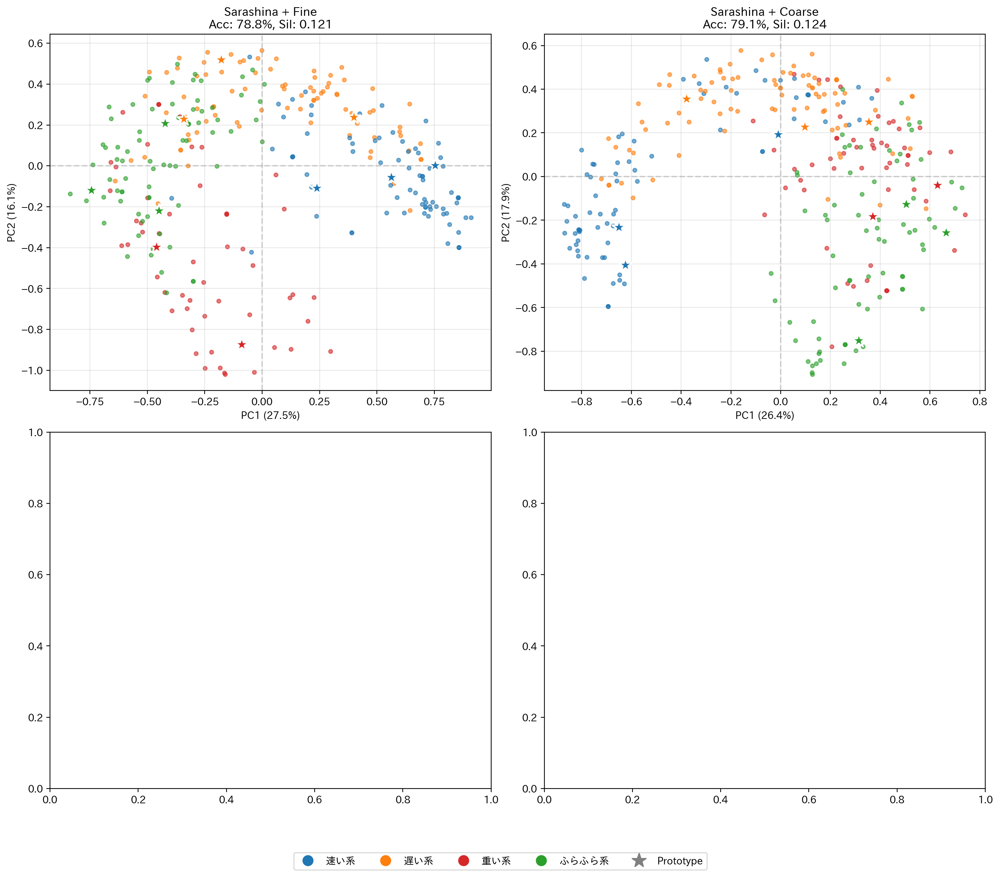
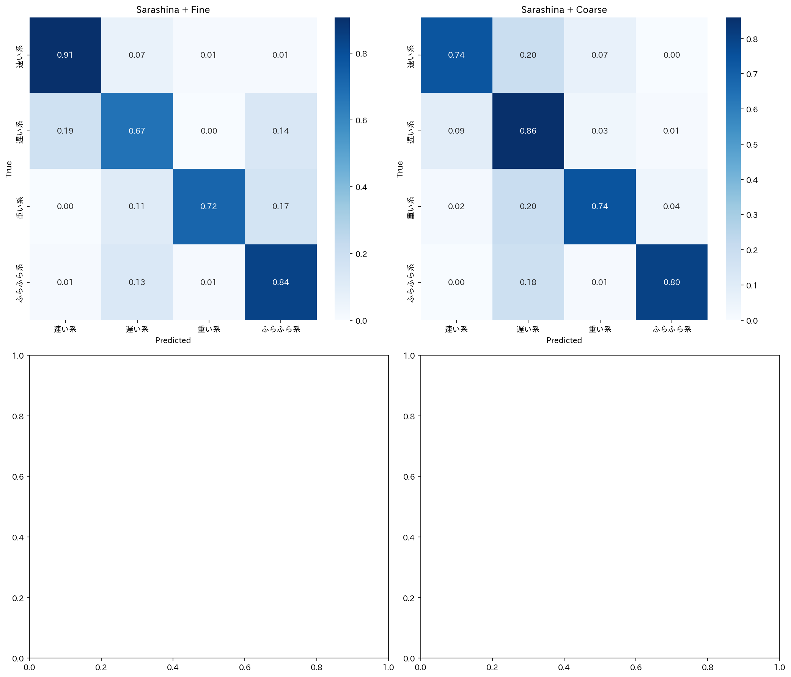
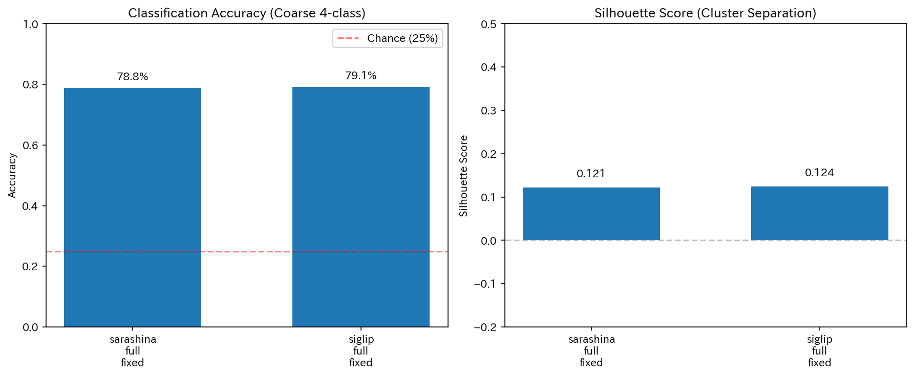
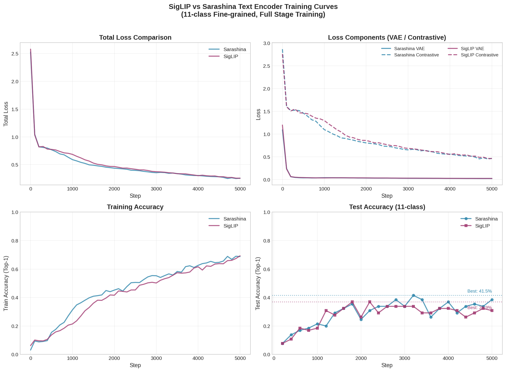
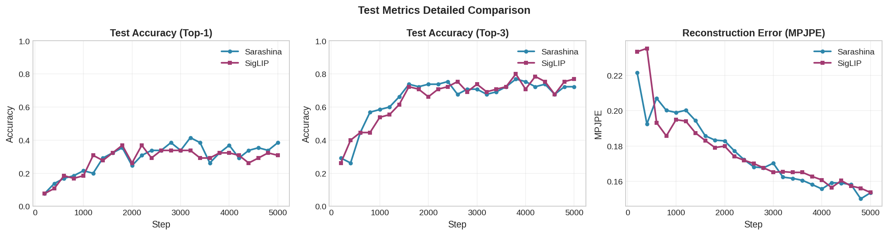

# HoYo + MotionCLIP 対照学習 分析レポート（バグ修正後）

**作成日時**: 2025年1月

## 1. 概要

本レポートは、Accuracy計算のバグ修正後に再実験した結果をまとめたものです。

### バグ修正内容

**修正前（誤り）**: バッチごとの精度を平均していた
```python
# 誤り: バッチサイズが異なると不正確
acc_list.append(batch_acc)
final_acc = np.mean(acc_list)
```

**修正後（正解）**: 正解数を数えてサンプル総数で割る
```python
# 正解: サンプル単位で正確にカウント
total_correct += (preds == labels).sum().item()
total_samples += len(labels)
final_acc = total_correct / total_samples
```

---

## 2. データセット統計

### HoYo Dataset

| 項目 | 値 |
|------|-----|
| 総サンプル数 | 292 |
| クラス数（細分類） | 11 |
| クラス数（粗分類） | 4 |
| フレーム数/サンプル | 60 |
| 関節数 | 14（2D座標） |

### ラベル分布

| ラベル（日本語） | サンプル数 |
|-----------------|-----------|
| 通常 | 32 |
| すたすた | 32 |
| せかせか | 22 |
| てくてく | 22 |
| どっしどっし | 32 |
| とぼとぼ | 22 |
| のしのし | 22 |
| のろのろ | 32 |
| ぶらぶら | 22 |
| よたよた | 22 |
| よろよろ | 32 |

### 粗分類マッピング（4クラス）

| 粗分類 | 細分類（含まれるラベル） |
|--------|------------------------|
| 速い系 | すたすた, せかせか, てくてく |
| 遅い系 | 通常, とぼとぼ, のろのろ |
| 重い系 | どっしどっし, のしのし |
| ふらふら系 | ぶらぶら, よたよた, よろよろ |

---

## 3. 学習設定

### モデルアーキテクチャ

- **モーションエンコーダ**: MotionCLIP VAE Encoder
  - 入力: (batch, 60, 14, 2) → HoYo skeleton format
  - 出力: 512次元潜在ベクトル
  
- **テキストエンコーダ（比較対象）**:
  - **Sarashina**: `sbintuitions/sarashina-embedding-v2-1b`（日本語特化、1B params）
  - **SigLIP**: `google/siglip-base-patch16-256-multilingual`（多言語対応、110M params）

### 学習パラメータ

```bash
# 共通パラメータ
--stage full
--steps 5000
--batch-size 32
--lr 5e-5
--lr-encoder 2e-5
--lr-decoder 2e-5
--lambda-contrastive 0.5
--lambda-vae 1.0
--temp 0.07
--seed 42
```

### 実行コマンド

```bash
# Sarashina
/home/jouta/venvs/motionclip/bin/python hoyo_v1_1/models/train_motionclip_joint.py \
  --stage full --steps 5000 --batch-size 32 \
  --lr 5e-5 --lr-encoder 2e-5 --lr-decoder 2e-5 \
  --lambda-contrastive 0.5 --lambda-vae 1.0 --temp 0.07 \
  --sem-encoder sarashina --run-name sarashina_full_fixed --seed 42

# SigLIP
/home/jouta/venvs/motionclip/bin/python hoyo_v1_1/models/train_motionclip_joint.py \
  --stage full --steps 5000 --batch-size 32 \
  --lr 5e-5 --lr-encoder 2e-5 --lr-decoder 2e-5 \
  --lambda-contrastive 0.5 --lambda-vae 1.0 --temp 0.07 \
  --sem-encoder siglip --run-name siglip_full_fixed --seed 42
```

---

## 4. 実験結果

### 4.1 学習曲線（Training時の検証精度）

| モデル | 最終 Test Acc@1 | 最高 Test Acc@1 |
|--------|----------------|----------------|
| Sarashina | 38.5% | 41.5% |
| SigLIP | 30.8% | 36.9% |

※ これは学習中の検証精度（Supervised Contrastive Loss使用時）

### 4.2 学習後の評価（Zero-shot like retrieval）

最終的なモーション埋め込みとテキスト埋め込みのコサイン類似度によるretrieval評価：

#### 11クラス分類（細分類）

| 指標 | Sarashina | SigLIP | 差分 |
|------|-----------|--------|------|
| Acc@1 | **67.1%** | 59.9% | +7.2pp |
| Acc@3 | **90.8%** | 90.8% | ±0.0pp |
| Silhouette | **0.058** | 0.034 | +0.024 |

#### 4クラス分類（粗分類）

| 指標 | Sarashina | SigLIP | 差分 |
|------|-----------|--------|------|
| Acc@1 | 78.8% | **79.1%** | -0.3pp |
| Acc@3 | 99.3% | **99.7%** | -0.4pp |
| Silhouette | 0.121 | **0.124** | -0.003 |

---

## 5. 考察

### 5.1 細分類（11クラス）での優位性

**Sarashina が +7.2pp 優位**

日本語オノマトペの微妙なニュアンスを捉える能力において、日本語特化モデル（Sarashina）が優れていることを示唆しています。特に：

- 「すたすた」vs「せかせか」vs「てくてく」のような、同じ「速い系」内での違い
- 「のろのろ」vs「とぼとぼ」のような、歩き方の質感の違い

これらの違いは日本語の音象徴（sound symbolism）に基づいており、日本語コーパスで事前学習されたSarashinaが有利と考えられます。

### 5.2 粗分類（4クラス）での同等性能

**両者がほぼ同等（差は0.3pp）**

粗い分類（速い/遅い/重い/ふらふら）では、両エンコーダが同等の性能を示しました。これは：

- 大まかな動作カテゴリは多言語モデルでも十分捉えられる
- SigLIPの視覚-言語対照学習の知識が動作概念にも転移している可能性

### 5.3 Acc@3の高さ

11クラスでもAcc@3が90%超えを達成しており、これは：

- 上位3候補に正解が含まれる確率が非常に高い
- 細分類でも大きく外れることは少ない
- 実用上、候補を絞り込む用途には十分使える

### 5.4 Silhouette Scoreの考察

- 11クラス: 0.03〜0.06（低め）→ クラス間の分離が不十分
- 4クラス: 0.12前後 → ある程度の分離が達成

潜在空間では4つの大きなクラスタが形成されつつも、11クラスの細かい区別は重なりが多いことを示唆しています。

---

## 6. 可視化

### 6.1 PCA可視化（潜在空間の分布）

モーション埋め込みをPCAで2次元に圧縮し、Sarashina vs SigLIP で比較：



### 6.2 混同行列（4クラス粗分類）

各エンコーダの予測結果と正解ラベルの対応：



### 6.3 メトリクス比較

Accuracy、Silhouette Scoreの比較：



### 6.4 学習曲線

学習中のLoss・Accuracyの推移：



### 6.5 テスト詳細メトリクス

Top-1, Top-3 Accuracy、MPJPEの詳細：



---

## 7. 結論

1. **細分類タスクにはSarashina（日本語特化）が有効**: 11クラス分類で+7.2pp の優位性
2. **粗分類では両者同等**: 4クラス分類では実質的な差なし
3. **実用的な精度を達成**: 4クラスで約80%、11クラスAcc@3で91%
4. **次のステップ**: この学習済みモデルをスタイル報酬関数として強化学習に組み込む

---

## 8. 今後の展望

### 8.1 強化学習への統合

学習済みモデルを `scripts/style_reward_module.py` に組み込み：

```python
reward_style = beta * cosine_similarity(z_motion, z_text)
```

### 8.2 改善の余地

- データ拡張（時間方向のaugmentation）
- より大きなバッチサイズでの学習
- ハードネガティブマイニングの導入
- モーションエンコーダのアーキテクチャ改善

---

## 付録: ファイル配置

```
hoyo_v1_1/
├── joint_training_results/
│   ├── sarashina_full_fixed/
│   │   ├── checkpoint_final.pt
│   │   └── latent_snapshot_final.npz
│   └── siglip_full_fixed/
│       ├── checkpoint_final.pt
│       └── latent_snapshot_final.npz
└── viz/
    └── outputs/
        └── encoder_comparison_fixed/
            ├── pca_comparison_2x2.png
            ├── confusion_comparison_2x2.png
            ├── metrics_comparison.png
            └── summary_report.txt
```
