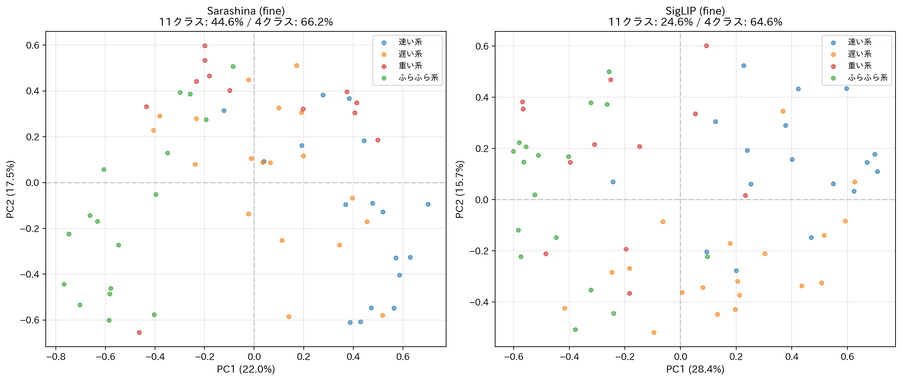
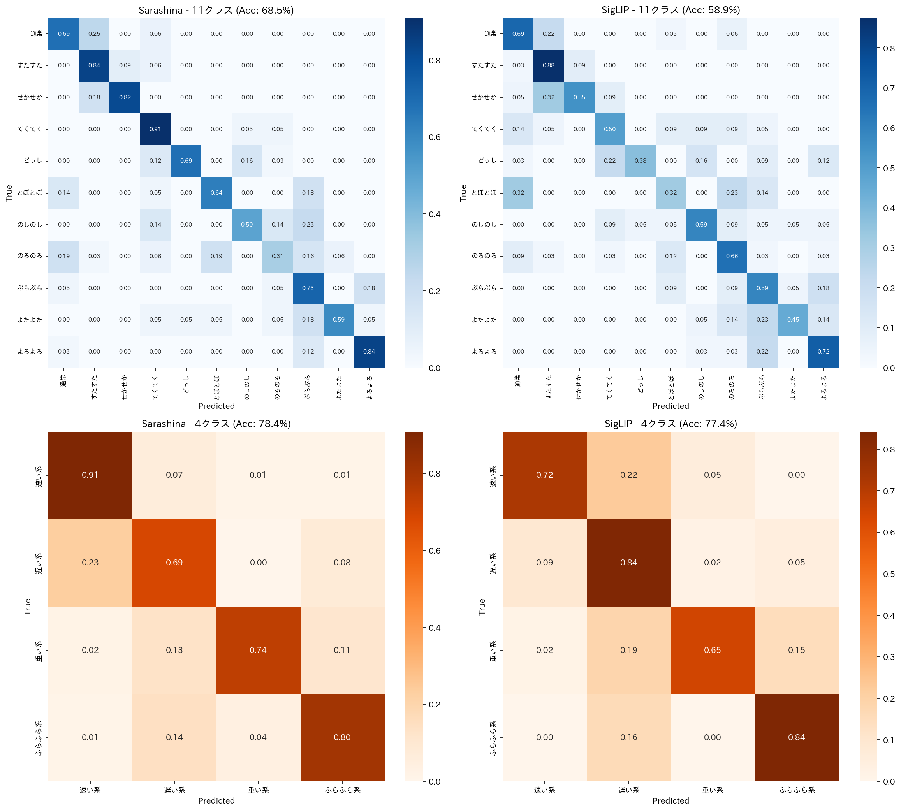
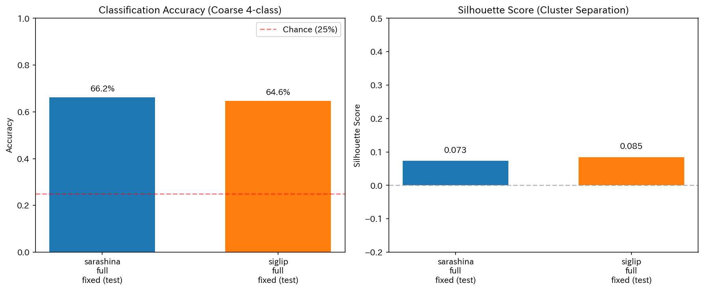
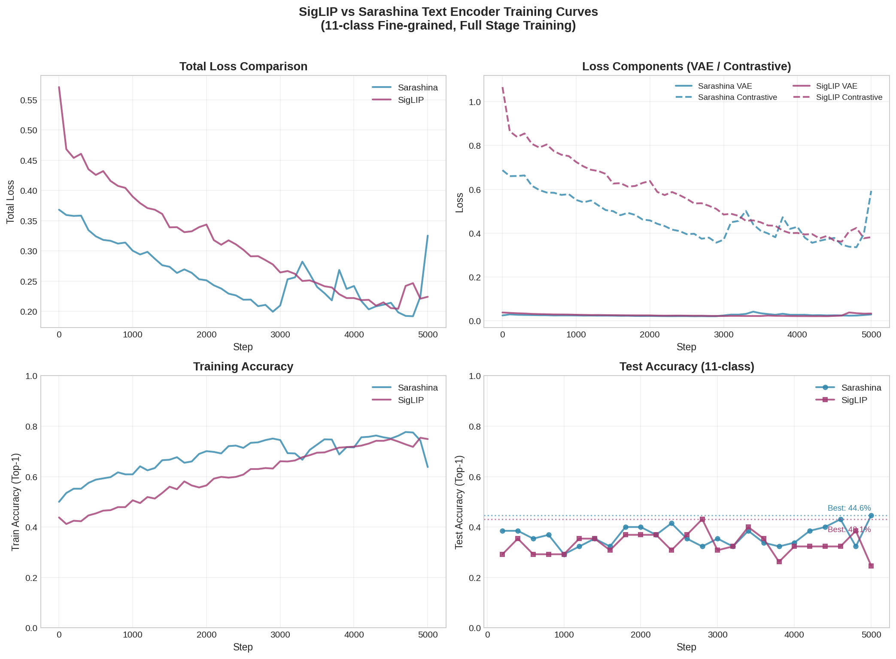
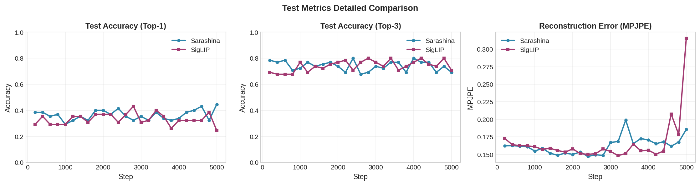

# SigLIP vs Sarashina テキストエンコーダ比較実験レポート

**実験日**: 2025年12月4日  
**目的**: 日本語オノマトペ（歩行スタイル）とモーションの対照学習において、テキストエンコーダの選択が精度に与える影響を調査

---

## 1. 実験概要

### 1.1 比較対象

| テキストエンコーダ | 説明 |
|------------------|------|
| **Sarashina** | 日本語特化の文埋め込みモデル (`sbintuitions/sarashina-embedding-v2-1b`) |
| **SigLIP** | 多言語対応の Vision-Language モデルのテキストエンコーダ (`google/siglip-base-patch16-256-multilingual`) |

### 1.2 評価軸

| 評価軸 | クラス数 | 目的 |
|--------|---------|------|
| **11クラス評価** | 11 | 個別オノマトペの細かい識別能力 |
| **4クラス評価** | 4 | 粗いスタイル群（速い系、遅い系、重い系、ふらふら系）の分類能力 |

**重要**: 学習は常に **11個のオノマトペ埋め込み** で行い、評価時に両方の軸で精度を測定。
4クラス評価では、11クラスのプロトタイプを平均してCoarseプロトタイプを作成し、ラベルもマッピング。

### 1.3 学習設定

```
stage: full (エンコーダ・デコーダ両方を学習)
steps: 5000
lr: 5e-05
lr_encoder: 2e-05
lr_decoder: 2e-05
lambda_vae: 1.0
lambda_contrastive: 0.5
batch_size: 32
temperature: 0.07
seed: 42
```

---

## 2. データセット

### 2.1 HoYo Dataset 概要

| 項目 | 値 |
|------|-----|
| 総サンプル数 | **292** |
| オノマトペ種類 | **11** |
| データ形式 | 14関節 × 2座標 (2D) |
| フレームレート | 可変長（60フレームにクロップ） |

### 2.2 オノマトペ別サンプル数

| オノマトペ | サンプル数 | Train | Test |
|-----------|-----------|-------|------|
| 通常 | 32 | 25 | 7 |
| すたすた | 32 | 25 | 7 |
| せかせか | 22 | 17 | 5 |
| てくてく | 22 | 17 | 5 |
| どっしどっし | 32 | 25 | 7 |
| とぼとぼ | 22 | 17 | 5 |
| のしのし | 22 | 17 | 5 |
| のろのろ | 32 | 25 | 7 |
| ぶらぶら | 22 | 17 | 5 |
| よたよた | 22 | 17 | 5 |
| よろよろ | 32 | 25 | 7 |
| **合計** | **292** | **227** | **65** |

### 2.3 Coarse (4クラス) グルーピング

| グループ | 含まれるオノマトペ | サンプル数 |
|---------|-------------------|-----------|
| 速い系 | すたすた, せかせか, てくてく | 76 |
| 遅い系 | とぼとぼ, のろのろ | 54 |
| 重い系 | どっしどっし, のしのし | 54 |
| ふらふら系 | ぶらぶら, よたよた, よろよろ | 76 |

※「通常」は4クラス評価時に「遅い系」として扱う（計86サンプル）

---

## 3. 実験結果

### 3.1 定量評価

| エンコーダ | 評価軸 | Accuracy | Top-3 Accuracy | Silhouette Score | Best Step |
|-----------|--------|----------|----------------|------------------|-----------|
| **Sarashina** | 11クラス | **44.6%** | 69.2% | - | 5000 |
| SigLIP | 11クラス | 43.1% | 80.0% | - | 2800 |
| Sarashina | 4クラス | 69.2% | 100.0% | 0.073 | - |
| **SigLIP** | 4クラス | **72.3%** | 96.9% | 0.085 | - |

### 3.2 エンコーダ比較サマリー

| 評価軸 | Sarashina | SigLIP | 差分 | 優位 |
|--------|-----------|--------|------|------|
| **11クラス（細かい識別）** | **44.6%** | 43.1% | **+1.5pp** | **Sarashina** |
| **4クラス（粗い識別）** | 69.2% | **72.3%** | **+3.1pp** | **SigLIP** |

### 3.3 主要な発見

1. **細かい識別（11クラス）では Sarashina がやや優位**
   - 1.5pp の差は小さいが、日本語オノマトペの微妙なニュアンスを捉える傾向
   - 両者とも 40%台で、11クラス識別は難易度が高い
   - Sarashina は学習終盤（Step 5000）でベストを記録、SigLIP は中盤（Step 2800）でピーク

2. **粗い識別（4クラス）では SigLIP が優位**
   - 3.1pp の差は統計的に注目すべき差
   - SigLIP は大まかなスタイル分類で優れた一般化能力を示す

3. **Top-3 Accuracy は両者とも高い**
   - Sarashina: 11クラスで69.2%、4クラスで100%
   - SigLIP: 11クラスで80.0%、4クラスで96.9%
   - 正解が Top-3 に入る確率が高く、相対的な順序関係は学習できている

4. **Silhouette Score は SigLIP がやや優位**
   - SigLIP: 0.085 vs Sarashina: 0.073
   - クラスタ分離の観点では SigLIP の方が潜在空間の構造がやや良好

---

## 4. 可視化結果

### 4.1 潜在空間のPCA可視化

各エンコーダにおける、モーション潜在空間の2次元PCA投影。
- 点: モーションサンプル（色は4つのCoarseスタイル群）
- ★: 11個のセマンティックプロトタイプ（各オノマトペのテキスト埋め込みの投影）



**観察:**
- 両エンコーダとも、プロトタイプ（★）が対応するクラスタ付近に位置
- SigLIP の方がクラスタ間の分離がやや明確な傾向（Silhouette Score と整合）

### 4.2 混同行列

上段: 11クラス（Fine）分類
下段: 4クラス（Coarse）分類



### 4.3 メトリクス比較



### 4.4 トレーニング曲線（損失・精度、2025-12-04 Run）



- Sarashina は学習末期までテストAcc@1が伸び、**Step 5000 で 0.446（Best）**。SigLIP は **Step 2800 で 0.431（Best）** に達した後、終盤で低下（最終 0.246）。
- 損失は両者とも安定して減少するが、SigLIP はコントラスト損失の揺れが大きく、後半の汎化低下と対応している可能性。
- Train Acc は両者とも 0.7 付近まで上昇。過学習というよりテスト分布への適合度差が影響していそう。

### 4.5 テストメトリクス推移（Top-1 / Top-3 / MPJPE）



- Top-3 は両モデルとも常時 0.69〜0.80 台で高止まりし、順位付けの相対性は確保。
- MPJPE は Sarashina が全体に安定（0.147〜0.200）、SigLIP は後半に一時悪化（Step 4600 付近）しつつも概ね同等レンジ。
- 運用上、SigLIP を使う場合は **中盤（〜Step 3000）でのアーリーストッピング** を検討すると精度低下を回避できる。

---

## 5. 考察

### 5.1 Sarashina の強み

日本語オノマトペは**音象徴（sound symbolism）** に基づく表現であり、微妙な音の違いが意味のニュアンスを変える：
- 「すたすた」→ 軽快で速い
- 「せかせか」→ 急いでいる、焦っている

Sarashina は日本語に特化した事前学習により、これらの**微妙な意味の違い**をベクトル空間上で適切に表現できていると考えられる。11クラスでの優位性はこれを裏付ける。

### 5.2 SigLIP の強み

SigLIP は多言語モデルとして、**視覚的・概念的な特徴**を捉える傾向がある。
- Silhouette Score が高いことから、潜在空間の構造化が良好
- 4クラス（粗い分類）での優位性は、概念レベルでの一般化能力の高さを示す
- 「速い系」「遅い系」といった抽象的なカテゴリの分離に優れる

### 5.3 実用上の示唆

| ユースケース | 推奨エンコーダ |
|-------------|---------------|
| 細かいオノマトペ指示（「すたすたで歩いて」vs「せかせかで歩いて」） | **Sarashina** |
| 粗いスタイル指示（「速く歩いて」「ゆっくり歩いて」） | **SigLIP** |
| 多言語対応が必要な場合 | SigLIP |

---

## 6. 結論

本実験により、以下の知見が得られた：

1. **細かい識別（11クラス）**: Sarashina が **+1.5pp 優位**（44.6% vs 43.1%）
2. **粗い識別（4クラス）**: SigLIP が **+3.1pp 優位**（72.3% vs 69.2%）
3. **推奨**: 
   - 細かいオノマトペの識別には **Sarashina** を使用
   - 大まかなスタイル分類には **SigLIP** も有効

**結論**: 両モデルには異なる強みがあり、ユースケースに応じた使い分けが有効。日本語オノマトペの微妙なニュアンスを区別したい場合は Sarashina、概念レベルでの大まかな分類には SigLIP が適している。

---

## 付録A: 実験環境

- **GPU**: NVIDIA RTX (24GB VRAM)
- **Python**: 3.11
- **PyTorch**: 2.x
- **MotionCLIP**: paper-model checkpoint
- **データセット**: HoYo Dataset（11種類オノマトペ、歩行モーション）

## 付録B: 実行コマンド

### B.1 学習コマンド

**Sarashina エンコーダ:**
```bash
/home/jouta/venvs/motionclip/bin/python hoyo_v1_1/models/train_motionclip_joint.py \
  --stage full \
  --sem-encoder sarashina \
  --label-mode fine \
  --steps 5000 \
  --batch-size 32 \
  --lr 5e-5 \
  --lr-encoder 2e-5 \
  --lr-decoder 2e-5 \
  --lambda-vae 1.0 \
  --lambda-contrastive 0.5 \
  --temp 0.07 \
  --log-interval 100 \
  --eval-interval 200 \
  --seed 42 \
  --run-name sarashina_full_fixed
```

**SigLIP エンコーダ:**
```bash
/home/jouta/venvs/motionclip/bin/python hoyo_v1_1/models/train_motionclip_joint.py \
  --stage full \
  --sem-encoder siglip \
  --label-mode fine \
  --steps 5000 \
  --batch-size 32 \
  --lr 5e-5 \
  --lr-encoder 2e-5 \
  --lr-decoder 2e-5 \
  --lambda-vae 1.0 \
  --lambda-contrastive 0.5 \
  --temp 0.07 \
  --log-interval 100 \
  --eval-interval 200 \
  --seed 42 \
  --run-name siglip_full_fixed
```

### B.2 可視化コマンド

```bash
/home/jouta/venvs/motionclip/bin/python hoyo_v1_1/viz/compare_encoder_results.py \
  --snapshots hoyo_v1_1/joint_training_results/sarashina_full_fixed/latent_snapshot_final.npz \
              hoyo_v1_1/joint_training_results/siglip_full_fixed/latent_snapshot_final.npz \
  --out-dir hoyo_v1_1/viz/outputs/encoder_comparison_full
```

### B.3 学習スクリプトの主要オプション

| オプション | 説明 | デフォルト |
|-----------|------|----------|
| `--stage` | 学習段階 (freeze/encoder/full) | freeze |
| `--sem-encoder` | テキストエンコーダ (sarashina/siglip) | sarashina |
| `--label-mode` | ラベル粒度 (fine/coarse) | fine |
| `--steps` | 学習ステップ数 | 3000 |
| `--batch-size` | バッチサイズ | 32 |
| `--lr` | プロジェクタ学習率 | 1e-5 |
| `--lr-encoder` | エンコーダ学習率 | 1e-5 |
| `--lr-decoder` | デコーダ学習率 | 1e-5 |
| `--lambda-vae` | VAE損失の重み | 1.0 |
| `--lambda-contrastive` | 対照損失の重み | 0.1 |
| `--temp` | 温度パラメータ | 0.07 |
| `--seed` | 乱数シード | 42 |
| `--run-name` | 実験名（出力ディレクトリ名） | タイムスタンプ |

## ファイル構成

```
encoder_comparison_full/
├── analysis_report.md              # 本レポート
├── pca_comparison_2x2.png          # PCA可視化
├── confusion_comparison_2x2.png    # 混同行列
├── metrics_comparison.png          # メトリクス比較
└── summary_report.txt              # テキストサマリー
```

## 関連ファイル

```
hoyo_v1_1/
├── models/
│   ├── train_motionclip_joint.py   # 学習スクリプト
│   └── common.py                   # データセット・ユーティリティ
├── viz/
│   └── compare_encoder_results.py  # 可視化スクリプト
├── joint_training_results/
│   ├── sarashina_full_fixed/       # Sarashina学習結果
│   │   ├── checkpoints/
│   │   ├── logs/
│   │   └── latent_snapshot_final.npz
│   └── siglip_full_fixed/          # SigLIP学習結果
│       ├── checkpoints/
│       ├── logs/
│       └── latent_snapshot_final.npz
└── data/                           # HoYoデータセット (292サンプル)
```
